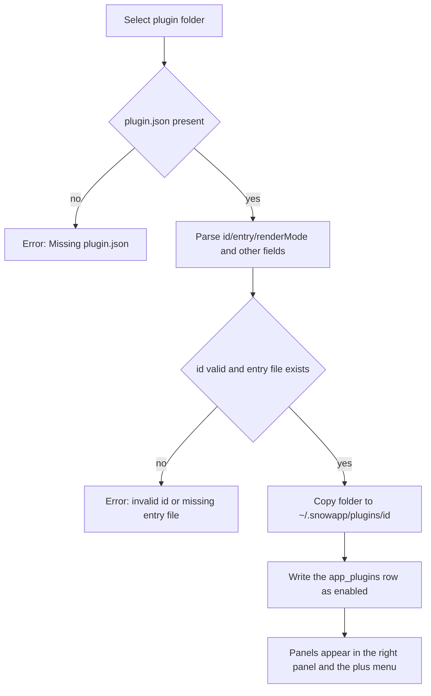

# 24-Plugin Development and Installation (Plugins)

> Applies to: Snow App desktop (Windows / macOS / Linux). A plugin is a **local folder** package that contributes custom tabs to the right panel; this guide covers both installing/removing plugins and authoring one.

## Goal

- Install a plugin from a local folder and open the panels it provides;
- write a `plugin.json` manifest plus an entry module that reads metadata, stores settings, and declares privacy scopes;
- let the AI **install, toggle, reload, and uninstall plugins automatically** through the `plugins` scope of the `config` tool, without opening any settings UI.

## Prerequisites

- The plugin folder must contain `plugin.json` and the entry file declared in the manifest (`entry`, default `index.js`); a missing entry file fails the install.
- Plugins run as **local code**: with `renderMode: "esm"` the entry runs as an ES module inside the main renderer process with the same DOM and network access as the page, while `renderMode: "iframe"` runs the entry in a separate sandboxed document that can only reach the bridged API. Install only plugins you trust.
- Installation copies at most **128 MB** per plugin folder and skips `.git` and `node_modules`.
- One text file may be read up to 8 MB, one binary asset up to 16 MB.

## Entry Point

The **Plugins** button at the bottom of the sidebar (with an installed-count badge) opens the plugin management modal; it is not a settings page with its own page id. The toolbar offers **Install from folder** and **Refresh**; each row shows the plugin version, author and render mode, and a plugin that declares privacy scopes lists every requested data domain as an amber tag (localized, e.g. "API keys", "Messages") followed by the manifest `note`. The modal is management-only; open panels from the plus menu's Plugins group in the top bar or the right-panel plugin entry.

## Steps

### 1. Install a plugin

1. Click **Install from folder** and pick the plugin folder (the level that contains `plugin.json`) in the system directory picker.
2. The backend reads and validates the manifest, copies the folder to `~/.snowapp/plugins/<pluginId>/` (on Windows `C:\Users\<user>\.snowapp\plugins\<pluginId>\`), writes the app database row, and enables it by default.
3. Installing a plugin with the same `id` again **replaces it in place**: the folder is overwritten with the new content while the saved enabled state is kept.



### 2. Manage installed plugins

Each row shows the name, version, author, render mode, and install path, plus:

- **Enable switch**: takes effect immediately; a disabled plugin contributes no panels, and an already open panel reports that the plugin is disabled.
- **Reload manifest**: re-parses `plugin.json` after manual edits inside the installed folder (an `id` that no longer matches the record is rejected).
- **Show in folder**: reveals `installPath`.
- **Uninstall**: after a confirmation it deletes the database row and **removes the plugin folder** (irreversible).

### 3. Open plugin panels

Every panel declared in `panels` appears in the **plus menu** group of the top bar and in the right-panel tab system; clicking it opens a right-panel tab, and several panels can be open at once. Panel titles are resolved from `panels[].title` using the current UI language.

### 4. Author a plugin

Minimal folder layout:

```text
my-plugin/
  plugin.json
  index.js
  locales/
    zh-CN.json
  style.css
```

Sample `plugin.json`:

```json
{
  "id": "com.example.hello",
  "name": { "default": "Hello", "zh-CN": "你好" },
  "description": { "default": "Demo panel", "zh-CN": "示例面板" },
  "version": "1.0.0",
  "author": "You",
  "license": "MIT",
  "icon": "lucide:Sparkles",
  "renderMode": "esm",
  "entry": "index.js",
  "panels": [
    {
      "id": "main",
      "title": { "default": "Hello", "zh-CN": "你好" },
      "icon": "lucide:Sparkles"
    }
  ],
  "locales": { "zh-CN": "locales/zh-CN.json" },
  "styles": ["style.css"],
  "privacy": {
    "scopes": ["apiKeys"],
    "note": "Reads API profiles to list models."
  }
}
```

Field reference (actual parsed semantics):

| Field                             | Type                       | Required | Default        | Constraints and notes                                                                                                                                                                 |
| --------------------------------- | -------------------------- | -------- | -------------- | ------------------------------------------------------------------------------------------------------------------------------------------------------------------------------------- |
| `id`                              | string                     | yes      | —              | Letters, digits, `.`, `-`, `_` only, at most 96 characters, must not start with `.`; it is also the install folder name and the database key                                          |
| `name`                            | string or localized object | no       | `id`           | Object keys support `default`, `zh-CN`, `zh-TW`, `en`; other keys are kept as-is                                                                                                      |
| `description`                     | string or localized object | no       | `name.default` | Same as `name`                                                                                                                                                                        |
| `version`                         | string                     | no       | `1.0.0`        | Display only                                                                                                                                                                          |
| `author` / `homepage` / `license` | string                     | no       | empty          | Display only                                                                                                                                                                          |
| `icon`                            | string                     | no       | empty          | `lucide:IconName` uses a built-in icon; any other value is read as a **relative** path inside the plugin folder; `http(s):` and `data:` prefixes are not resolved as assets           |
| `renderMode`                      | `esm` or `iframe`          | no       | `esm`          | Case-insensitive; invalid values fall back to `esm`                                                                                                                                   |
| `entry`                           | string                     | no       | `index.js`     | Path relative to the plugin folder, **must exist** or the install fails                                                                                                               |
| `panels`                          | array                      | no       | `[]`           | Each item requires `id`; `title` (or its `name` alias) defaults to `id`; `entry` defaults to the top-level `entry`; `icon` defaults to the plugin icon; `widthHint` is passed through |
| `locales`                         | object                     | no       | `{}`           | Maps a locale tag to the relative path of its message file                                                                                                                            |
| `styles`                          | string array               | no       | `[]`           | CSS file paths injected while the panel is mounted and removed on unmount                                                                                                             |
| `privacy`                         | array or object            | no       | `[]`           | The array form lists sensitive scopes; the object form reads `scopes` (also accepts `domains`) and `note`; `permissions` is accepted as an alternative key                            |
| `privacyNote`                     | string                     | no       | empty          | Only the `note` of an object-form `privacy` is read and displayed                                                                                                                     |
| `minAppVersion`                   | string                     | no       | empty          | Currently stored and displayed only; **no version gating**                                                                                                                            |

### 5. Write the entry module (`renderMode: "esm"`)

The entry is imported dynamically as an ES module; pick one of the export shapes:

```javascript
// Shape 1: default-export a React component (props: api / locale / panelId / panel / pluginId / isActive)
export default function Panel({ api, isActive }) {
  const { React } = window.SnowAppPlugin;
  const [count, setCount] = React.useState(0);
  return React.createElement(
    "button",
    { onClick: () => setCount(count + 1) },
    api.t("clicked", {
      defaultValue: "Clicked {{count}} times",
      values: { count },
    }),
  );
}

// Shape 2: export mount(container, api) returning a cleanup function or { unmount }
export function mount(container, api) {
  container.textContent = api.name;
  return () => {
    container.replaceChildren();
  };
}
```

Before mounting, the host injects a global `window.SnowAppPlugin`:

| Member                    | Description                                                       |
| ------------------------- | ----------------------------------------------------------------- |
| `React` / `createElement` | The host React instance, so plugins never bundle their own copy   |
| `icons`                   | The lucide icon namespace (also reachable as `api.ui.icon(name)`) |
| `api`                     | The same runtime API object passed to `mount(container, api)`     |
| `locale`                  | Current UI language (`en` / `zh-CN` / `zh-TW`)                    |
| `plugin`                  | `{ id, version, installPath }`                                    |

With `renderMode: "iframe"` those globals are not injected: the entry runs inside a sandboxed document and reaches the bridge as `window.SnowPlugin`, exposing `runtime: "iframe"`, `plugin: {id, name, version}`, `locale`, `t`, `metadata`, `storage`, `assets`, `on`, and `log` with the same semantics as the table below (an iframe may only request `metadata`, `storage`, and `assets`).

### 6. Runtime API

| API                                                                      | Description                                                                                                                                                                                                                    |
| ------------------------------------------------------------------------ | ------------------------------------------------------------------------------------------------------------------------------------------------------------------------------------------------------------------------------ |
| `api.id` / `api.version` / `api.name` / `api.installPath` / `api.locale` | Plugin identity and current language                                                                                                                                                                                           |
| `api.t(key, { defaultValue, values })`                                   | Message lookup; a missing `key` falls back to `defaultValue` then to the key itself; `{{name}}` placeholders are interpolated from `values`                                                                                    |
| `api.metadata.get(domain \| domain[], { params })`                       | Collects metadata domains, returning `{ generatedAt, domains, denied, withheld, unknown }`                                                                                                                                     |
| `api.metadata.subscribe(domain, listener, { params, intervalMs })`       | Subscribes: `live` domains re-emit on runtime snapshot changes (200 ms debounce) and other domains poll every `intervalMs` (minimum 1000 ms); without an interval only the initial value is emitted; returns `{ unsubscribe }` |
| `api.metadata.domains()`                                                 | Lists domains with authorization state: `{ id, scope, granted, live, sensitiveFields }`                                                                                                                                        |
| `api.storage.get / set / remove / all`                                   | Plugin-private persistence (the `app_plugin_values` table), values are strings                                                                                                                                                 |
| `api.storage.getJson / setJson`                                          | JSON convenience wrappers over the same storage                                                                                                                                                                                |
| `api.assets.resolve(relativePath)`                                       | Reads an asset such as an image from the plugin folder and returns a data URL; `null` on failure                                                                                                                               |
| `api.ui.React` / `api.ui.icon(name)`                                     | Equivalent to `window.SnowAppPlugin.React` / icon lookup                                                                                                                                                                       |
| `api.log(...args)`                                                       | Logging prefixed with `[plugin:<id>]`                                                                                                                                                                                          |

Frequent `params` keys: `projectId`, `projectPath`, `directoryId`, `conversationId` (defaulting to the active project or conversation) plus domain-specific pagination and filters.

The `runtime` domain is the live data source: `conversation` is the full snapshot of the focused conversation (`conversationId`, `sessionKey`, `title`, `directoryId`, `isStreaming`, `isPaused`, `isAborting`, `streamTokenCount`, `streamElapsedMs`, `streamTtftMs`, `streamStartedAt`, `runTtftMs`, `lastRunDurationMs`, `streamingConversationIds`, ...), while `streamingSessions` lists every running conversation (including pending new-chat slots) with `sessionKey`, `conversationId`, `title`, `directoryId`, `isStreaming`, `isPaused`, `isAborting`, `messageCount`, `tokenCount`, `elapsedMs`, `ttftMs`, `runTtftMs`, `startedAt`, `lastRunDurationMs`, and `runTokenUsage`. `startedAt` is the wall-clock anchor of the current run, so live wall-clock duration is `Date.now() - startedAt` and live speed is `tokenCount / elapsedMs`, matching the stream metrics bar above the input box. `chatInput` carries the live input-area data (published by the input area while it is mounted; the last published value is kept when it is unmounted): `conversationId` is the conversation the input area is bound to (`null` for a fresh-chat input area), `maxContextTokens` is the context window limit of the API profile in effect for that conversation, and `isLoadingApiConfig` is the API config loading state. Together with `conversation.tokenUsage` (already normalized by Rust; cache reads are a subset of input) this reproduces the token usage ring next to the input box: `total = inputTokens + outputTokens` and the ratio is `min(total / maxContextTokens, 1)` (falling back to a full ring keyed on `total` when `maxContextTokens` is absent); treat `isLoadingApiConfig === true` as the placeholder ring so a still-loading config is not misread as a full window.

### 7. Available metadata domains and privacy declarations

A **domain-level** sensitive domain that is not declared in `privacy` comes back in `denied` as `{ reason: "privacy-declaration-missing", scope }` and is absent from `domains`. There are 34 domains: **see the [plugin metadata domain reference](../3-reference/6-plugin-metadata-domains.md) for the accepted parameters, every returned field, and typical uses of each domain**; the table below is the declaration overview:

| Domains                                                                                                                                                                                              | Domain-level privacy scope  | Notes                                                                                                                                                         |
| ---------------------------------------------------------------------------------------------------------------------------------------------------------------------------------------------------- | --------------------------- | ------------------------------------------------------------------------------------------------------------------------------------------------------------- |
| `app`, `theme`, `settings`, `apiProfiles`, `mcp`, `subAgents`, `hooks`, `skills`, `lsp`, `permissions`, `codebase`, `projects`, `scheduledTasks`, `runtime`, `panels`, `ide`, `imageLibrary`, `pets` | —                           | These 18 domains need no declaration; `theme`, `settings`, `apiProfiles`, `mcp`, `subAgents`, and `scheduledTasks` still withhold individual sensitive fields |
| `privacy`                                                                                                                                                                                            | `privacyConfig`             | Privacy filtering settings                                                                                                                                    |
| `systemPrompts`                                                                                                                                                                                      | `systemPrompts`             | System prompts                                                                                                                                                |
| `customHeaders`                                                                                                                                                                                      | `customHeaders`             | Custom-header schemes                                                                                                                                         |
| `personalization`                                                                                                                                                                                    | `personalization`           | Global ROLE rules                                                                                                                                             |
| `conversations`, `messages`                                                                                                                                                                          | `conversations`, `messages` | Conversations and messages                                                                                                                                    |
| `memos`, `memory`                                                                                                                                                                                    | `memos`, `memory`           | Memos and project memory                                                                                                                                      |
| `logs`, `usage`, `git`, `ssh`, `userscripts`, `remoteControl`, `plugins`                                                                                                                             | same-named scopes           | Logs, usage, Git, SSH, userscripts, remote control, plugin inventory                                                                                          |
| `browser`                                                                                                                                                                                            | `browserData`               | Browser passwords, bookmarks, downloads, import sources                                                                                                       |

Field-level sensitive names (`apiKey`, `visionApiKey`, `secret`, `password`, `token`, `credentials`, and similar) are withheld by name and the removed paths are listed in `withheld[domain]`. Object-form example: `"privacy": { "scopes": ["apiKeys", "privacyConfig"], "note": "why you need it" }`. Use `api.metadata.domains()` inside a panel to check whether a domain is granted.

The [plugin metadata domain reference](../3-reference/6-plugin-metadata-domains.md) holds the full field list per domain, the live-versus-polled difference, a requirement-to-domain map, and copy-ready examples: locate the domain for your requirement there before writing a panel, then read its parameters and fields, and you avoid most trial and error.

### 8. Localization and styles

- Message files are **flat JSON** (`{"key": "text"}`) with free file and key names; when `api.t` misses, it falls back to `defaultValue` and then to the key.
- `locales` picks a file by exact language match, then case-insensitive match, then primary language (`zh` / `en`), then `default`, then the first entry.
- CSS files listed in `styles` are injected as `<style data-snow-plugin="<id>">` in the document head and removed when the panel unmounts; prefix your selectors to avoid affecting the app UI.
- A panel may override the plugin icon with `panels[].icon` (again `lucide:Name` or a relative asset path).

### 9. Let the AI install a plugin (the `plugins` scope)

The AI does not need the modal; it can write files and install them:

```text
# 1) write the plugin folder to disk with the filesystem server
filesystem-create ./my-plugin/plugin.json
filesystem-create ./my-plugin/index.js

# 2) install (key "new"; the real id comes from plugin.json)
config-set scope=plugins key="new" value={sourceDir: "/abs/path/my-plugin"}
#   value={sourcePath: "/abs/path/my-plugin/plugin.json"} works as well

# 3) inspect / toggle / reload the manifest
config-list scope=plugins
config-get  scope=plugins key=com.example.hello
config-set  scope=plugins key=com.example.hello value={enabled: false}
config-set  scope=plugins key=com.example.hello value={rescan: true}

# 4) uninstall (user confirmation required; deleteFiles defaults to true and removes the folder too)
config-delete scope=plugins key=com.example.hello confirmed=true
config-delete scope=plugins key=com.example.hello value={deleteFiles: false} confirmed=true
```

Key points:

- `sourceDir` and `sourcePath` accept absolute paths, `~/` paths, and paths relative to the current working directory; a file path resolves to its parent folder.
- The scope reuses exactly the same storage layer as the UI, so folder copying, skipped entries, the database row, and the default-enabled state behave identically; the panel host does **not** auto-refresh its list, it re-reads when the modal or a panel opens.
- Uninstalling is destructive: `config-delete` requires user confirmation first and then `confirmed: true`.

## Verification

- `config-list scope=plugins` includes the new plugin with `enabled: true`, and `pluginsDirectory` points at `~/.snowapp/plugins`.
- The install folder holds `plugin.json` and the entry file, and its name equals the `id` from `plugin.json`.
- The modal lists the plugin, the plus menu shows its panels, and opening one renders without a load error.
- For granted domains `denied` from `api.metadata.get` is empty.

## Troubleshooting and recovery

| Symptom                                                                                | Cause and fix                                                                                                          |
| -------------------------------------------------------------------------------------- | ---------------------------------------------------------------------------------------------------------------------- |
| `Missing plugin.json in '...'`                                                         | The selected folder has no manifest; pick the level that contains `plugin.json`                                        |
| `Plugin id is required and may only contain letters, digits, dot, dash and underscore` | `id` is missing or contains invalid characters (spaces, CJK, a leading dot)                                            |
| `Plugin entry file 'index.js' is missing`                                              | The `entry` file does not exist; confirm the file was written before copying                                           |
| `Plugin directory is too large to install (limit 128 MB)`                              | The folder is too big; although `node_modules` and `.git` are skipped, other large files must be cleaned up            |
| `Plugin manifest id 'x' does not match 'y'`                                            | The manifest `id` was changed before a reload; restore it or install under the new id (uninstall the old record first) |
| The panel reports an invalid entry                                                     | The entry exports neither a default React component nor `mount(container, api)` / `render(...)`                        |
| `denied` contains `privacy-declaration-missing`                                        | Declare the domain in `plugin.json` `privacy`, then reload the manifest (reinstall or `rescan`)                        |
| Nothing changes after hand-editing the install folder                                  | Click **Reload manifest** or run `config-set ... value={rescan: true}`; use **Refresh** to reload the list itself      |
| Keep the source after uninstalling                                                     | Uninstall with `value={deleteFiles: false}` (or back up `~/.snowapp/plugins/<id>/` first); the folder is not deleted   |

## Source anchors

- `native/src/storage/plugins.rs`: manifest parsing, folder copying, install/reload/toggle/uninstall
- `native/src/storage/models.rs::PluginRecord`, `native/src/storage/database.rs`: the `app_plugins` / `app_plugin_values` tables
- `native/src/exports/storage/plugins.rs`: napi exports
- `src/main/ipc/handlers/pluginHandlers.ts`: the `plugins:*` IPC channels
- `src/renderer/plugins/pluginStore.ts`, `src/renderer/plugins/manifest.ts`, `src/preload/types/plugins.ts`: renderer view model and parsing
- `src/renderer/plugins/pluginRuntime.ts`, `src/renderer/plugins/pluginApi.ts`, `src/renderer/plugins/pluginIframeBridge.js`: ESM and iframe runtime assembly plus the API
- `src/renderer/plugins/metadata/domains.ts`, `src/renderer/plugins/metadata/index.ts`: metadata domains and privacy redaction
- `src/renderer/components/rightPanel/PluginPanelContent.tsx`, `src/renderer/components/sidebar/PluginsModal.tsx`: panel host and management modal
- `native/src/mcp/servers/config/plugins_scope.rs`, `native/src/mcp/servers/config/mod.rs`: the `plugins` scope of the `config` tool
- Install folder and data locations: [Data storage locations](../3-reference/4-data-storage-locations.md); `config` scope fields: [Built-in tools reference](../3-reference/2-builtin-tools-reference.md)
