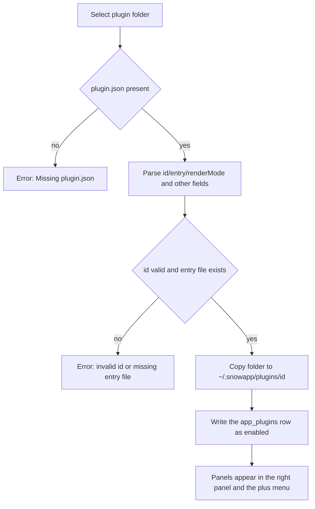
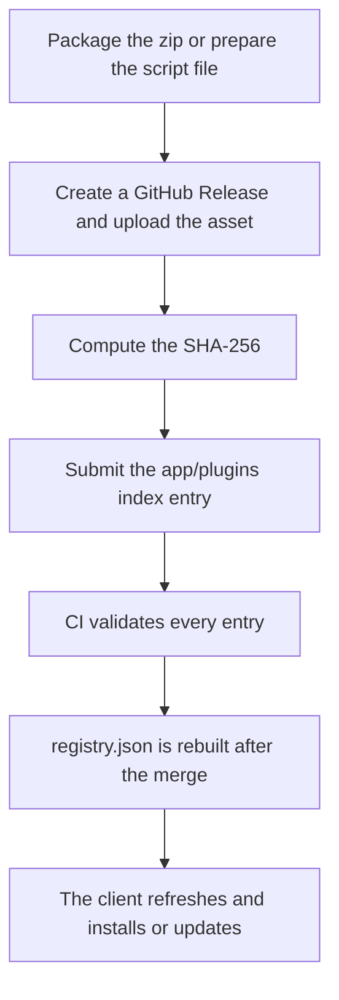

# 24-Plugin Development and Installation (Plugins)

> Applies to: Snow App desktop (Windows / macOS / Linux). A plugin is a **local folder** package that contributes custom tabs to the right panel; this guide covers installing/removing plugins (local folder and plugin market), authoring one, and publishing it to the plugin market.

## Goal

- Install a plugin from a local folder or the **plugin market** and open the panels it provides;
- write a `plugin.json` manifest plus an entry module that reads metadata, writes application data through `api.write`, stores private settings, and declares privacy scopes;
- **publish** a plugin to the plugin market: prepare the Release asset, compute its SHA-256, and submit the index entry;
- let the AI **install, toggle, reload, and uninstall plugins automatically** through the `plugins` scope of the `config` tool, without opening any settings UI.

## Prerequisites

- The plugin folder must contain `plugin.json` and the entry file declared in the manifest (`entry`, default `index.js`); a missing entry file fails the install.
- Plugins run as **local code**: with `renderMode: "esm"` the entry runs as an ES module inside the main renderer process with the same DOM and network access as the page, while `renderMode: "iframe"` runs the entry in a separate sandboxed document that can only reach the bridged API. Install only plugins you trust.
- Application data access is "read plus controlled write": reads go through `api.metadata` and writes through `api.write`, where each write action's `scope` decides whether a `privacy` declaration is required (see the writable-capabilities section below).
- Installation copies at most **128 MB** per plugin folder and skips `.git` and `node_modules`.
- One text file may be read up to 8 MB, one binary asset up to 16 MB.
- The plugin market needs network access to GitHub raw or the jsDelivr mirror; publishing a plugin requires its own GitHub repository and Release.

## Entry Point

The **Plugins** button at the bottom of the sidebar (with an installed-count badge) opens the plugin management page — a main-content view (view id `plugins`), not a settings page, and it has no settings page id. The page has three top-level tabs: **Plugin list** (badge: panel plugins plus client scripts), **Plugin market**, and **Metadata catalog** (badge: the metadata-domain count):

| Tab                  | Contents                                                                                                                                                                                                                           |
| -------------------- | ---------------------------------------------------------------------------------------------------------------------------------------------------------------------------------------------------------------------------------- |
| **Plugin list**      | The main management area; it carries two sub-tabs with counters, **Panel plugins** and **Script plugins** — the former covers the folder-installed plugins described in the rest of this guide, the latter holds client UI scripts |
| **Plugin market**    | Install or update panel plugins and client scripts in one click from the snow-plugin-store index; installation, updates, and the author publishing flow live in the plugin market section                                          |
| **Metadata catalog** | The app metadata domains plugins can read together with the write actions and the network capability a plugin can use                                                                                                              |

Under the **Panel plugins** sub-tab the toolbar offers **Install from folder** and **Refresh**; each row shows the plugin version, author and render mode, and a plugin that declares privacy scopes lists every requested data domain as an amber tag (localized, e.g. "API keys", "Messages") followed by the manifest `note`; clicking any amber tag opens the "Privacy scopes" dialog, which explains each scope in one line and lists the metadata domains it unlocks (field-level declarations name the exact fields) plus the writable capabilities aggregated per write domain, along with where it is declared (`privacy` in `plugin.json` / `@snow-privacy` in the script metadata header). The **Script plugins** sub-tab shows the script's `@snow-privacy` declarations as the same amber badges and opens the very same dialog. The **Metadata catalog** tab shows "Reading", "Writable" and "Network" sub-tabs: it groups all 34 domains with a one-line summary, the required privacy declaration, live-versus-polled behavior and accepted parameters, with keyword search, while the Writable sub-tab lists every write action with its required `scope` and declaration state and the Network sub-tab lists the `api.net.fetch` external request capability (forwarded by the main process, no privacy declaration needed). The per-row "Metadata n/34" and "Write n/206" links mark that plugin's declared (readable/writable) and undeclared (denied) domains and actions, so users can audit the `privacy` declaration. The page is management-only; open panels from the plus menu's Plugins group in the top bar or the right-panel plugin entry.

## Script plugins (client UI scripts)

The **Plugin list → Script plugins** sub-tab manages **client UI scripts injected into the Snow desktop window itself**; they are a different kind of extension from the panel plugins on the sibling **Panel plugins** sub-tab — same management page, but separate storage, execution model, and capability boundary:

| Dimension      | Panel plugins (Plugin list → Panel plugins)                                                                                   | Client UI scripts (Plugin list → Script plugins)                                                                                                                                                                                            |
| -------------- | ----------------------------------------------------------------------------------------------------------------------------- | ------------------------------------------------------------------------------------------------------------------------------------------------------------------------------------------------------------------------------------------- |
| Shape          | A local folder package: `plugin.json` plus an entry file (`entry`)                                                            | A single Tampermonkey-compatible file with a `// ==UserScript==` header                                                                                                                                                                     |
| Execution      | `renderMode: "esm"` runs as an ES module in the main renderer; `renderMode: "iframe"` runs in a sandboxed document            | A **dedicated isolated world** by default (sandboxed mode, no `window.snow`); declaring `@snow-sandbox false` or `@grant unsafeWindow` moves it to the main world (full-permission mode)                                                    |
| What it can do | Contribute right-panel tabs and read/write app data through `api.metadata` / `api.write` (gated by the `privacy` declaration) | Customize the UI through the anchor and slot contract and call the `GM_*` and `snow` APIs (gated by script scope and execution mode); read/write app data through `snow.metadata` / `snow.write` (gated by the `@snow-privacy` declaration) |
| UI entry       | The plus menu's Plugins group and the right-panel tab system                                                                  | No panel of its own; it acts on existing UI elements                                                                                                                                                                                        |
| Storage        | `~/.snowapp/plugins/<pluginId>/` plus the `app_plugins` table                                                                 | `~/.snowapp/browser-script/{script_id}.user.js` plus the `userscripts` table (`target` is `client` or `all`)                                                                                                                                |
| Install routes | **Install from folder**, the `config` tool's `plugins` scope                                                                  | **New script** / **Import file** / **Install URL** (https direct link) / **Build with AI**, the `config` tool's `userscripts` scope                                                                                                         |
| Icon           | The `icon` in `plugin.json` (`lucide:Name` or a plugin-relative path; a panel may override it with `panels[].icon`)           | The `@icon` / `@iconURL` metadata header (`lucide:Name`, an http(s) URL, or a data URI), shown in the Script plugins list                                                                                                                   |

Inside the sub-tab you can **create** a script (the modal editor prefills the client-script template), **import a file**, or **install from a URL**; while the list is empty its empty state also offers a **Build with AI** request box (describe what you want, the page closes, a new conversation starts and auto-sends the request, and the AI loads the `snow-app-docs` skill to locate the built-in docs and writes a `.user.js` following the client-script rules in 22-Userscripts before installing and enabling it); every script row can be enabled / disabled / edited / deleted and shows an **Update** button as soon as the market index lists a newer version (in-place update that keeps the enabled state, same as panel plugins). Both creating and editing use the very same large modal editor as **Settings → Browser settings → Userscripts** (`Modal` plus the line-numbered, highlighted `FileViewerContent`; the virtual file name is `<script name>.user.js` when editing — saving writes the database, re-matches and takes effect immediately, while closing the modal cancels). A script that keeps failing is auto-disabled after 5 consecutive errors. The directive table (including `@snow-privacy`), the GM / `snow` / `snow.metadata` / `snow.write` API list, the anchor and slot contract, and a minimal example live in [22-Userscripts](22-userscripts.md) under "Client scripts (desktop window)".

> Both entry points share the single `userscripts` table: the Script plugins sub-tab shows only scripts whose `target` is `client` or `all`, while the browser settings Userscripts list shows only `browser` and `all`; the metadata header's `@snow-target` or `@match snow://client/<view>` decides the home.

## Steps

### 1. Install a plugin

1. Click **Install from folder** and pick the plugin folder (the level that contains `plugin.json`) in the system directory picker.
2. The backend reads and validates the manifest, copies the folder to `~/.snowapp/plugins/<pluginId>/` (on Windows `C:\Users\<user>\.snowapp\plugins\<pluginId>\`), writes the app database row, and enables it by default.
3. Installing a plugin with the same `id` again **replaces it in place**: the folder is overwritten with the new content while the saved enabled state is kept.


```mermaid
flowchart TD
    A[Select plugin folder] --> B{plugin.json present}
    B -- no --> C[Error: Missing plugin.json]
    B -- yes --> D[Parse id/entry/renderMode and other fields]
    D --> E{id valid and entry file exists}
    E -- no --> F[Error: invalid id or missing entry file]
    E -- yes --> G[Copy folder to ~/.snowapp/plugins/id]
    G --> H[Write the app_plugins row as enabled]
    H --> I[Panels appear in the right panel and the plus menu]
```

### 2. Manage installed plugins

Each row shows the name, version, author, render mode, and install path, plus:

- **Enable switch**: takes effect immediately; a disabled plugin contributes no panels, and an already open panel reports that the plugin is disabled.
- **Reload manifest**: re-parses `plugin.json` after manual edits inside the installed folder (an `id` that no longer matches the record is rejected).
- **Show in folder**: reveals `installPath`.
- **Update**: the installed lists share the market index — when a newer version exists the row shows an **Update** button (hovering shows `Installed v<from> → v<to>`) that updates in place without switching to the Plugin market tab; the button is disabled with an explanatory tooltip when the entry's `minAppVersion` is newer than the app.
- **Uninstall**: after a confirmation it deletes the database row and **removes the plugin folder** (irreversible).

### 3. Open plugin panels

Every panel declared in `panels` appears in the **plus menu** group of the top bar and in the right-panel tab system; clicking it opens a right-panel tab, and several panels can be open at once. Panel titles are resolved from `panels[].title` using the current UI language.

### 4. Author a plugin

Minimal folder layout:

```text
my-plugin/
  plugin.json
  index.js
  locales/
    zh-CN.json
  style.css
```

Sample `plugin.json`:

```json
{
  "id": "com.example.hello",
  "name": { "default": "Hello", "zh-CN": "你好" },
  "description": { "default": "Demo panel", "zh-CN": "示例面板" },
  "version": "1.0.0",
  "author": "You",
  "license": "MIT",
  "icon": "lucide:Sparkles",
  "renderMode": "esm",
  "entry": "index.js",
  "panels": [
    {
      "id": "main",
      "title": { "default": "Hello", "zh-CN": "你好" },
      "icon": "lucide:Sparkles"
    }
  ],
  "locales": { "zh-CN": "locales/zh-CN.json" },
  "styles": ["style.css"],
  "privacy": {
    "scopes": ["apiKeys"],
    "note": "Reads API profiles to list models."
  }
}
```

Field reference (actual parsed semantics):

| Field                             | Type                       | Required | Default        | Constraints and notes                                                                                                                                                                 |
| --------------------------------- | -------------------------- | -------- | -------------- | ------------------------------------------------------------------------------------------------------------------------------------------------------------------------------------- |
| `id`                              | string                     | yes      | —              | Letters, digits, `.`, `-`, `_` only, at most 96 characters, must not start with `.`; it is also the install folder name and the database key                                          |
| `name`                            | string or localized object | no       | `id`           | Object keys support `default`, `zh-CN`, `zh-TW`, `en`; other keys are kept as-is                                                                                                      |
| `description`                     | string or localized object | no       | `name.default` | Same as `name`                                                                                                                                                                        |
| `version`                         | string                     | no       | `1.0.0`        | Display only                                                                                                                                                                          |
| `author` / `homepage` / `license` | string                     | no       | empty          | Display only                                                                                                                                                                          |
| `icon`                            | string                     | no       | empty          | `lucide:IconName` uses a built-in icon; any other value is read as a **relative** path inside the plugin folder; `http(s):` and `data:` prefixes are not resolved as assets           |
| `renderMode`                      | `esm` or `iframe`          | no       | `esm`          | Case-insensitive; invalid values fall back to `esm`                                                                                                                                   |
| `entry`                           | string                     | no       | `index.js`     | Path relative to the plugin folder, **must exist** or the install fails                                                                                                               |
| `panels`                          | array                      | no       | `[]`           | Each item requires `id`; `title` (or its `name` alias) defaults to `id`; `entry` defaults to the top-level `entry`; `icon` defaults to the plugin icon; `widthHint` is passed through |
| `locales`                         | object                     | no       | `{}`           | Maps a locale tag to the relative path of its message file                                                                                                                            |
| `styles`                          | string array               | no       | `[]`           | CSS file paths injected while the panel is mounted and removed on unmount                                                                                                             |
| `privacy`                         | array or object            | no       | `[]`           | The array form lists sensitive scopes; the object form reads `scopes` (also accepts `domains`) and `note`; `permissions` is accepted as an alternative key                            |
| `privacyNote`                     | string                     | no       | empty          | Only the `note` of an object-form `privacy` is read and displayed                                                                                                                     |
| `minAppVersion`                   | string                     | no       | empty          | Currently stored and displayed only; **no version gating**                                                                                                                            |

A manifest panel may additionally declare `"chatInput": true` (only boolean `true` enables it; default `false`) for an input-toolbar entry. Existing `entry`, `icon`, `widthHint` and privacy semantics are unchanged; see section 6.1.

### 5. Write the entry module (`renderMode: "esm"`)

The entry is imported dynamically as an ES module; pick one of the export shapes:

```javascript
// Shape 1: default-export a React component (props: api / locale / panelId / panel / pluginId / isActive / inputText)
// inputText is the current raw chat-input content (keeps @@file:...@@ tag markers) and updates as you type
export default function Panel({ api, isActive }) {
  const { React } = window.SnowAppPlugin;
  const [count, setCount] = React.useState(0);
  return React.createElement(
    "button",
    { onClick: () => setCount(count + 1) },
    api.t("clicked", {
      defaultValue: "Clicked {{count}} times",
      values: { count },
    }),
  );
}

// Shape 2: export mount(container, api) returning a cleanup function or { unmount }
export function mount(container, api) {
  container.textContent = api.name;
  return () => {
    container.replaceChildren();
  };
}
```

Before mounting, the host injects a global `window.SnowAppPlugin`:

| Member                    | Description                                                       |
| ------------------------- | ----------------------------------------------------------------- |
| `React` / `createElement` | The host React instance, so plugins never bundle their own copy   |
| `icons`                   | The lucide icon namespace (also reachable as `api.ui.icon(name)`) |
| `api`                     | The same runtime API object passed to `mount(container, api)`     |
| `locale`                  | Current UI language (`en` / `zh-CN` / `zh-TW`)                    |
| `plugin`                  | `{ id, version, installPath }`                                    |

With `renderMode: "iframe"` those globals are not injected: the entry runs inside a sandboxed document and reaches the bridge as `window.SnowPlugin`, exposing `runtime: "iframe"`, `plugin: {id, name, version}`, `locale`, `t`, `metadata`, `write`, `storage`, `assets`, `net`, `on`, and `log` with the same semantics as the table below (an iframe may request the five capabilities `metadata`, `write`, `storage`, `assets`, and `net`; for writes it only has `api.write.run` and `api.write.domains`, without the per-domain sugar).

### 6. Runtime API

| API                                                                      | Description                                                                                                                                                                                                                                                                                                                                 |
| ------------------------------------------------------------------------ | ------------------------------------------------------------------------------------------------------------------------------------------------------------------------------------------------------------------------------------------------------------------------------------------------------------------------------------------- |
| `api.id` / `api.version` / `api.name` / `api.installPath` / `api.locale` | Plugin identity and current language                                                                                                                                                                                                                                                                                                        |
| `api.t(key, { defaultValue, values })`                                   | Message lookup; a missing `key` falls back to `defaultValue` then to the key itself; `{{name}}` placeholders are interpolated from `values`                                                                                                                                                                                                 |
| `api.metadata.get(domain \| domain[], { params })`                       | Collects metadata domains, returning `{ generatedAt, domains, denied, withheld, unknown }`                                                                                                                                                                                                                                                  |
| `api.metadata.subscribe(domain, listener, { params, intervalMs })`       | Subscribes: `live` domains re-emit on runtime snapshot changes (200 ms debounce) and other domains poll every `intervalMs` (minimum 1000 ms); without an interval only the initial value is emitted; returns `Promise<{ unsubscribe }>` (use `await`)                                                                                       |
| `api.metadata.domains()`                                                 | Lists domains with authorization state: `{ id, scope, granted, live, sensitiveFields }`                                                                                                                                                                                                                                                     |
| `api.write.<domain>.<action>(params)`                                    | Calls one write action (ESM only); identical to `api.write.run("<domain>.<action>", params)`                                                                                                                                                                                                                                                |
| `api.write.run(actionId, params)`                                        | Calls a write action by id and returns `{ ok, action, data, denied, error }` (see the writable-capabilities section)                                                                                                                                                                                                                        |
| `api.write.domains()`                                                    | Lists write actions and declaration state: `{ id, granted, actions: [{ id, scope, granted, summary }] }`                                                                                                                                                                                                                                    |
| `api.net.fetch(url, { method, headers, body, timeoutMs })`               | Sends an external HTTP request through the main-process network stack: follows the app proxy settings, bypasses CORS, and sends no cookies; returns `{ ok, status, statusText, headers, body, url, error }` and never throws on network failure (the `error` field carries it). Timeout defaults to 30s (max 120s), response body limit 5MB |
| `api.storage.get / set / remove / all`                                   | Plugin-private persistence (the `app_plugin_values` table), values are strings                                                                                                                                                                                                                                                              |
| `api.storage.getJson / setJson`                                          | JSON convenience wrappers over the same storage                                                                                                                                                                                                                                                                                             |
| `api.assets.resolve(relativePath)`                                       | Reads an asset such as an image from the plugin folder and returns a data URL; `null` on failure                                                                                                                                                                                                                                            |
| `api.ui.React` / `api.ui.icon(name)`                                     | Equivalent to `window.SnowAppPlugin.React` / icon lookup                                                                                                                                                                                                                                                                                    |
| `api.log(...args)`                                                       | Logging prefixed with `[plugin:<id>]`                                                                                                                                                                                                                                                                                                       |

Frequent `params` keys: `projectId`, `projectPath`, `directoryId`, `conversationId` (defaulting to the active project or conversation) plus domain-specific pagination and filters.

The `runtime` domain is the live data source: `conversation` is the full snapshot of the focused conversation (`conversationId`, `sessionKey`, `title`, `directoryId`, `isStreaming`, `isPaused`, `isAborting`, `streamTokenCount`, `streamElapsedMs`, `streamTtftMs`, `streamStartedAt`, `runTtftMs`, `lastRunDurationMs`, `streamingConversationIds`, ...), while `streamingSessions` lists every running conversation (including pending new-chat slots) with `sessionKey`, `conversationId`, `title`, `directoryId`, `isStreaming`, `isPaused`, `isAborting`, `messageCount`, `tokenCount`, `elapsedMs`, `ttftMs`, `runTtftMs`, `startedAt`, `lastRunDurationMs`, and `runTokenUsage`. `startedAt` is the wall-clock anchor of the current run, so live wall-clock duration is `Date.now() - startedAt` and live speed is `tokenCount / elapsedMs`, matching the stream metrics bar above the input box. `chatInput` carries the live input-area data (published by the input area while it is mounted; the last published value is kept when it is unmounted): `inputText` is the current raw chat-input content (keeping `@@file:...@@` / `@@image:...@@` tag markers, an empty string means nothing has been typed, updated as you type), `conversationId` is the conversation the input area is bound to (`null` for a fresh-chat input area), `maxContextTokens` is the context window limit of the API profile in effect for that conversation, and `isLoadingApiConfig` is the API config loading state. Together with `conversation.tokenUsage` (already normalized by Rust; cache reads are a subset of input) this reproduces the token usage ring next to the input box: `total = inputTokens + outputTokens` and the ratio is `min(total / maxContextTokens, 1)` (falling back to a full ring keyed on `total` when `maxContextTokens` is absent); treat `isLoadingApiConfig === true` as the placeholder ring so a still-loading config is not misread as a full window.

### 6.1 Prompt optimization and safe drafts (ESM)

Declare `panels[].chatInput: true` (boolean, default `false`) to show an enabled panel's icon in `toolbar-right`, immediately before the model selector, using the panel/plugin icon. `chatInputTitle` is a separate localized action tooltip, falling back to `panel.title`, so the wand can say “Optimize draft” while the panel says “Optimization strategy”. `chatInputAction` names an entry-module export (a valid JS Unicode IdentifierName; invalid / empty values normalize to empty): **an empty value still only opens the panel**; a non-empty ESM action is invoked only on the user's wand click and does not open the right panel. Its separate small gear opens the configuration panel even without draft text or API configuration. iframe does not execute Actions and retains panel-launcher behavior. The execution button is disabled for empty plain text (chips alone count as empty), unavailable / loading API configuration, streaming, stopping, or compaction. Existing plus-menu and right-panel entries remain unchanged; no plugin id is hardcoded.

`optimizationInstructions?: string` supplies an optional optimization meta prompt / strategy. Its raw value is limited to **8000 Unicode code points**, not UTF-16 code units; non-string / oversized values are rejected in renderer and backend. The backend trims surrounding whitespace and treats empty text as omitted, preserving older requests. Instructions occupy a separate trusted system section and cannot override fixed safety constraints. Never concatenate API secrets or attachment content into instructions.

#### Generic input Action signature and interaction

Manifest panel example:

```json
{
  "id": "settings",
  "title": { "default": "Optimization strategy", "zh-CN": "优化策略" },
  "chatInput": true,
  "chatInputAction": "optimizeDraft",
  "chatInputTitle": { "default": "Optimize draft", "zh-CN": "优化草稿" },
  "icon": "lucide:WandSparkles"
}
```

Export `async optimizeDraft({ api, signal, onStatus, confirm }): Promise<PluginChatInputActionResult>` from the entry module. The host does not call `mount`; configuration remains a separate panel. Types are exported from `src/renderer/plugins/pluginApi.ts`:

```typescript
type PluginChatInputActionContext = {
  api: PluginRuntimeApi;
  signal: AbortSignal;
  onStatus: (message: string) => void;
  confirm: (message: string) => Promise<boolean>;
};
type PluginChatInputActionResult = {
  message?: string;
  preview?: string;
  apply?: () => Promise<PluginChatInputActionResult>;
  undo?: () => Promise<void>;
};
```

- The right panel configures the meta prompt / strategy and saves private preferences. By default, a single wand click runs optimization; the plugin safely calls `applyDraft` to refill the input automatically and returns an `undo` closure based on `restoreToken`. The host shows a prominent Undo button. No additional right-panel action is needed and no message is sent.
- Optional preview-confirm mode returns `preview + apply`. An input-area preview displays plain text, Copy and Apply. Successful `apply` returns a new result with `undo`. If the draft is stale, return `preview` without `apply` for copy-only recovery; never re-capture a changed draft to force old output onto it.
- `onStatus` updates inline status. Execution / Apply / Undo shows a spinner; clicking the primary button again cancels only this Action's signal, never ordinary chat. Pass `signal` to `api.ai.optimizePrompt`; the scoped host API also combines the Action cancellation signal.
- `confirm` uses the existing host Modal: Confirm accepts, Close / Escape declines; cancellation or context invalidation settles the pending prompt and interrupts continuation. This is runtime UI confirmation, not tool authorization or automatic approval of a paid request.
- Each click loads messages, creates a **fresh API** (reloading current private storage; storage read failure prevents execution), loads the entry module and resolves `module[panel.chatInputAction]`. It never caches the configuration panel's API/storage snapshot; existing `api.storage` methods are unchanged. Cancellation is checked across awaited loading stages; a missing export shows an error without paid fallbacks.
- Parameters / API profile / model, project or real / pending session changes, plugin update / disable / removal, input unmount, streaming / stopping / compaction automatically cancel and invalidate callbacks. Late status, confirmation, results and scoped Action AI/write calls are rejected. Completed output may remain read-only after stripping `apply/undo`. Opening the configuration gear also cancels the current Action to prevent old strategies from refilling during configuration.
- Panel mount, module import top level and metadata subscription / refresh must never invoke Actions or paid APIs. The host invokes the export only on a user click; ESM remains trusted local code, not a sandbox for malicious top-level code. Refill / Undo must still use draft tokens, never guessed DOM writes, privacy bypasses or ordinary message-send channels.

`api.ai.optimizePrompt(options): Promise<{ content: string }>` is **ESM-only**; the iframe bridge has no `ai` capability. Options:

| Field                      | Type                    | Contract                                                                                                                                          |
| -------------------------- | ----------------------- | ------------------------------------------------------------------------------------------------------------------------------------------------- |
| `draft`                    | string                  | Required, non-empty plain text; send only after an explicit user optimization action, never automatically on mount, subscription or panel opening |
| `conversationId`           | string?                 | Optional conversation id; do not invent an id for a fresh chat                                                                                    |
| `apiProfile` / `model`     | string?                 | Optional profile / model overrides; backend owns defaults and model fallback                                                                      |
| `includeContext`           | boolean?                | Defaults to `false`; only explicit `true` includes history and requires `messages` in `privacy.scopes`                                            |
| `optimizationInstructions` | string?                 | Optional meta prompt / strategy; at most 8000 raw Unicode code points, whitespace-only text omitted, fixed safety constraints unchanged           |
| `contextRounds`            | number?                 | Non-negative integer; backend owns defaults and actual history selection                                                                          |
| `onChunk`                  | (delta: string) => void | Optional delta callback, not accumulated output                                                                                                   |
| `signal`                   | AbortSignal?            | Optional cancellation; rejects with `AbortError` when cancelled                                                                                   |

The host creates a separate UUID per request and uses dedicated optimization / cancellation channels. Cancelling never stops an ordinary chat session, and optimization input/output is not saved as conversation messages. Abort listeners are removed on success, failure and cancellation, and no chunks are delivered after stopping. Missing context privacy declarations reject before calling the backend; do not bypass privacy through other metadata or ordinary conversation APIs. Drafts do not automatically include chips, attachments or history: pass captured `text`, not `inputText`. Explicitly sending a draft to the model requires no new sensitive scope, but the panel must explain possible API costs.

Older running versions may lack these capabilities; `minAppVersion` is not a runtime gate. Check `typeof api.ai?.optimizePrompt === "function"` and use `api.write.domains()` to check the three draft actions. If unavailable, show an upgrade hint or a read-only preview; never fall back to guessed DOM writes or ordinary chat requests.

The three public `chatInput` actions use the existing standard response `{ ok, action, data, error?, denied? }`, with no new privacy scope. Check `ok` before accessing `data`:

| Action                   | Parameters                             | Success `data`                                                                            |
| ------------------------ | -------------------------------------- | ----------------------------------------------------------------------------------------- |
| `chatInput.captureDraft` | `{}`                                   | `{ draftToken: string, inputText: string, text: string, conversationId: string \| null }` |
| `chatInput.applyDraft`   | `{ draftToken: string, text: string }` | `{ restoreToken: string }`                                                                |
| `chatInput.restoreDraft` | `{ restoreToken: string }`             | `{ restored: true }`                                                                      |

- Capture requires the actual mounted, editable input. `inputText` is the complete original draft with encoded `@@file/image/...@@` chips; `text` contains plain text only, without expanding chips or reading file, image or referenced attachment contents.
- Apply replaces only plain text and retains captured chips verbatim, in their original order after the new text. Replacement text containing encoded chips is rejected. The user must still send manually. Restore recovers the complete captured input. Both use `useChatInputController.restoreContent` to synchronize the editor, immediate draft mirror and draft pool; neither sends messages.
- Tokens are random UUIDs in a host-private in-memory map, limited to 128 entries and five minutes, single-use, bound to plugin id, unique input instance, project, real / pending session, draft revision and actual original content. Do not persist tokens in plugin storage or use them across plugins.
- User edits, programmatic restoration, project/session switching, entering streaming / stopping / compaction, or input unmount invalidate old results. A→B→A changes still fail because revisions increment synchronously, not merely when text differs at render time. Restore also validates the actual applied input and revision, so subsequent user edits are never overwritten.
- Failures return `ok: false` and `error`, leaving content unchanged. Re-capture and obtain user confirmation after invalidation. `runtime.chatInput.inputText` and entry props are preview snapshots, not safe-capture substitutes.

Example flow (run from a button click; apply / restore are separate explicit user buttons):

```javascript
const captured = await api.write.run("chatInput.captureDraft", {});
if (!captured.ok) throw new Error(captured.error);
const controller = new AbortController();
const result = await api.ai.optimizePrompt({
  draft: captured.data.text,
  conversationId: captured.data.conversationId ?? undefined,
  includeContext: false,
  signal: controller.signal,
  onChunk: (delta) => appendPreview(delta),
});
// When the user confirms Apply:
const applied = await api.write.run("chatInput.applyDraft", {
  draftToken: captured.data.draftToken,
  text: result.content,
});
// On a separate Restore click, only use the token if applied.ok:
if (applied.ok) {
  await api.write.run("chatInput.restoreDraft", {
    restoreToken: applied.data.restoreToken,
  });
}
// Call controller.abort() on Cancel or panel unmount.
```

### 6.2 Message footer v1 (ESM-only)

A plugin can contribute the formal message-footer slot through **top-level** `contributions` in `plugin.json`, alongside existing `panels` and input Actions:

```json
{
  "renderMode": "esm",
  "entry": "index.js",
  "contributions": {
    "messageFooters": [
      { "id": "files", "entry": "footer.js", "exportName": "mountFooter" }
    ]
  }
}
```

- Only `renderMode: "esm"` loads footer v1. Contributions from `iframe` plugins are ignored: no conversion to ESM or privilege upgrade. Existing plugins without contributions keep their behavior.
- Only the first 16 items per plugin are inspected. Each `id` must match `[A-Za-z_][A-Za-z0-9_-]*` and be unique within the plugin. `exportName` must be a complete JavaScript export identifier, not an expression such as `obj.mount`. The host resolves that named function, not a React component.
- `entry` is a safe plugin-relative path such as `ui/footer.js`. Absolute paths, drive prefixes, backslashes, empty segments, `.` / `..`, URLs, encoded paths and queries/fragments are rejected. Only an omitted entry falls back to the plugin's `entry`; explicit invalid values do not.
- A panel can detect support with `api.ui.messageFooterVersion === 1`. On an older host without this field, show a compatibility notice in the panel rather than injecting a replacement into chat DOM.

The contract is a **synchronous DOM mount function**:

```javascript
export function mountFooter(container, api, context, signal) {
  let subscription;
  const render = (response) => {
    if (signal.aborted) return;
    const current = response.domains.runtime?.conversation;
    if (current?.conversationId !== context.conversationId) return;
    container.textContent = api.t("footer.completed", {
      defaultValue: "Reply completed",
    });
  };
  void (async () => {
    // subscribe returns Promise<MetadataSubscription>; await before unsubscribing.
    const sub = await api.metadata.subscribe("runtime", render);
    if (signal.aborted) {
      sub.unsubscribe();
      return;
    }
    subscription = sub;
  })().catch(() => {
    if (!signal.aborted) api.log("Footer subscription unavailable");
  });
  return () => {
    subscription?.unsubscribe();
    container.replaceChildren();
  };
}
```

`mountFooter(container, api, context, signal)` returns `void`, a cleanup function, or `{ unmount() }`, not a Promise. The `container` is dedicated to this contribution; mount only inside it. The frozen `context` is `{ slot: "message-footer", conversationId, messageId, directoryId }` (unknown directory is `undefined`). It contains no message body, thinking or file records: obtain data through privacy-checked metadata on demand. The host does not compute file statistics or worktree data.

The footer receives a **lifecycle-scoped read API subset plus file-reader and read-only diff navigation capabilities**: plugin identity fields, `t`, `log`, `assets.resolve`, `ui` (including `React`, `icon`, `messageFooterVersion`), and `metadata.get / subscribe / domains`. A frozen `write: { domains, run }` is also available, but there are no general write-domain shortcuts, `ai`, `net` or `storage`. `write.domains()` lists only `panels.openFile` and `panels.openFileDiff` (parameters and responses in section 8.5). Detect the target action's `id` and `granted` before requesting file reading or a real patch preview through `write.run` on a user click. All other actions return `{ ok: false, action, denied: { reason: "unsupported-runtime" }, error }` at the footer boundary without delegating to host writes. Calls check `signal` and current conversation/mount identity first; expired `run` calls return `{ ok: false, action, error: "Footer context expired" }`, and late results are discarded (already dispatched navigation is not rolled back). Metadata defaults include the mounted `conversationId` and known `directoryId`; explicit caller parameters still work, and no tracking root is invented. Existing `privacy` declarations and field redaction remain in effect. Expired reads and `write.domains()` reject with `AbortError`, logs stop, late `get` / asset results are discarded, and subscription callbacks stop.

Mounting is limited to the focused conversation whose **last non-tool message is this completed assistant reply**, with streaming, pause and abort all inactive; a new user message hides the previous footer. Disable, uninstall, record replacement after refresh, conversation/reply switches, a new run, locale changes and component unmount abort `signal` and remove containers, styles and subscriptions. The host owns subscription promises as well as subscriptions: it unsubscribes even when the plugin supplies no cleanup or the promise resolves after unmount. Throwing cleanup does not prevent host-resource release. One plugin's failure does not break other footers or chat.

> The restricted API and lifecycle cleanup are **not a sandbox guarantee**. Initial ESM execution still runs in the main renderer, and the existing `window.SnowAppPlugin` global loading mechanism is not isolated. Install only trusted plugins. Use the explicitly passed `api` and `container`, not a captured global API or DOM outside the container. Enable/disable uses existing plugin management and never automatically starts writes or AI.

### 7. Available metadata domains and privacy declarations

A **domain-level** sensitive domain that is not declared in `privacy` comes back in `denied` as `{ reason: "privacy-declaration-missing", scope }` and is absent from `domains`. There are 34 domains: **see the [plugin metadata domain reference](../3-reference/6-plugin-metadata-domains.md) for the accepted parameters, every returned field, and typical uses of each domain**; the table below is the declaration overview:

| Domains                                                                                                                                                                                              | Domain-level privacy scope  | Notes                                                                                                                                                         |
| ---------------------------------------------------------------------------------------------------------------------------------------------------------------------------------------------------- | --------------------------- | ------------------------------------------------------------------------------------------------------------------------------------------------------------- |
| `app`, `theme`, `settings`, `apiProfiles`, `mcp`, `subAgents`, `hooks`, `skills`, `lsp`, `permissions`, `codebase`, `projects`, `scheduledTasks`, `runtime`, `panels`, `ide`, `imageLibrary`, `pets` | —                           | These 18 domains need no declaration; `theme`, `settings`, `apiProfiles`, `mcp`, `subAgents`, and `scheduledTasks` still withhold individual sensitive fields |
| `privacy`                                                                                                                                                                                            | `privacyConfig`             | Privacy filtering settings                                                                                                                                    |
| `systemPrompts`                                                                                                                                                                                      | `systemPrompts`             | System prompts                                                                                                                                                |
| `customHeaders`                                                                                                                                                                                      | `customHeaders`             | Custom-header schemes                                                                                                                                         |
| `personalization`                                                                                                                                                                                    | `personalization`           | Global ROLE rules                                                                                                                                             |
| `conversations`, `messages`                                                                                                                                                                          | `conversations`, `messages` | Conversations and messages                                                                                                                                    |
| `memos`, `memory`                                                                                                                                                                                    | `memos`, `memory`           | Memos and project memory                                                                                                                                      |
| `logs`, `usage`, `git`, `ssh`, `userscripts`, `remoteControl`, `plugins`                                                                                                                             | same-named scopes           | Logs, usage, Git, SSH, userscripts, remote control, plugin inventory                                                                                          |
| `browser`                                                                                                                                                                                            | `browserData`               | Browser passwords, bookmarks, downloads, import sources                                                                                                       |

Field-level sensitive names (`apiKey`, `visionApiKey`, `secret`, `password`, `token`, `credentials`, and similar) are withheld by name and the removed paths are listed in `withheld[domain]`. Object-form example: `"privacy": { "scopes": ["apiKeys", "privacyConfig"], "note": "why you need it" }`. Use `api.metadata.domains()` inside a panel to check whether a domain is granted.

The [plugin metadata domain reference](../3-reference/6-plugin-metadata-domains.md) holds the full field list per domain, the live-versus-polled difference, a requirement-to-domain map, and copy-ready examples: locate the domain for your requirement there before writing a panel, then read its parameters and fields, and you avoid most trial and error.

### 8. Writable capabilities (`api.write`)

`api.metadata` reads and `api.write` writes, and both share the same privacy rule: when a write action has a non-null `scope`, the plugin must declare that scope in the `plugin.json` `privacy` list, otherwise the call is denied.

#### 8.1 Call shapes and response

```javascript
// Call by action id (works in both ESM and iframe)
const created = await api.write.run("memos.create", {
  directoryId: "local:/path/to/project",
  content: "Buy milk",
});

// ESM panels also have per-domain sugar, identical to the line above
const same = await api.write.memos.create({
  directoryId: "local:/path/to/project",
  content: "Buy milk",
});

// List every write action with its declaration state
const domains = api.write.domains();
// [{ id, granted, actions: [{ id, scope, granted, summary }] }]
```

- ESM runtime: `api.write.<domain>.<action>(params)` equals `api.write.run("<domain>.<action>", params)`, and `api.write.domains()` returns the per-domain action list (`scope` is `null` for a public action).
- iframe runtime: the bridge exposes only `api.write.run` and `api.write.domains`; the per-domain sugar does not exist there.
- A write **never throws** and always returns the same shape:

| Field    | Type    | Description                                                                                                                     |
| -------- | ------- | ------------------------------------------------------------------------------------------------------------------------------- |
| `ok`     | boolean | Whether the action ran successfully                                                                                             |
| `action` | string  | The action id of this call (`domain.action`)                                                                                    |
| `data`   | unknown | The return value on success; `null` when the action returns nothing                                                             |
| `denied` | object  | `{ reason, scope? }` when the call was denied, see 8.2                                                                          |
| `error`  | string  | Failure message; for invalid parameters it names the offending parameter, and such failures carry only `ok: false` plus `error` |

#### 8.2 Failures and `denied` reasons

| `denied.reason`             | Meaning and handling                                                                                                                   |
| --------------------------- | -------------------------------------------------------------------------------------------------------------------------------------- |
| `write-declaration-missing` | The action needs the `scope` reported in `denied.scope`, but `privacy` does not declare it; declare it, then reinstall or run `rescan` |
| `unknown-action`            | The action id does not exist (typo or version drift); list the available actions with `api.write.domains()` first                      |
| `unsupported-runtime`       | The current runtime does not allow this action (reserved value; neither runtime returns it today)                                      |

Missing or mistyped parameters and backend failures produce only `ok: false` plus `error`, never `denied`; that makes `api.write` as directly awaitable as the read API, with no try/catch required.

#### 8.3 Declaration rules and sensitive scopes

- An action whose `scope` is `null` is **public** and callable without any declaration (65 of the 206 actions).
- A sensitive write action shares its scope with reading that same area: writing a memo needs `memos`, writing a file needs `filesystem`, and calling an MCP tool needs `mcpSecrets`.
- Six sensitive scopes exist purely for writes (the original 21 are unchanged, 27 scopes in total):

| New sensitive scope | Covered write actions                                                                                   |
| ------------------- | ------------------------------------------------------------------------------------------------------- |
| `terminal`          | Create, write to, resize, and close terminal sessions                                                   |
| `filesystem`        | Write, rename, delete, and bulk-delete local files                                                      |
| `window`            | Minimize, maximize, close, hide to tray, pin on top, reload, reset window state                         |
| `storage`           | Storage directories, database repair and optimization, cleanup, migration and rollback, memory trimming |
| `updater`           | Check for, download, and install app updates                                                            |
| `toolApproval`      | Global and project approved-tool lists plus sensitive-command rules                                     |

The full definition of all 27 sensitive scopes lives in the [plugin metadata domain reference](../3-reference/6-plugin-metadata-domains.md); `messages` serves reads only and has no write action.

#### 8.4 Write action cheat sheet: content and projects (38)

| Domain           | Declaration      | Action ids                                                                                                                                                                                                                          | Behavior                                                                                               |
| ---------------- | ---------------- | ----------------------------------------------------------------------------------------------------------------------------------------------------------------------------------------------------------------------------------- | ------------------------------------------------------------------------------------------------------ |
| `memos`          | `memos`          | `memos.create`, `memos.updateContent`, `memos.updateStatus`, `memos.remove`                                                                                                                                                         | Create a memo, edit its text, mark it done or pending, delete it                                       |
| `memory`         | `memory`         | `memory.create`, `memory.update`, `memory.remove`                                                                                                                                                                                   | Save, update, and delete project memories                                                              |
| `scheduledTasks` | `scheduledTasks` | `scheduledTasks.create`, `scheduledTasks.update`, `scheduledTasks.setPaused`, `scheduledTasks.runNow`, `scheduledTasks.remove`                                                                                                      | Create a task, change its run config, pause/resume, run now, delete it                                 |
| `imageLibrary`   | —                | `imageLibrary.createAlbum`, `imageLibrary.renameAlbum`, `imageLibrary.removeAlbum`, `imageLibrary.reorderAlbums`, `imageLibrary.assignImage`, `imageLibrary.setAlbumCover`, `imageLibrary.importImages`, `imageLibrary.removeImage` | Album create/rename/delete/reorder, move an image into an album, set a cover, import and delete images |
| `conversations`  | `conversations`  | `conversations.rename`, `conversations.setEmoji`, `conversations.setStatus`, `conversations.archive`, `conversations.restore`, `conversations.remove`                                                                               | Rename, set an emoji, change status, archive, restore, and delete conversations                        |
| `projects`       | —                | `projects.create`, `projects.addDirectory`, `projects.activate`, `projects.reorder`, `projects.relink`, `projects.undoRelink`                                                                                                       | Create a project folder, add an existing one, activate, reorder, relink a moved path, undo a relink    |
| `collections`    | —                | `collections.create`, `collections.rename`, `collections.remove`, `collections.moveMember`, `collections.removeMember`, `collections.reorderMembers`                                                                                | Create, rename, and delete groups plus move members in, out, and into order                            |

#### 8.5 Write action cheat sheet: system and UI (14)

`panels.openFileDiff` is public, in-memory, read-only UI navigation (`scope: null`). On a user click, call `api.write.run("panels.openFileDiff", { filePath, patch, changeType })`. Both `filePath` and the real unified diff `patch` must be non-empty strings without NUL; `changeType` must be exactly `added`, `modified`, or `deleted`. The path is only a tab identifier, tooltip and filename hint (both `/` and `\` separators work). The action does not require a file to exist, read disk, execute commands, enable file editing, or fabricate old/new full text. It sends the supplied patch unchanged through `open-file-diff-preview` and reuses the existing `file-diff-preview` tab. The response is `{ ok: true, action: "panels.openFileDiff", data: { requested: true, filePath, changeType } }`, with no patch or file contents. `requested` acknowledges dispatch only, not a mounted panel or successful patch rendering. Invalid parameters return the standard failure response. ESM panels can also use `api.write.panels.openFileDiff(params)`; footers expose only `write.domains / run`. Detect the action and its `granted` state before calling. No `filesystem` / `ssh` permission is granted.

`panels.openFile` is public UI navigation (`scope: null`). It emits the existing `open-file` event to the built-in right-panel reader. It does not read or return file contents, or grant sensitive `filesystem` / `ssh` metadata access. Call it in response to a user clicking a file.

```js
const result = await api.write.run("panels.openFile", {
  filePath: "D:/project/src/main.ts",
  focusLine: 12,
});
// { ok: true, action: "panels.openFile",
//   data: { requested: true, filePath: "D:/project/src/main.ts", isSsh: false } }
```

- `filePath` is a required non-empty string. Local paths must be absolute Windows drive, UNC, or POSIX paths. Relative paths, `file://` / `ssh://` file URLs, and `:line` / `#Lline` suffix parsing are not supported.
- Optional `focusLine` is a positive safe integer (1-based). The reader derives the filename and tab title from the path.
- For SSH, pass a remote absolute POSIX path (e.g. `/home/user/project/main.ts`) and `sshWorkspacePath: "ssh://user@host/home/user/project"`; optional `sshWorkspaceId` binds existing remote drafts. Connections, credentials, workspace write boundaries and errors use the host reader's existing flow. Plugin-provided SSH session IDs, credentials, and file contents are not accepted.
- `requested: true` means only that the event was emitted; it does **not guarantee existence, a mounted panel, SSH connection, or successful loading**. The reader handles asynchronous loading without returning its result to the plugin. Invalid parameters return the standard `{ ok: false, action, error }` response.
- ESM may use `api.write.panels.openFile(params)`; iframe uses `api.write.run`. Check `api.write.domains()` to detect availability on older hosts.

| Domain        | Declaration     | Action ids                                                                                             | Behavior                                                                                       |
| ------------- | --------------- | ------------------------------------------------------------------------------------------------------ | ---------------------------------------------------------------------------------------------- |
| `ide`         | —               | `ide.open`                                                                                             | Open a project in an external IDE                                                              |
| `system`      | —               | `system.notify`, `system.writeClipboardText`, `system.showItemInFolder`, `system.openStorageDirectory` | System notification, clipboard text, reveal in the file manager, open a storage directory      |
| `nav`         | —               | `nav.openSettings`                                                                                     | Open a settings page                                                                           |
| `chatInput`   | —               | `chatInput.insertText`, `chatInput.captureDraft`, `chatInput.applyDraft`, `chatInput.restoreDraft`     | Append text, or safely capture, apply and restore drafts using single-use tokens (section 6.1) |
| `chatInput`   | `conversations` | `chatInput.sendMessage`                                                                                | Send a message to the active conversation                                                      |
| `pluginsSelf` | —               | `pluginsSelf.openPanel`                                                                                | Open one of this plugin's own panels                                                           |
| `panels`      | —               | `panels.openFile`, `panels.openFileDiff`                                                               | Request the built-in file reader or read-only diff preview (contracts above)                   |

#### 8.6 Write action cheat sheet: app configuration (62)

| Domain                 | Declaration       | Action ids                                                                                                                                                                                                          | Behavior                                                                                                   |
| ---------------------- | ----------------- | ------------------------------------------------------------------------------------------------------------------------------------------------------------------------------------------------------------------- | ---------------------------------------------------------------------------------------------------------- |
| `apiProfiles`          | `apiKeys`         | `apiProfiles.upsert`, `apiProfiles.remove`, `apiProfiles.reorder`                                                                                                                                                   | Save, delete, and reorder API profiles                                                                     |
| `systemPrompts`        | `systemPrompts`   | `systemPrompts.upsert`, `systemPrompts.remove`                                                                                                                                                                      | Save and delete system prompts                                                                             |
| `customHeaders`        | `customHeaders`   | `customHeaders.upsert`, `customHeaders.remove`                                                                                                                                                                      | Save and delete custom-header schemes                                                                      |
| `customCommands`       | —                 | `customCommands.upsert`, `customCommands.remove`                                                                                                                                                                    | Save and delete custom commands                                                                            |
| `mcp`                  | `mcpSecrets`      | `mcp.upsert`, `mcp.remove`, `mcp.upsertProject`, `mcp.removeProject`, `mcp.setToolEnabled`, `mcp.setToolsEnabled`, `mcp.setProjectServerEnabled`, `mcp.setProjectToolEnabled`                                       | Add and delete MCP servers and project servers, toggle servers and tools                                   |
| `lsp`                  | —                 | `lsp.upsert`, `lsp.remove`, `lsp.upsertProject`, `lsp.removeProject`                                                                                                                                                | Save and delete LSP servers and project-level configs                                                      |
| `subAgents`            | `subAgents`       | `subAgents.upsert`, `subAgents.remove`                                                                                                                                                                              | Save and delete sub-agents                                                                                 |
| `hooks`                | —                 | `hooks.upsert`, `hooks.remove`                                                                                                                                                                                      | Save and delete hook configs                                                                               |
| `skills`               | —                 | `skills.setEnabled`, `skills.setProjectEnabled`, `skills.installGithub`, `skills.uninstallGithub`                                                                                                                   | Toggle skills globally and per project, install from and uninstall on GitHub                               |
| `userscripts`          | `userscripts`     | `userscripts.create`, `userscripts.update`, `userscripts.remove`, `userscripts.setEnabled`, `userscripts.install`                                                                                                   | Create, update, delete, toggle, and install userscripts                                                    |
| `appSettings`          | —                 | `appSettings.setLiteMode`, `appSettings.setAutoFormat`, `appSettings.setImageLibraryDir`, `appSettings.setSystemSetting`                                                                                            | Lite mode, auto format, image-library directory, and single system settings                                |
| `theme`                | `privacyConfig`   | `theme.setSettings`, `theme.setBackgroundColor`                                                                                                                                                                     | Save theme settings and the theme background color                                                         |
| `keyboardShortcuts`    | —                 | `keyboardShortcuts.set`                                                                                                                                                                                             | Save keyboard shortcuts                                                                                    |
| `privacy`              | `privacyConfig`   | `privacy.set`                                                                                                                                                                                                       | Save privacy filter settings                                                                               |
| `personalization`      | `personalization` | `personalization.saveRole`                                                                                                                                                                                          | Save the global role rules                                                                                 |
| `codebase`             | —                 | `codebase.setProjectEnabled`, `codebase.setProjectAgentReview`, `codebase.setProjectReranking`, `codebase.startIndex`, `codebase.pauseIndex`, `codebase.resumeIndex`, `codebase.cancelIndex`, `codebase.clearIndex` | Toggle project indexing with its three overrides, start/pause/resume/cancel index sessions, clear an index |
| `usage`                | `usage`           | `usage.removeRecords`                                                                                                                                                                                               | Delete usage records                                                                                       |
| `logs`                 | `logs`            | `logs.clear`                                                                                                                                                                                                        | Clear the application logs                                                                                 |
| `pets`                 | —                 | `pets.installZip`, `pets.uninstall`, `pets.setEnabled`, `pets.setActive`, `pets.setScale`                                                                                                                           | Install, uninstall, show or hide, select, and scale a pet                                                  |
| `requests`             | —                 | `requests.setLogging`, `requests.setExpiry`                                                                                                                                                                         | Request-logging switch and expiry                                                                          |
| `conversationSettings` | `conversations`   | `conversationSettings.setModes`, `conversationSettings.setRuntime`                                                                                                                                                  | Per-conversation mode and runtime overrides                                                                |

#### 8.7 Write action cheat sheet: administration and operations (92)

| Domain          | Declaration     | Action ids                                                                                                                                                                                                                                                                                                                                                                                                                                                                                                                                                                                                                      | Behavior                                                                                                                                                                                                                                                                                |
| --------------- | --------------- | ------------------------------------------------------------------------------------------------------------------------------------------------------------------------------------------------------------------------------------------------------------------------------------------------------------------------------------------------------------------------------------------------------------------------------------------------------------------------------------------------------------------------------------------------------------------------------------------------------------------------------- | --------------------------------------------------------------------------------------------------------------------------------------------------------------------------------------------------------------------------------------------------------------------------------------- |
| `browserData`   | `browserData`   | `browserData.passwordSave`, `browserData.passwordDelete`, `browserData.passwordDeleteBatch`, `browserData.bookmarkAdd`, `browserData.bookmarkUpdate`, `browserData.bookmarkDelete`, `browserData.bookmarkDeleteBatch`, `browserData.importPasswords`, `browserData.importCookies`, `browserData.importBookmarks`, `browserData.cookieDelete`, `browserData.clearCache`, `browserData.clearCookies`, `browserData.routeSet`, `browserData.routeClear`, `browserData.storageSave`, `browserData.storageRestore`, `browserData.deviceEmulate`, `browserData.dialogRespond`, `browserData.cdpCommand`, `browserData.cancelDownload` | Save, delete, and bulk-delete passwords and bookmarks, import passwords, cookies, and bookmarks from a local browser, delete cookies, clear the cache, set and clear route rules, save and restore login state, emulate a device, answer a dialog, run a CDP command, cancel a download |
| `ssh`           | `ssh`           | `ssh.saveCredential`, `ssh.deleteCredential`, `ssh.writeFile`, `ssh.deleteEntry`, `ssh.deleteEntries`, `ssh.renameEntry`, `ssh.executeCommand`, `ssh.upsertDraft`, `ssh.deleteDraft`, `ssh.disconnect`                                                                                                                                                                                                                                                                                                                                                                                                                          | Save and delete SSH credentials, write remote files, delete single and multiple remote entries, rename entries, run remote commands, save and delete remote drafts, close a session                                                                                                     |
| `remoteControl` | `remoteControl` | `remoteControl.setEnabled`, `remoteControl.setPort`, `remoteControl.setFixedToken`, `remoteControl.saveTunnelConfig`, `remoteControl.connectTunnel`, `remoteControl.disconnectTunnel`, `remoteControl.removeTunnelConfig`                                                                                                                                                                                                                                                                                                                                                                                                       | Toggle remote control, set its port, pin or clear a token, save, connect, disconnect, and remove the tunnel config                                                                                                                                                                      |
| `storage`       | `storage`       | `storage.setDir`, `storage.repair`, `storage.optimize`, `storage.scanCleanup`, `storage.deleteCleanupData`, `storage.prepareMigration`, `storage.commitMigration`, `storage.rollbackMigration`, `storage.optimizeMemory`                                                                                                                                                                                                                                                                                                                                                                                                        | Storage directories, database repair and optimization, cleanup scan and deletion, migration prepare/commit/rollback, memory trimming                                                                                                                                                    |
| `checkpoints`   | `checkpoints`   | `checkpoints.create`, `checkpoints.restore`, `checkpoints.restoreMany`, `checkpoints.remove`                                                                                                                                                                                                                                                                                                                                                                                                                                                                                                                                    | Create, restore, restore several in order, and delete checkpoints                                                                                                                                                                                                                       |
| `filesystem`    | `filesystem`    | `filesystem.writeFile`, `filesystem.rename`, `filesystem.delete`, `filesystem.deleteBatch`                                                                                                                                                                                                                                                                                                                                                                                                                                                                                                                                      | Write, rename, delete, and bulk-delete local files                                                                                                                                                                                                                                      |
| `terminal`      | `terminal`      | `terminal.create`, `terminal.write`, `terminal.resize`, `terminal.kill`                                                                                                                                                                                                                                                                                                                                                                                                                                                                                                                                                         | Create a terminal session, write input, resize, and close it                                                                                                                                                                                                                            |
| `window`        | `window`        | `window.minimize`, `window.toggleMaximize`, `window.close`, `window.hideToTray`, `window.setAlwaysOnTop`, `window.reload`, `window.clearState`                                                                                                                                                                                                                                                                                                                                                                                                                                                                                  | Minimize, toggle maximize, close, hide to tray, pin on top, reload, and reset the window state                                                                                                                                                                                          |
| `updater`       | `updater`       | `updater.check`, `updater.download`, `updater.install`                                                                                                                                                                                                                                                                                                                                                                                                                                                                                                                                                                          | Check for updates, download the update, and install it                                                                                                                                                                                                                                  |
| `mcpTools`      | `mcpSecrets`    | `mcpTools.call`, `mcpTools.abort`, `mcpTools.writeStdin`                                                                                                                                                                                                                                                                                                                                                                                                                                                                                                                                                                        | Call an MCP tool, abort a running tool call, and send input to a tool session                                                                                                                                                                                                           |
| `toolApproval`  | `toolApproval`  | `toolApproval.setGlobal`, `toolApproval.setProject`, `toolApproval.setProjectMany`, `toolApproval.sensitiveCommandUpsert`, `toolApproval.sensitiveCommandDelete`, `toolApproval.sensitiveCommandReset`, `toolApproval.sensitiveCommandUpsertProject`, `toolApproval.sensitiveCommandDeleteProject`, `toolApproval.sensitiveCommandSetProjectEnabled`                                                                                                                                                                                                                                                                            | Replace the global approved-tool list, approve or revoke project tools singly and in bulk, and add, update, delete, and reset sensitive-command rules                                                                                                                                   |
| `pluginsAdmin`  | `plugins`       | `pluginsAdmin.install`, `pluginsAdmin.rescan`, `pluginsAdmin.setEnabled`, `pluginsAdmin.remove`                                                                                                                                                                                                                                                                                                                                                                                                                                                                                                                                 | Install, rescan, toggle, and uninstall plugins                                                                                                                                                                                                                                          |
| `team`          | `git`           | `team.configureIdentity`, `team.upsert`, `team.remove`, `team.fileSave`, `team.mediaSave`, `team.mediaDelete`, `team.sync`                                                                                                                                                                                                                                                                                                                                                                                                                                                                                                      | Set the team git identity, add and delete records, save message attachments and note images, delete media, and sync                                                                                                                                                                     |

#### 8.8 User-visible surfaces

- The "Write X/Y" badge on every Plugins page row: X counts the write actions the plugin has declared, Y is the total (206); an action counts as writable as soon as its scope is declared.
- The "Writable" sub-tab of the Metadata catalog tab: it lists each `domain.action` with its required `scope` ("Public" for scope-less actions) and declaration state ("Writable" / "Not declared"), with the same keyword search as the metadata section.
- Both surfaces render the same `api.write.domains()` data, so a panel can use it to check its own declaration state.

### 9. Localization and styles

- Message files are **flat JSON** (`{"key": "text"}`) with free file and key names; when `api.t` misses, it falls back to `defaultValue` and then to the key.
- `locales` picks a file by exact language match, then case-insensitive match, then primary language (`zh` / `en`), then `default`, then the first entry.
- CSS files listed in `styles` are injected as `<style data-snow-plugin="<id>">` in the document head and removed when the panel unmounts; prefix your selectors to avoid affecting the app UI.
- A panel may override the plugin icon with `panels[].icon` (again `lucide:Name` or a relative asset path).

### 10. Let the AI install a plugin (the `plugins` scope)

The AI does not need the page; it can write files and install them:

```text
# 1) write the plugin folder to disk with the filesystem server
filesystem-create ./my-plugin/plugin.json
filesystem-create ./my-plugin/index.js

# 2) install (key "new"; the real id comes from plugin.json)
config-set scope=plugins key="new" value={sourceDir: "/abs/path/my-plugin"}
#   value={sourcePath: "/abs/path/my-plugin/plugin.json"} works as well

# 3) inspect / toggle / reload the manifest
config-list scope=plugins
config-get  scope=plugins key=com.example.hello
config-set  scope=plugins key=com.example.hello value={enabled: false}
config-set  scope=plugins key=com.example.hello value={rescan: true}

# 4) uninstall (user confirmation required; deleteFiles defaults to true and removes the folder too)
config-delete scope=plugins key=com.example.hello confirmed=true
config-delete scope=plugins key=com.example.hello value={deleteFiles: false} confirmed=true
```

Key points:

- `sourceDir` and `sourcePath` accept absolute paths, `~/` paths, and paths relative to the current working directory; a file path resolves to its parent folder.
- The scope reuses exactly the same storage layer as the UI, so folder copying, skipped entries, the database row, and the default-enabled state behave identically; the panel host does **not** auto-refresh its list, it re-reads when the page or a panel opens.
- Uninstalling is destructive: `config-delete` requires user confirmation first and then `confirmed: true`.

### 11. Plugin market (install, update, publish)

The **Plugin market** tab reads `app/registry.json` from the [snow-plugin-store](https://github.com/MayDay-wpf/snow-plugin-store) index repository to install or update panel plugins and client scripts in one click: each plugin ships from its own GitHub repository as a Release asset, and the client verifies the SHA-256 pinned in the index before installing. The index is fetched when the tab opens (the in-memory result is reused for 60 seconds; **Refresh** forces a re-fetch): when the GitHub raw source fails it falls back to the jsDelivr mirror, and when both fail it reuses the last successful disk cache (`~/.snowapp/plugin-market/registry.json`).

#### 11.1 Installing and updating in the client

- Each entry shows its name, version, author, tags, and type (script entries carry a Script label), and supports keyword search over name, description, author, and tags; a `lucide:Name` icon is resolved to the matching icon, and anything else falls back to a placeholder.
- A not-installed entry offers **Install**; an entry already on the indexed version shows **Installed**; a higher indexed version offers **Update** with an `Installed v<from> → v<to>` hint — updates replace in place: a panel plugin keeps its enabled state, and a script is re-matched and keeps its enabled state.
- When the entry declares `privacy` scopes they show as amber badges that open the shared "Privacy scopes" dialog; when the entry's `minAppVersion` is newer than the running app, installation is disabled with a "Requires app v<version> or newer" hint.
- Install/update first shows a confirmation dialog: version, author, description, source repository link, the first 16 characters of the SHA-256, and the privacy badges. After confirmation Rust downloads, verifies the SHA-256, and installs.
  - Panel plugin: downloads the zip (`plugin.json` at the zip root or inside a single top-level folder), verifies that the manifest `id` equals the entry `id`, then reuses the same storage layer as a folder install; `source_path` records the entry repository for update display and provenance.
  - Script entry (`kind: "script"`): downloads the `.user.js` file directly and stores it under the entry `id` in the `userscripts` table, re-matching immediately; installing the same id again updates it in place and leaves its enabled state untouched.

Size limits match folder installs: 128 MB per zip, 512 MB extracted in total, and 10 MB per script file.

#### 11.2 Publishing to the market (author flow)

Publishing and updating both happen through a pull request on the [snow-plugin-store](https://github.com/MayDay-wpf/snow-plugin-store) index repository; after the merge the client refreshes to see the new version:


```mermaid
flowchart TD
    A[Package the zip or prepare the script file] --> B[Create a GitHub Release and upload the asset]
    B --> C[Compute the SHA-256]
    C --> D[Submit the app/plugins index entry]
    D --> E[CI validates every entry]
    E --> F[registry.json is rebuilt after the merge]
    F --> G[The client refreshes and installs or updates]
```

1. **Prepare the plugin**: author it by the rules in this guide; a script entry follows the client-script rules in [22-Userscripts](22-userscripts.md), and either way install it locally once as a self-test.
2. **Publish a Release**: package the plugin folder as a zip — `plugin.json` must sit at the zip root, with no extra wrapping folder — create a Release in the plugin's own GitHub repository (a semantic tag such as `v1.2.0` is recommended), and upload the zip as the Release asset; a script entry uploads the single `.user.js` file instead (do not pack it into a zip).
3. **Compute the SHA-256**: `sha256sum my-plugin-1.2.0.zip` on Linux / macOS or `Get-FileHash .\my-plugin-1.2.0.zip -Algorithm SHA256` on Windows; the same applies to the script file. The hash must cover the raw bytes of the Release asset.
4. **Submit the index entry**: add or update `app/plugins/<id>.json` (one file per plugin, named exactly `<id>.json`) and open a pull request; run `node app/scripts/validate-registry.mjs` locally first.
5. **Merge and ship**: once CI validation passes and the maintainer merges, `app/registry.json` is rebuilt automatically (never edit it by hand); the client **Refresh** then offers the new version.

Entry fields (the authoritative JSON Schema is `app/entry.schema.json` in the repository):

| Field                  | Required    | Notes                                                                                                                                                                                    |
| ---------------------- | ----------- | ---------------------------------------------------------------------------------------------------------------------------------------------------------------------------------------- |
| `id`                   | yes         | Unique ID; for a panel plugin it must equal the `plugin.json` `id`. Letters, digits, `.`, `-`, `_`, at most 96 characters, must not start with `.`                                       |
| `kind`                 | no          | `plugin` (default, panel plugin) or `script` (client script whose Release asset is the `.user.js` file itself)                                                                           |
| `name` / `description` | yes         | Display name and summary, a string or a localized object (such as `{"default": "...", "zh-CN": "..."}`)                                                                                  |
| `repo`                 | yes         | Plugin repository shaped `https://github.com/owner/repo`                                                                                                                                 |
| `version`              | yes         | Version matching the Release content                                                                                                                                                     |
| `tag` / `asset`        | conditional | Release tag and asset file name; both are required unless `downloadUrl` is given, and the download URL is derived as `https://github.com/<owner>/<repo>/releases/download/<tag>/<asset>` |
| `downloadUrl`          | no          | Explicit https asset URL; when present the `tag`/`asset` derivation is skipped                                                                                                           |
| `sha256`               | yes         | Asset SHA-256 (64 hex characters)                                                                                                                                                        |
| `author` / `homepage`  | no          | Author credit and homepage / docs URL                                                                                                                                                    |
| `minAppVersion`        | no          | Minimum app version; older clients disable installation and show a hint                                                                                                                  |
| `privacy`              | no          | Sensitive-scope list kept in sync with the plugin `plugin.json` (or `@snow-privacy` for scripts); drives the market badges and the install confirmation                                  |
| `tags`                 | no          | Search keywords                                                                                                                                                                          |
| `icon`                 | no          | Market list icon such as `lucide:Puzzle`; a placeholder is shown when absent                                                                                                             |

> A merged entry only means the index format and hash checks passed; it is not a security endorsement of the plugin. Plugin code still ships from the author's repository, so verify the source and privacy declarations before installing.

## Verification

- `config-list scope=plugins` includes the new plugin with `enabled: true`, and `pluginsDirectory` points at `~/.snowapp/plugins`.
- The install folder holds `plugin.json` and the entry file, and its name equals the `id` from `plugin.json`.
- The page lists the plugin, the plus menu shows its panels, and opening one renders without a load error.
- For granted domains `denied` from `api.metadata.get` is empty.
- For granted write actions `api.write.run` returns `ok: true`; without the declaration it returns `denied.reason = "write-declaration-missing"` plus the required `scope`, and `api.write.domains()` lists every action with its declaration state.
- The counters and the list under **Plugin list → Script plugins** cover only scripts whose `target` is `client` or `all`; a `client` script never appears in the **Settings → Browser settings → Userscripts** list.
- The Plugin market loads its entry list and shows privacy badges; installing a panel plugin adds it enabled under **Plugin list → Panel plugins**, and a `kind: "script"` entry appears under **Script plugins**.
- An entry whose indexed version is newer than the installed one shows **Update** with the version hint and switches to **Installed** afterwards; entries whose `minAppVersion` is newer than the app have their install button disabled.
- Installed items in the Panel plugins and Script plugins lists likewise show **Update** when the indexed version is newer; clicking it updates in place and keeps the enabled state.

## Troubleshooting and recovery

| Symptom                                                                                | Cause and fix                                                                                                                                                    |
| -------------------------------------------------------------------------------------- | ---------------------------------------------------------------------------------------------------------------------------------------------------------------- |
| `Missing plugin.json in '...'`                                                         | The selected folder has no manifest; pick the level that contains `plugin.json`                                                                                  |
| `Plugin id is required and may only contain letters, digits, dot, dash and underscore` | `id` is missing or contains invalid characters (spaces, CJK, a leading dot)                                                                                      |
| `Plugin entry file 'index.js' is missing`                                              | The `entry` file does not exist; confirm the file was written before copying                                                                                     |
| `Plugin directory is too large to install (limit 128 MB)`                              | The folder is too big; although `node_modules` and `.git` are skipped, other large files must be cleaned up                                                      |
| `Plugin manifest id 'x' does not match 'y'`                                            | The manifest `id` was changed before a reload; restore it or install under the new id (uninstall the old record first)                                           |
| The panel reports an invalid entry                                                     | The entry exports neither a default React component nor `mount(container, api)` / `render(...)`                                                                  |
| `denied` contains `privacy-declaration-missing`                                        | Declare the domain in `plugin.json` `privacy`, then reload the manifest (reinstall or `rescan`)                                                                  |
| Nothing changes after hand-editing the install folder                                  | Click **Reload manifest** or run `config-set ... value={rescan: true}`; use **Refresh** to reload the list itself                                                |
| Keep the source after uninstalling                                                     | Uninstall with `value={deleteFiles: false}` (or back up `~/.snowapp/plugins/<id>/` first); the folder is not deleted                                             |
| A client script is missing from browser settings                                       | Expected: a script with `@snow-target client` is managed under **Plugins → Plugin list → Script plugins** only, while the browser list shows `browser` and `all` |
| `api.write` returns `denied.reason = "write-declaration-missing"`                      | The write action needs the `scope` shown in `denied.scope`; declare it in the `plugin.json` `privacy` list, then reinstall or `rescan`                           |
| `api.write` returns `denied.reason = "unknown-action"`                                 | The action id is misspelled or absent from this version; list the available actions with `api.write.domains()`                                                   |
| `api.write` returns `ok: false` without `denied`                                       | Parameter validation or the backend call failed; fix the argument named in `error`                                                                               |
| The plugin market fails to load (`Failed to fetch the plugin market index`)            | Both the raw source and the jsDelivr mirror are unreachable and no cache is available; check the network/proxy and press **Refresh**                             |
| `Plugin archive SHA256 mismatch (...)`                                                 | The Release asset and the index `sha256` disagree (re-packed asset or stale entry); recompute the hash and update the entry                                      |
| `Plugin archive id 'x' does not match the market entry 'y'`                            | The `id` in the zip `plugin.json` differs from the index entry `id`; fix it, re-release, and update the entry                                                    |
| The market install button is disabled with "Requires app vX.Y.Z or newer"              | The running app is older than the entry `minAppVersion`; upgrade the app first                                                                                   |
| The index changed but the market list is stale                                         | The 60-second memory cache still serves the old result; press **Refresh** to force a re-fetch                                                                    |

## Source anchors

- `native/src/storage/plugins.rs`: manifest parsing, folder copying, install/reload/toggle/uninstall
- `native/src/storage/models.rs::PluginRecord`, `native/src/storage/database.rs`: the `app_plugins` / `app_plugin_values` tables
- `native/src/exports/storage/plugins.rs`: napi exports
- `src/main/ipc/handlers/pluginHandlers.ts`: the `plugins:*` IPC channels
- `src/renderer/plugins/pluginStore.ts`, `src/renderer/plugins/manifest.ts`, `src/preload/types/plugins.ts`: renderer view model and parsing
- `src/renderer/plugins/pluginRuntime.ts`, `src/renderer/plugins/pluginApi.ts`, `src/renderer/plugins/pluginIframeBridge.js`: ESM and iframe runtime assembly plus the API
- `src/renderer/plugins/metadata/domains.ts`, `src/renderer/plugins/metadata/index.ts`: metadata domains and privacy redaction
- `src/renderer/plugins/writes/index.ts::executeWrite`, `::describeWriteDomains`, `::WRITE_ACTION_IDS`: write execution, privacy-declaration checks, and the action list
- `src/renderer/plugins/writes/domains/content.ts`, `system.ts`, `draft.ts`, `config.ts`, `admin.ts`: the 206 write action definitions (including 3 safe-draft actions; grouped as sections 8.4 to 8.7 here)
- `src/renderer/components/sidebar/PluginsPanel.tsx`: the three top-level tabs (Plugin list / Plugin market / Metadata catalog), the list sub-tabs (Panel plugins / Script plugins), their counters, and the Panel plugins toolbar
- `src/renderer/components/sidebar/PluginMetadataCatalog.tsx`: the Metadata catalog tab (Reading / Writable) and the badge data
- `src/renderer/plugins/privacy.ts`, `src/renderer/components/sidebar/PluginPrivacyBadges.tsx`, `src/renderer/components/sidebar/PluginPrivacyDialog.tsx`: the privacy-scope badges and the "Privacy scopes" dialog shared by panel plugins and script plugins
- `src/renderer/components/sidebar/PluginScriptsSection.tsx`, `src/renderer/userscripts/clientScriptStore.ts`: the Script plugins sub-tab UI and the client-script state source
- `native/src/storage/userscripts.rs::parse_meta`: client-script metadata (`target` / `view_json` / `surface_json` / `scope` / `sandbox`)
- `src/renderer/components/rightPanel/PluginPanelContent.tsx`, `src/renderer/components/sidebar/PluginsPanel.tsx`: panel host and management page
- `native/src/plugin_market.rs::fetch_registry_blocking`, `::install_from_market_blocking`, `::install_script_from_market_blocking`: market index fetching (dual-source fallback plus memory/disk cache) and market installs (download, SHA-256 check, extraction, id verification)
- `src/renderer/plugins/market.ts::parseMarketRegistry`, `::buildMarketDownloadUrl`, `::compareMarketVersions`, `::hasMarketUpdate`, `::isMarketEntryTooNew`: registry parsing, download-URL derivation, and version / update checks
- `src/renderer/plugins/marketStore.ts`: the app-level market index state (fetch, app version, lookup by id) shared by the market tab and the installed lists
- `src/renderer/components/sidebar/PluginMarketPanel.tsx`: the Plugin market tab (search, install/update confirmation dialog, `minAppVersion` gating, and privacy badges)
- `src/renderer/plugins/pluginStore.ts::installFromMarket`: panel-plugin / script install dispatch
- `native/src/storage/plugins.rs::install_plugin_with_source`, `native/src/storage/userscripts.rs::install_market_userscript`: market provenance recording and in-place script updates
- `native/src/mcp/servers/config/plugins_scope.rs`, `native/src/mcp/servers/config/mod.rs`: the `plugins` scope of the `config` tool
- Install folder and data locations: [Data storage locations](../3-reference/4-data-storage-locations.md); `config` scope fields: [Built-in tools reference](../3-reference/2-builtin-tools-reference.md)
