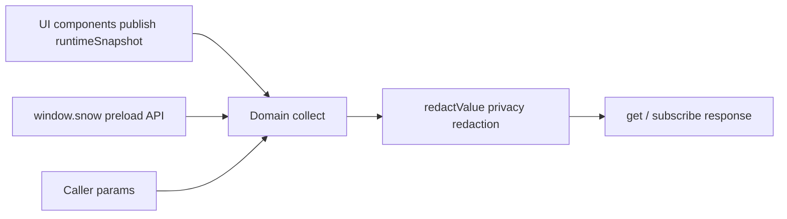

# 6-Plugin Metadata Domains

> Applies to: Snow App desktop plugins (`renderMode` is `esm` or `iframe`). This reference lists, domain by domain, the application metadata a plugin can read through `api.metadata`: domain ids, privacy declaration requirements, liveness, accepted parameters, and return shapes, plus a requirement-to-domain map. For the manifest and installation workflow see [24-Plugin development and installation](../2-guides/24-plugin-development-and-installation.md).

## 1. Scope and sources

Metadata is collected in the renderer process and has exactly three sources:

| Source           | Description                                                                                                                                                                                                |
| ---------------- | ---------------------------------------------------------------------------------------------------------------------------------------------------------------------------------------------------------- |
| Runtime snapshot | Live UI state continuously published by components into `src/renderer/plugins/runtimeSnapshot.ts` (focused conversation, streaming metrics, right panel, active project, and so on); changes can be pushed |
| Preload API      | `window.snow.*` queries that read the app database and the Rust layer, shared with the settings panels                                                                                                     |
| Call context     | The current plugin record itself (the `plugins` domain) and the caller-supplied `params`                                                                                                                   |

Metadata is a **read-only** capability: a plugin cannot write application data through `api.metadata`. Use `api.storage` for plugin-private data, or let the user change settings in the UI.



### 1.1 Call shapes

```javascript
const response = await api.metadata.get(["conversations", "memos"], {
  params: { directoryId: "local:D:/repo" },
});

const sub = api.metadata.subscribe(
  "runtime",
  (next) => render(next.domains.runtime),
  { intervalMs: 2000 },
);
sub.unsubscribe();

const list = api.metadata.domains(); // [{ id, scope, granted, live, sensitiveFields }]
```

`get` and `subscribe` deliver the same response object:

| Field         | Type     | Description                                                                                |
| ------------- | -------- | ------------------------------------------------------------------------------------------ |
| `generatedAt` | number   | Collection timestamp (epoch milliseconds)                                                  |
| `domains`     | object   | Domain id to collected value; a domain whose `collect` throws is omitted here              |
| `denied`      | object   | Domain id to `{ reason, scope }`; `reason` is currently only `privacy-declaration-missing` |
| `withheld`    | object   | Domain id to the list of stripped field paths (for example `["0.apiKey", "api.apiKey"]`)   |
| `unknown`     | string[] | Domain ids that do not exist                                                               |

`get(domain)` accepts a single domain id or an array; an empty array requests all 34 domains (undeclared sensitive domains are still denied).

The app ships the same catalog for users: **Plugins** at the bottom of the sidebar, then **Metadata catalog** in the toolbar, opens the "App metadata available to plugins" modal. It groups all 34 domains with a one-line summary, the privacy requirement, live-versus-polled behavior and accepted parameters, and offers keyword search; the per-plugin "Metadata n/34" link marks that plugin's declared (readable) and undeclared (denied) domains.

### 1.2 Parameters (`params`)

| Key                 | Default                                                      | Domains and meaning                                                                                                                        |
| ------------------- | ------------------------------------------------------------ | ------------------------------------------------------------------------------------------------------------------------------------------ |
| `projectId`         | Active project (`runtime.activeDirectory.directoryId`)       | Project and code domains; `mcp`, `lsp`, `skills`, `hooks`, `subAgents`, `permissions`, and `codebase` use it to resolve project-level data |
| `directoryId`       | Same as above                                                | `projects`, `memos`, `memory`, `git`, `ssh`, `usage`                                                                                       |
| `projectPath`       | Active project path                                          | `git` (repository path)                                                                                                                    |
| `conversationId`    | Focused conversation (`runtime.conversation.conversationId`) | `messages`, `settings.conversationModes`, `settings.conversationRuntime`                                                                   |
| `limit` / `offset`  | memory 200/0, memos 200/0, logs 200/0, usage records 100/0   | Paging for list domains                                                                                                                    |
| `page` / `pageSize` | 1 / 50                                                       | `codebase.indexedFiles`                                                                                                                    |
| `since` / `until`   | Usage: last 30 days to now; logs: empty                      | ISO timestamps                                                                                                                             |
| `profileName`       | Empty (all profiles)                                         | `usage`                                                                                                                                    |
| `level` / `module`  | Empty                                                        | `logs`                                                                                                                                     |

When a parameter is missing, mistyped, or the underlying data is unavailable, the corresponding field is `null` instead of throwing; list fields degrade to `null` in the same way.

### 1.3 Liveness and refresh

| Kind                | Push behavior                                                                         | Domains                                                                        |
| ------------------- | ------------------------------------------------------------------------------------- | ------------------------------------------------------------------------------ |
| Live (`live: true`) | Re-collected and pushed after a 200 ms debounce whenever the runtime snapshot changes | `projects`, `git`, `conversations`, `messages`, `runtime`, `panels`, `plugins` |
| Non-live            | Pushed once on subscribe; pass `intervalMs` (minimum 1000 ms) to poll                 | The other 27 domains                                                           |

The `live` flag from `api.metadata.domains()` lets a panel distinguish "realtime once subscribed" from "poll to refresh" domains.

## 2. Requirement to domain map

| UI or feature you want                                   | Domain to read                                      | Key fields                                              |
| -------------------------------------------------------- | --------------------------------------------------- | ------------------------------------------------------- |
| Conversation list, titles, pinned items, message counts  | `conversations`                                     | `items[]`, `pinned[]`, `active`                         |
| Message bodies and thinking traces of one conversation   | `messages`                                          | `items[]` (with `content`, `thinking`, `toolCallsJson`) |
| A streaming metrics bar (tokens, elapsed time, TTFT)     | `runtime`                                           | `conversation.*`, `streamingSessions[]`                 |
| The chat-input token usage ring                          | `runtime` + `conversations`                         | `chatInput.maxContextTokens`, `conversation.tokenUsage` |
| Which right-panel tabs are open                          | `panels`                                            | `tabs[]`, `activeTabId`                                 |
| Project (workspace) list, collections, relink history    | `projects`                                          | `directories[]`, `collections[]`, `relinks[]`           |
| A memo panel with pending/done counts                    | `memos`                                             | `summary`, `items[]`                                    |
| Project memory browsing and statistics                   | `memory`                                            | `stats`, `items[]`                                      |
| A scheduled task board                                   | `scheduledTasks`                                    | Task array (with `nextRunAt`, `runCount`)               |
| Usage charts                                             | `usage`                                             | `summary`, `daily[]`, `models[]`, `records`             |
| A log viewer                                             | `logs`                                              | `items[]`, `total`                                      |
| Git status, branches, team identity                      | `git`                                               | `status`, `branches[]`, `identity`                      |
| Codebase index progress and file list                    | `codebase`                                          | `indexStats`, `indexedFiles`, `resumableSessions[]`     |
| API profile and model pickers                            | `apiProfiles`                                       | Profile array (`profileName`, `advancedModel`, ...)     |
| Matching the app theme                                   | `theme`                                             | `mode`, `custom`, `fontFamily`                          |
| Reading app switches (lite, auto-format, shortcuts, ...) | `settings`                                          | See 4.1.3                                               |
| MCP servers and tools                                    | `mcp`                                               | `servers[]`, `projectServersWithTools[]`                |
| Sub-agents, Hooks, Skills, and LSP inventory             | `subAgents`, `hooks`, `skills`, `lsp`               | Their respective arrays                                 |
| Tool approvals and sensitive command rules               | `permissions`                                       | `alwaysApprovedTools[]`, `sensitiveCommands[]`          |
| Privacy filtering settings                               | `privacy`                                           | `enabled`, `mode`, `toolResults`                        |
| System prompts, custom headers, global ROLE              | `systemPrompts`, `customHeaders`, `personalization` | Record arrays or file content                           |
| App version, engine, storage locations, memory usage     | `app`                                               | `appVersion`, `engine`, `storageLocations`              |
| SSH credentials, `~/.ssh/config` hosts, remote drafts    | `ssh`                                               | `credentials[]`, `configHosts[]`, `remoteDrafts[]`      |
| Mobile remote-control pairing and tunnel state           | `remoteControl`                                     | `pairing`, `tunnel`                                     |
| Browser passwords, bookmarks, downloads, import sources  | `browser`                                           | Four arrays                                             |
| Userscript inventory                                     | `userscripts`                                       | Script array                                            |
| Image library and albums                                 | `imageLibrary`                                      | `images[]`, `albums[]`                                  |
| Desktop pets and their settings                          | `pets`                                              | `installed[]`, `settings`                               |
| Installed plugins (including this one)                   | `plugins`                                           | Plugin array                                            |
| Opening an external IDE                                  | `ide`                                               | `id`, `name`, `executable`                              |

## 3. Domain quick reference

| Domain            | Privacy declaration | Live | Main parameters                                        | Summary                                                           |
| ----------------- | ------------------- | ---- | ------------------------------------------------------ | ----------------------------------------------------------------- |
| `app`             | —                   | No   | —                                                      | Version, updates, engine, storage locations, environment          |
| `theme`           | Field-level         | No   | —                                                      | Theme mode, palettes, font, background, stream cursor             |
| `settings`        | Field-level         | No   | `conversationId`                                       | App switches, shortcuts, conversation modes, Git scan             |
| `privacy`         | `privacyConfig`     | No   | —                                                      | Privacy filter switch, mode, and API configuration                |
| `permissions`     | —                   | No   | `projectId`                                            | Approval lists, read-only tools, sensitive command rules          |
| `ide`             | —                   | No   | —                                                      | IDEs usable for "open in editor"                                  |
| `pets`            | —                   | No   | —                                                      | Installed pets and pet window settings                            |
| `plugins`         | `plugins`           | Yes  | —                                                      | Installed plugin inventory                                        |
| `apiProfiles`     | Field-level         | No   | —                                                      | API profiles (keys stripped)                                      |
| `systemPrompts`   | `systemPrompts`     | No   | —                                                      | System prompt entries                                             |
| `customHeaders`   | `customHeaders`     | No   | —                                                      | Custom request-header schemes                                     |
| `personalization` | `personalization`   | No   | —                                                      | The global ROLE rules file                                        |
| `mcp`             | Field-level         | No   | `projectId`                                            | MCP servers, tools, and project-level state                       |
| `subAgents`       | Field-level         | No   | `projectId`                                            | Sub-agent configurations                                          |
| `hooks`           | —                   | No   | `projectId`                                            | Global and project-level hooks                                    |
| `skills`          | —                   | No   | `projectId`                                            | Available Skills and project overrides                            |
| `lsp`             | —                   | No   | `projectId`                                            | LSP servers, effective config, session states                     |
| `codebase`        | —                   | No   | `projectId`, `page`, `pageSize`                        | Index scope, stats, files, resumable sessions                     |
| `conversations`   | `conversations`     | Yes  | `directoryId`                                          | Project conversation list and focused conversation                |
| `messages`        | `messages`          | Yes  | `conversationId`                                       | Messages, including thinking and tool-call JSON                   |
| `runtime`         | —                   | Yes  | —                                                      | Live runtime snapshot (conversation, streaming, panels, projects) |
| `panels`          | —                   | Yes  | —                                                      | Right-panel tab state                                             |
| `memos`           | `memos`             | No   | `directoryId`, `limit`, `offset`                       | Memo entries and counts                                           |
| `memory`          | `memory`            | No   | `directoryId`, `limit`, `offset`                       | Project memory entries and statistics                             |
| `scheduledTasks`  | Field-level         | No   | —                                                      | Scheduled task definitions and run state                          |
| `usage`           | `usage`             | No   | `since`, `until`, `profileName`, `limit`, `offset`     | Usage summary, daily/model breakdowns, and records                |
| `logs`            | `logs`              | No   | `level`, `module`, `since`, `until`, `limit`, `offset` | Paged application logs                                            |
| `projects`        | —                   | Yes  | `directoryId`                                          | Project list, collections, relinks, active project                |
| `git`             | `git`               | Yes  | `projectPath`, `projectId`                             | Repository status, branches, team identity                        |
| `ssh`             | `ssh`               | No   | `directoryId`                                          | SSH credentials, config hosts, remote drafts                      |
| `remoteControl`   | `remoteControl`     | No   | —                                                      | Mobile pairing state and tunnel status                            |
| `browser`         | `browserData`       | No   | —                                                      | Passwords, bookmarks, downloads, import sources                   |
| `userscripts`     | `userscripts`       | No   | —                                                      | Userscript inventory                                              |
| `imageLibrary`    | —                   | No   | —                                                      | Library images, albums, and root directory                        |

"Field-level" means the whole domain is readable, but values whose key name matches a sensitive field are stripped unless the matching privacy scope is declared; chapter 4 lists each domain.

## 4. Field reference by domain

Every section states the privacy requirement, liveness, parameters, and return shape. All calls fall back to `null` on failure.

### 4.1 Application and appearance

#### 4.1.1 `app`

No declaration · Not live · No parameters

| Field                                 | Type           | Description                                                                                      |
| ------------------------------------- | -------------- | ------------------------------------------------------------------------------------------------ |
| `appVersion`                          | string \| null | App version (`app:get-version`)                                                                  |
| `updateStatus`                        | object \| null | `{ available, version, downloading, progress, downloaded, error, releaseNotes, releaseNotesZh }` |
| `engine`                              | string \| null | Rust engine information string                                                                   |
| `processMemoryBytes`                  | number \| null | Resident memory of the app process in bytes                                                      |
| `storageLocations`                    | object \| null | `{ databasePath, archiveDbPath, checkpointDir, uploadDir, checkpointRoot, uploadRoot }`          |
| `pluginsDirectory`                    | string \| null | Plugin install root (`~/.snowapp/plugins`)                                                       |
| `locale`                              | string         | UI language (`en` / `zh-CN` / `zh-TW`)                                                           |
| `language` / `platform` / `userAgent` | string         | Matching `navigator` values                                                                      |
| `hardwareConcurrency`                 | number         | Logical core count                                                                               |
| `timezone`                            | string         | IANA time zone                                                                                   |
| `startedAt`                           | number         | Renderer `performance.timeOrigin`                                                                |
| `now`                                 | number         | Collection timestamp (epoch milliseconds)                                                        |

#### 4.1.2 `theme`

Field-level sensitive: `backgroundValue` to `privacyConfig` · Not live · No parameters

| Field          | Type                          | Description                                                    |
| -------------- | ----------------------------- | -------------------------------------------------------------- |
| `mode`         | `system` \| `light` \| `dark` | Theme mode                                                     |
| `presetId`     | string                        | Preset theme id                                                |
| `custom`       | object                        | `{ light: ThemePalette, dark: ThemePalette }`                  |
| `background`   | object                        | `{ enabled, imagePath, opacity, blur }`                        |
| `fontFamily`   | string                        | UI font                                                        |
| `streamCursor` | object                        | `{ iconType, lucideName, svgPath, iconSize }` streaming cursor |

`ThemePalette` keys: `bgPrimary`, `bgSecondary`, `bgTertiary`, `bgHover`, `bgActive`, `chromeBg`, `appBg`, `borderColor`, `borderLight`, `borderSubtle`, `textPrimary`, `textSecondary`, `textTertiary`, `textMuted`, `accentGreen`, `accentGreenBg`, `accentGreenText`, `accentRed`, `accentRedBg`, `accentRedText`, `accentBlue`, `accentBlueBg`, `accentBlueText`, `accentColor`, `onSolid`, `selectionBg`, `focusRing`.

#### 4.1.3 `settings`

Field-level sensitive: `proxyPassword` to `privacyConfig`, `apiKey` to `apiKeys` · Not live · Parameters: `conversationId`

| Field                 | Type            | Description                                                                                                                      |
| --------------------- | --------------- | -------------------------------------------------------------------------------------------------------------------------------- |
| `liteMode`            | boolean \| null | Lite mode (disables the Browser / App Control / Terminal built-in servers)                                                       |
| `autoFormat`          | boolean \| null | Prettier after file edits                                                                                                        |
| `yoloMode`            | boolean \| null | Confirmation-free mode (read-only mirror; cannot be changed here)                                                                |
| `requestLogging`      | object \| null  | `{ enabled: boolean, expiresAt: number }` request-body logging switch and expiry                                                 |
| `keyboardShortcuts`   | object \| null  | 12 actions to `{ key, enabled, foregroundOnly }`; `key` looks like `mod+f`                                                       |
| `conversationModes`   | object \| null  | `{ planMode, goalMode, worktreeMode, workflowMode, goalModeTokenBudget }`; `null` means the conversation follows global defaults |
| `conversationRuntime` | object \| null  | `{ thinkingStrength, responsesFastMode }` per-conversation overrides                                                             |
| `gitScan`             | object \| null  | `{ maxDepth, ignoredFolders, changeDebounceMs, remotePollIntervalMs, statusLimit, autoRefresh, confirmPullPush }`                |
| `imageLibraryDir`     | string \| null  | Image library directory (empty string means the default)                                                                         |
| `storageLocations`    | object \| null  | Same as `app.storageLocations`                                                                                                   |

#### 4.1.4 `privacy`

**Whole-domain sensitive: `privacyConfig`** · Not live · No parameters

| Field         | Type    | Description                                                                                                  |
| ------------- | ------- | ------------------------------------------------------------------------------------------------------------ |
| `enabled`     | boolean | Master switch of the privacy filter                                                                          |
| `mode`        | string  | `local` or `api`                                                                                             |
| `api`         | object  | `{ url, apiKey, model }` (`apiKey` is a global sensitive field and is stripped unless `apiKeys` is declared) |
| `toolResults` | object  | `{ tools: string[] }` fully qualified tool names routed through the filter                                   |

#### 4.1.5 `permissions`

No declaration · Not live · Parameters: `projectId`

| Field                  | Type             | Description                                                                                |
| ---------------------- | ---------------- | ------------------------------------------------------------------------------------------ |
| `alwaysApprovedTools`  | string[] \| null | Globally approved tool names (no confirmation)                                             |
| `readonlyTools`        | string[] \| null | Built-in read-only tool names                                                              |
| `projectApprovedTools` | string[] \| null | Project-level approvals (`null` without project context)                                   |
| `sensitiveCommands`    | object[] \| null | `{ id, commandId, pattern, description, enabled, isPreset, sortOrder, source, updatedAt }` |

#### 4.1.6 `ide`

No declaration · Not live · No parameters

| Field                        | Type   | Description                                       |
| ---------------------------- | ------ | ------------------------------------------------- |
| `id` / `name` / `executable` | string | IDE identifier, display name, and executable path |

The domain returns an array of IDEs, used by "open in editor" style panels.

#### 4.1.7 `pets`

No declaration · Not live · No parameters

| Field       | Type             | Description                                                                                                                  |
| ----------- | ---------------- | ---------------------------------------------------------------------------------------------------------------------------- |
| `installed` | object[] \| null | Pet manifests: `{ id, displayName, description, spritesheetFile, dirPath, spritesheetPath, source, version, columns, rows }` |
| `settings`  | object \| null   | `{ enabled, activePetId, scale }`                                                                                            |

#### 4.1.8 `plugins`

**Whole-domain sensitive: `plugins`** · Live · No parameters

Returns a read-only array of installed plugins from the renderer plugin store. Each entry:

| Field                                                                               | Type                      | Description                                                                |
| ----------------------------------------------------------------------------------- | ------------------------- | -------------------------------------------------------------------------- |
| `pluginId` / `name` / `description` / `version` / `author` / `homepage` / `license` | string / localized object | Manifest metadata (`name` and `description` are `{ default, zh-CN, ... }`) |
| `icon`                                                                              | string                    | `lucide:Name`, a relative path, or a URL                                   |
| `renderMode` / `entry`                                                              | string                    | `esm` or `iframe`; entry file relative path                                |
| `panels`                                                                            | object[]                  | `{ id, title, entry, icon, widthHint }`                                    |
| `privacy` / `privacyNote`                                                           | string[] / string         | Declared sensitive scopes and the explanation                              |
| `enabled`                                                                           | boolean                   | Whether the plugin is enabled                                              |
| `installPath` / `sourcePath`                                                        | string                    | Install directory and source directory                                     |
| `minAppVersion`                                                                     | string                    | Minimum app version (not enforced today)                                   |
| `createdAt` / `updatedAt`                                                           | string                    | Install and update timestamps                                              |

### 4.2 AI and configuration

#### 4.2.1 `apiProfiles`

Field-level sensitive: `apiKey`, `visionApiKey` to `apiKeys` · Not live · No parameters

Returns the API profile array. Key fields: `profileName`, `displayName`, `isActive`, `baseUrl`, `baseUrlMode`, `requestMethod`, `advancedModel`, `basicModel`, `supportsVision`, `visionModel`, `maxContextTokens`, `maxTokens`, `enableAutoCompress`, `autoCompressThreshold`, `systemPromptIdsJson`, `customHeaderSchemeId`, `sortOrder`, `source`, `updatedAt`.

#### 4.2.2 `systemPrompts`

**Whole-domain sensitive: `systemPrompts`** · Not live · No parameters

Returns system prompt entries: `{ promptId, name, content, isActive, sortOrder, scope, projectId, updatedAt }` where `scope` is `global` or `project`.

#### 4.2.3 `customHeaders`

**Whole-domain sensitive: `customHeaders`** · Not live · No parameters

Returns header schemes: `{ schemeId, name, headersJson, isActive, sortOrder, updatedAt }`.

#### 4.2.4 `personalization`

**Whole-domain sensitive: `personalization`** · Not live · No parameters

| Field      | Type   | Description                                               |
| ---------- | ------ | --------------------------------------------------------- |
| `filePath` | string | Absolute path of the global ROLE file (`~/.snow/ROLE.md`) |
| `content`  | string | File content (empty string when the file does not exist)  |

#### 4.2.5 `mcp`

Field-level sensitive: `env`, `headers`, `url` to `mcpSecrets` · Not live · Parameters: `projectId`

| Field                     | Type             | Description                                                                                                                                         |
| ------------------------- | ---------------- | --------------------------------------------------------------------------------------------------------------------------------------------------- |
| `servers`                 | object[] \| null | Global servers: `{ serverId, name, transportType, url, command, argsJson, envJson, headersJson, enabled, timeoutMs, sortOrder, source, updatedAt }` |
| `projectServers`          | object[] \| null | Project-level servers (`null` without a project)                                                                                                    |
| `tools`                   | object[] \| null | Global tools: `{ name, description, inputSchemaJson, enabled }`                                                                                     |
| `projectServersWithTools` | object[] \| null | Project servers with tool state: `{ id, name, source, globalEnabled, enabled, tools[], toolsPending, error }`                                       |

#### 4.2.6 `subAgents`

Field-level sensitive: `systemPrompt`, `toolsJson` to `subAgents` · Not live · Parameters: `projectId`

Returns sub-agent entries: `{ agentId, name, description, systemPrompt, toolsJson, configProfile, model, builtin, sortOrder, source, projectId, updatedAt }`.

#### 4.2.7 `hooks`

No declaration · Not live · Parameters: `projectId`

| Field     | Type             | Description                                                                                                                                                                                                                                                  |
| --------- | ---------------- | ------------------------------------------------------------------------------------------------------------------------------------------------------------------------------------------------------------------------------------------------------------ |
| `global`  | object[] \| null | Global hooks: `{ hookType, scope, projectId, rulesJson, updatedAt }`; `hookType` is one of `onUserMessage`, `beforeToolCall`, `toolConfirmation`, `afterToolCall`, `onSubAgentComplete`, `beforeCompress`, `onSessionStart`, `onStop`, `beforeSubAgentStart` |
| `project` | object[] \| null | Project-level hooks (`null` without a project)                                                                                                                                                                                                               |

#### 4.2.8 `skills`

No declaration · Not live · Parameters: `projectId`

| Field       | Type             | Description                                                                                  |
| ----------- | ---------------- | -------------------------------------------------------------------------------------------- |
| `available` | object[] \| null | Available skills: `{ id, name, description, location, source, path, allowedTools, enabled }` |
| `project`   | object[] \| null | Project skills (additionally carry `defaultEnabled`)                                         |

#### 4.2.9 `lsp`

No declaration · Not live · Parameters: `projectId`

| Field       | Type             | Description                                                                                                                                               |
| ----------- | ---------------- | --------------------------------------------------------------------------------------------------------------------------------------------------------- |
| `servers`   | object[] \| null | Global configuration: `{ lang, command, argsJson, fileExtensionsJson, installCommand, initializationOptionsJson, enabled, sortOrder, source, updatedAt }` |
| `effective` | object[] \| null | Effective configuration for the project (global and project overrides merged, same shape)                                                                 |
| `sessions`  | object[] \| null | Runtime sessions: `{ lang, projectRoot, status, restartCount, lastUsedMs, error }`; `status` is `running` / `dead` / `exited`                             |

### 4.3 Conversations, content, and runtime

#### 4.3.1 `conversations`

**Whole-domain sensitive: `conversations`** · Live · Parameters: `directoryId`

| Field         | Type             | Description                                                             |
| ------------- | ---------------- | ----------------------------------------------------------------------- |
| `directoryId` | string           | The project id actually used                                            |
| `items`       | object[] \| null | Conversation list ordered by most recent update                         |
| `pinned`      | object[] \| null | Pinned conversations                                                    |
| `active`      | object \| null   | Live state of the focused conversation (same as `runtime.conversation`) |

Conversation record fields: `conversationId`, `title`, `summary`, `lastMessagePreview`, `messageCount`, `model`, `apiProfileName`, `status`, `directoryId`, `forkedFromConversationId`, `forkMessageCount`, `conversationType`, `parentConversationId`, `subAgentId`, `subAgentName`, `subAgentStatus`, `subAgentError`, `createdAt`, `updatedAt`, `inputTokens`, `outputTokens`, `cacheCreationInputTokens`, `cacheReadInputTokens`, `totalDurationMs`, `runInputTokens`, `runOutputTokens`, `runCacheCreationInputTokens`, `runCacheReadInputTokens`, `lastRunDurationMs`, `runTtftSumMs`, `runRequestCount`, `emoji`.

#### 4.3.2 `messages`

**Whole-domain sensitive: `messages`** · Live · Parameters: `conversationId`

| Field            | Type             | Description                                                                                                                                                                                 |
| ---------------- | ---------------- | ------------------------------------------------------------------------------------------------------------------------------------------------------------------------------------------- |
| `conversationId` | string           | The conversation id actually used                                                                                                                                                           |
| `live`           | object \| null   | Live state of that conversation (same as `runtime.conversation`)                                                                                                                            |
| `items`          | object[] \| null | Messages: `{ id, role, content, thinking, thinkingDurationMs, thinkingTokenCount, status, model, responseId, checkpointId, toolCallsJson, interruptionReason, recoveryOutcome, createdAt }` |
| `userMessages`   | object[] \| null | User message summaries: `{ id, content, createdAt, isContextCompaction }`                                                                                                                   |

#### 4.3.3 `runtime`

No declaration · Live · No parameters

| Field                       | Type           | Description                                                                                                                                                                                                                                                                                                                                                                                                                                                                 |
| --------------------------- | -------------- | --------------------------------------------------------------------------------------------------------------------------------------------------------------------------------------------------------------------------------------------------------------------------------------------------------------------------------------------------------------------------------------------------------------------------------------------------------------------------- |
| `conversation`              | object \| null | Focused conversation: `{ conversationId, sessionKey, title, directoryId, isStreaming, isPaused, isAborting, messageCount, pendingMessageCount, tokenUsage, runTokenUsage, conversationTokenUsage, streamElapsedMs, streamTtftMs, streamStartedAt, runTtftMs, lastRunDurationMs, streamTokenCount, planMode, goalMode, liteMode, yoloMode, fileChangeStats, streamingConversationIds, completedConversationIds, attentionRequiredConversationIds, subAgentSessions, todos }` |
| `chatInput`                 | object \| null | Chat input data: `{ conversationId, maxContextTokens, isLoadingApiConfig }` (`conversationId` is `null` for the new-conversation input)                                                                                                                                                                                                                                                                                                                                     |
| `streamingSessions`         | object[]       | Running sessions: `{ sessionKey, conversationId, title, directoryId, isStreaming, isPaused, isAborting, messageCount, tokenCount, elapsedMs, ttftMs, runTtftMs, startedAt, lastRunDurationMs, runTokenUsage }`                                                                                                                                                                                                                                                              |
| `panels`                    | object         | Right-panel state (same as the `panels` domain)                                                                                                                                                                                                                                                                                                                                                                                                                             |
| `activeDirectory`           | object \| null | Active project record (`directoryId`, `name`, `path`, `kind`, `isActive`, `pathState`, ...)                                                                                                                                                                                                                                                                                                                                                                                 |
| `activeSessionDirectoryIds` | string[]       | Project ids that currently have running sessions                                                                                                                                                                                                                                                                                                                                                                                                                            |
| `revisions`                 | object         | `{ workspace, memories, scheduledTasks, conversationList, plugins }` change counters for detecting what just changed                                                                                                                                                                                                                                                                                                                                                        |
| `locale`                    | string         | Current UI language                                                                                                                                                                                                                                                                                                                                                                                                                                                         |

Live metric semantics: `startedAt` is the wall-clock start of the current run, so live duration is `Date.now() - startedAt` and live speed is `tokenCount / elapsedMs`, matching the streaming metrics bar in the UI.

#### 4.3.4 `panels`

No declaration · Live · No parameters

| Field                          | Type           | Description                                                                                      |
| ------------------------------ | -------------- | ------------------------------------------------------------------------------------------------ |
| `tabs`                         | object[]       | `{ id, type, title, isActive, pluginId, panelId }`; plugin panels carry `pluginId` and `panelId` |
| `activeTabId`                  | string \| null | Currently active tab                                                                             |
| `isCollapsed` / `isFullscreen` | boolean        | Panel collapse and fullscreen state                                                              |

#### 4.3.5 `memos`

**Whole-domain sensitive: `memos`** · Not live · Parameters: `directoryId`, `limit`, `offset`

| Field     | Type           | Description                                                                                                                                     |
| --------- | -------------- | ----------------------------------------------------------------------------------------------------------------------------------------------- |
| `summary` | object \| null | `{ total, pending, done }`                                                                                                                      |
| `items`   | object \| null | `{ items, total, hasMore }`; entries are `{ id, memoId, directoryId, content, status, createdAt, updatedAt }` with `status` `pending` or `done` |

#### 4.3.6 `memory`

**Whole-domain sensitive: `memory`** · Not live · Parameters: `directoryId`, `limit`, `offset`

| Field   | Type           | Description                                                                                                                                                                                                                                                         |
| ------- | -------------- | ------------------------------------------------------------------------------------------------------------------------------------------------------------------------------------------------------------------------------------------------------------------- |
| `stats` | object \| null | `{ total, active, pending, archived }`                                                                                                                                                                                                                              |
| `items` | object \| null | `{ items, total, hasMore }`; entries are `{ memoryId, kind, title, content, source, status, importance, tags, conversationId, lastRecalledAt, recallCount, createdAt, updatedAt }` with `kind` one of `fact` / `decision` / `preference` / `pitfall` / `task_state` |

#### 4.3.7 `scheduledTasks`

Field-level sensitive: `prompt`, `preScript` to `scheduledTasks` · Not live · No parameters

Returns the scheduled task array:

| Field                                                      | Type                      | Description                                                                                      |
| ---------------------------------------------------------- | ------------------------- | ------------------------------------------------------------------------------------------------ |
| `id` / `directoryId` / `name`                              | string                    | Task id, owning project (empty string means a global task), and name                             |
| `prompt`                                                   | string                    | Prompt sent to the AI Loop on fire (stripped unless `scheduledTasks` is declared)                |
| `scheduleJson`                                             | string                    | Schedule JSON: `{ type: "once" \| "recurring", executeAt?, mode?, intervalMs?, hour?, minute? }` |
| `status`                                                   | string                    | `pending` / `running` / `completed` / `error`                                                    |
| `paused`                                                   | boolean                   | Whether the task is paused                                                                       |
| `nextRunAt` / `lastRunAt` / `createdAt` / `updatedAt`      | string                    | Schedule and timestamps                                                                          |
| `runCount` / `skipCount`                                   | number                    | Executions and pre-script skips                                                                  |
| `lastError` / `lastSkipReason` / `lastSkippedAt`           | string                    | Most recent failure and skip reasons                                                             |
| `preScript` / `preScriptTimeoutMs` / `runOnScriptError`    | string / number / boolean | Pre-script configuration                                                                         |
| `apiProfile` / `basicModel` / `model` / `thinkingStrength` | string                    | Model overrides used by the fired conversation                                                   |
| `history`                                                  | object[]                  | `{ runAt, status, durationMs, error }`, at most 20 entries                                       |

#### 4.3.8 `usage`

**Whole-domain sensitive: `usage`** · Not live · Parameters: `since`, `until`, `profileName`, `conversationId`, `directoryId`, `limit`, `offset`

| Field          | Type             | Description                                                                                                                                                                                                                                                                                    |
| -------------- | ---------------- | ---------------------------------------------------------------------------------------------------------------------------------------------------------------------------------------------------------------------------------------------------------------------------------------------- |
| `profileNames` | string[] \| null | Profile names that have usage records                                                                                                                                                                                                                                                          |
| `summary`      | object \| null   | `{ totalInputTokens, totalOutputTokens, totalCacheCreationInputTokens, totalCacheReadInputTokens, totalRequests, errorRequests, totalTokens, effectiveCacheReadTokens, nonCachedInputTokens }`                                                                                                 |
| `daily`        | object[] \| null | `{ date, totalRequests, errorRequests, totalInputTokens, totalOutputTokens, totalCacheCreationInputTokens, totalCacheReadInputTokens, totalTokens }`                                                                                                                                           |
| `models`       | object[] \| null | `{ model, totalRequests, errorRequests, ...same token fields }`                                                                                                                                                                                                                                |
| `records`      | object \| null   | `{ items, total }`; entries are `{ id, conversationId, responseId, model, apiProfileName, requestMethod, inputTokens, outputTokens, cacheCreationInputTokens, cacheReadInputTokens, status, isSubAgent, directoryId, createdAt, totalTokens, effectiveCacheReadTokens, nonCachedInputTokens }` |

#### 4.3.9 `logs`

**Whole-domain sensitive: `logs`** · Not live · Parameters: `level`, `module`, `since`, `until`, `limit`, `offset`

| Field   | Type             | Description                                                                                              |
| ------- | ---------------- | -------------------------------------------------------------------------------------------------------- |
| `items` | object[] \| null | `{ id, level, module, func, line, message, input, output, duration, context, error, source, createdAt }` |
| `total` | number           | Total number of matching entries                                                                         |

### 4.4 Projects and code

#### 4.4.1 `projects`

No declaration · Live · Parameters: `directoryId`

| Field                       | Type             | Description                                                                                                                                                                                                                                         |
| --------------------------- | ---------------- | --------------------------------------------------------------------------------------------------------------------------------------------------------------------------------------------------------------------------------------------------- |
| `directories`               | object[] \| null | Projects: `{ directoryId, name, path, kind, isActive, sortOrder, source, pathState, lastKnownPath, updatedAt }`; `kind` is `local` / `ssh` and `pathState` is `ok` / `missing` / `mismatch` / `offline` / `permission_error` / `remote` / `unknown` |
| `collections`               | object[] \| null | Project collections: `{ collectionId, name, sortOrder, memberDirectoryIds, createdAt, updatedAt }`                                                                                                                                                  |
| `relinks`                   | object[] \| null | Relocation history: `{ relinkId, oldDirectoryId, newDirectoryId, oldPath, newPath, movedBy, createdAt, undoneAt }`                                                                                                                                  |
| `active`                    | object \| null   | Active project (same as `runtime.activeDirectory`)                                                                                                                                                                                                  |
| `activeSessionDirectoryIds` | string[]         | Project ids with running sessions                                                                                                                                                                                                                   |

#### 4.4.2 `git`

**Whole-domain sensitive: `git`** · Live · Parameters: `projectPath`, `projectId`

| Field      | Type             | Description                                                                                                                                                                                              |
| ---------- | ---------------- | -------------------------------------------------------------------------------------------------------------------------------------------------------------------------------------------------------- |
| `repoPath` | string           | Repository path used for the query                                                                                                                                                                       |
| `status`   | object \| null   | `{ isRepo, currentBranch, upstream, ahead, behind, files[], stagedCount, unstagedCount, untrackedCount, statusLimitHit }`; `files[]` entries are `{ path, oldPath, indexStatus, workdirStatus, status }` |
| `branches` | object[] \| null | `{ name, isCurrent, isRemote, remoteName }`                                                                                                                                                              |
| `identity` | object \| null   | Team identity: `{ isRepo, repoPath, name, email, remoteUrl, hasIdentity, error }`                                                                                                                        |

#### 4.4.3 `codebase`

No declaration · Not live · Parameters: `projectId`, `page`, `pageSize`

| Field               | Type             | Description                                                                                                                                                         |
| ------------------- | ---------------- | ------------------------------------------------------------------------------------------------------------------------------------------------------------------- |
| `projectScope`      | object \| null   | `{ projectId, enabled, enableAgentReview, enableReranking }` project-level three-state overrides                                                                    |
| `indexStats`        | object \| null   | `{ totalChunks, totalFiles, totalSizeBytes, isIndexed }`                                                                                                            |
| `indexedFiles`      | object \| null   | `{ items, total, page, pageSize }`; `items[]` are `{ relativePath, filePath, chunkCount, startLine, endLine, sizeBytes, updatedAt }`                                |
| `resumableSessions` | object[] \| null | Resumable indexing sessions: `{ sessionId, projectId, status, totalFiles, processedFiles, totalChunks, processedChunks, currentFile, error, createdAt, updatedAt }` |

### 4.5 Connections and assets

#### 4.5.1 `ssh`

**Whole-domain sensitive: `ssh`** · Not live · Parameters: `directoryId`

| Field          | Type             | Description                                                                                                                |
| -------------- | ---------------- | -------------------------------------------------------------------------------------------------------------------------- |
| `credentials`  | object[] \| null | `{ profileKey, host, port, username, authMethod, privateKeyPath, encryptedSecret }` (the secret is an encrypted reference) |
| `configHosts`  | object[] \| null | `~/.ssh/config` hosts: `{ alias, host, user, port, identityFile }`                                                         |
| `remoteDrafts` | object[] \| null | Remote drafts: `{ id, profileId, workspaceId, remotePath, baseVersionJson, content, status, updatedAt }`                   |

#### 4.5.2 `remoteControl`

**Whole-domain sensitive: `remoteControl`** · Not live · No parameters

| Field     | Type           | Description                                                                                                                                                                                                                                                                         |
| --------- | -------------- | ----------------------------------------------------------------------------------------------------------------------------------------------------------------------------------------------------------------------------------------------------------------------------------- |
| `pairing` | object \| null | `{ enabled, running, host, port, configuredPort, pairingUrls[], generation, token, tokenPinned, tokenStorageAvailable, wan }`; `wan` is `{ enabled, localPort, publicOrigin, pairingUrl, token, tokenPinned }`. **Tokens are highly sensitive**; read them only when truly required |
| `tunnel`  | object \| null | `{ config, stage, listenerPort, attempt, nextRetryAt, endpoint, error }`; `config` exposes only flags such as `hasToken` and `hasCaCertificate`                                                                                                                                     |

#### 4.5.3 `browser`

**Whole-domain sensitive: `browserData`** · Not live · No parameters

| Field           | Type             | Description                                                                                                 |
| --------------- | ---------------- | ----------------------------------------------------------------------------------------------------------- |
| `passwords`     | object[] \| null | `{ id, origin, username, createdAt, updatedAt }` (**never plaintext passwords**)                            |
| `bookmarks`     | object[] \| null | `{ id, title, url, folder, createdAt }`                                                                     |
| `downloads`     | object[] \| null | `{ id, url, filename, path, state, receivedBytes, totalBytes, startedAt, endedAt }`                         |
| `importSources` | object[] \| null | `{ id, name, profile, accountName, passwordDb, cookieDb, passwordCount, cookieCount, bookmarkCount, note }` |

#### 4.5.4 `userscripts`

**Whole-domain sensitive: `userscripts`** · Not live · No parameters

Returns scripts: `{ scriptId, name, version, description, namespace, author, enabled, runAt, noframes, grant, matches, includes, excludes, requires, filePath, createdAt, updatedAt }`.

#### 4.5.5 `imageLibrary`

No declaration · Not live · No parameters

| Field       | Type             | Description                                                                                                       |
| ----------- | ---------------- | ----------------------------------------------------------------------------------------------------------------- |
| `images`    | object[] \| null | `{ id, relativePath, fileName, mimeType, sizeBytes, width, height, prompt, model, provider, createdAt, albumId }` |
| `albums`    | object[] \| null | `{ id, name, createdAt, coverPath, imageCount }`                                                                  |
| `directory` | string \| null   | Absolute path of the image library root                                                                           |

## 5. Examples

### 5.1 Live token usage ring

```javascript
export function mount(container, api) {
  container.innerHTML = "<div class='ring'>--</div>";
  const render = (response) => {
    const runtime = response.domains.runtime;
    if (!runtime) return;
    const usage = runtime.conversation?.tokenUsage;
    const total = usage ? usage.inputTokens + usage.outputTokens : 0;
    const limit = runtime.chatInput?.isLoadingApiConfig
      ? null
      : runtime.chatInput?.maxContextTokens;
    const ratio = limit ? Math.min(total / limit, 1) : total > 0 ? 1 : 0;
    container.firstChild.textContent = limit
      ? `${Math.round(ratio * 100)}%`
      : `~${total}`;
  };
  const subscription = api.metadata.subscribe("runtime", render);
  return () => subscription.unsubscribe();
}
```

### 5.2 Project memo list (polling)

```javascript
const subscription = api.metadata.subscribe(
  "memos",
  ({ domains, denied }) => {
    if (denied.memos) {
      showDeclareHint(denied.memos.scope); // declare "memos" in plugin.json
      return;
    }
    renderList(domains.memos?.items?.items ?? []);
  },
  { intervalMs: 5000 },
);
```

### 5.3 Combining domains: conversations plus usage

```javascript
const response = await api.metadata.get(["conversations", "usage"], {
  params: { directoryId: activeProjectId, since, until, limit: 20 },
});
const rows = response.domains.conversations?.items ?? [];
const tokensByConversation = new Map(
  (response.domains.usage?.records?.items ?? []).map((record) => [
    record.conversationId,
    record.totalTokens,
  ]),
);
```

### 5.4 Git status badge (live)

```javascript
api.metadata.subscribe("git", ({ domains }) => {
  const status = domains.git?.status;
  paint(
    status?.isRepo
      ? `${status.currentBranch} ${status.ahead}/${status.behind}`
      : "—",
  );
});
```

## 6. States and errors

| Symptom                                                             | Cause and handling                                                                                                                                                                                      |
| ------------------------------------------------------------------- | ------------------------------------------------------------------------------------------------------------------------------------------------------------------------------------------------------- |
| `denied[domain] = { reason: "privacy-declaration-missing", scope }` | The domain is whole-domain sensitive; declare the scope in `plugin.json` (for example `"privacy": { "scopes": ["conversations"] }`), then reinstall or run `rescan`                                     |
| Field paths appear in `withheld[domain]`                            | A key matched a global or domain-level sensitive field name (`apiKey`, `secret`, `password`, `token`, ...) without the matching privacy scope; declare the scope only when the data is genuinely needed |
| `unknown: ["xxx"]`                                                  | Misspelled domain id; list the valid ids with `api.metadata.domains()`                                                                                                                                  |
| A field is `null`                                                   | Collection failed or the data is unavailable (no project, no configured profile, failed command); `null` is the normal fallback, so no try/catch is required                                            |
| A domain appears in neither `domains` nor `denied`                  | Its `collect` threw; retry, fall back to another domain, and log the investigation through `api.log`                                                                                                    |
| `subscribe` never pushes again                                      | Non-live domains require `intervalMs` (>= 1000); without it only the initial value is pushed                                                                                                            |

## 7. Security and compatibility

- Keep privacy declarations honest: declared scopes are shown to the user as amber tags with the manifest note in the Plugins modal, so an inflated declaration is visible to the user.
- Even with a declaration, minimize usage: read high-sensitivity values such as `remoteControl.token` or the `ssh` credential references only when required, and never persist them into plugin storage or logs.
- `browser.passwords` never contains plaintext passwords; rely on `origin` and `username` when a panel needs account context.
- The domain set is stable, but **fields inside a domain may be added over releases**: read only what you need and stay tolerant of unknown fields.
- Metadata is read-only; configuration changes stay in the UI or in the AI's `config` tool scopes.
- In `iframe` mode only `metadata`, `storage`, and `assets` are available; domain semantics match ESM, but `window.snow` is not reachable.

## Source anchors

- `src/renderer/plugins/metadata/domains.ts::METADATA_DOMAINS`: definitions, parameter resolution, and collectors for all 34 domains
- `src/renderer/plugins/metadata/index.ts::collectMetadata`, `::subscribeMetadata`, `::describeMetadataDomains`: privacy checks, field redaction, subscribe/poll plumbing
- `src/renderer/plugins/metadata/catalog.ts::METADATA_DOMAIN_CATALOG`: grouping, accepted parameters and quick-reference summaries for the 34 domains (data source of the in-app catalog)
- `src/renderer/components/sidebar/PluginMetadataModal.tsx`: the user-facing "App metadata available to plugins" modal
- `src/renderer/plugins/runtimeSnapshot.ts::RuntimeSnapshot`: live data source behind the `runtime` and `panels` domains
- `src/renderer/plugins/pluginApi.ts`: plugin-facing `api.metadata.get / subscribe / domains` wrappers
- `src/renderer/plugins/pluginIframeBridge.js`: capability allow-list of the iframe runtime
- `src/preload/types/*.ts`: authoritative return types per domain (`chat.ts`, `settings.ts`, `workspace.ts`, and others)
