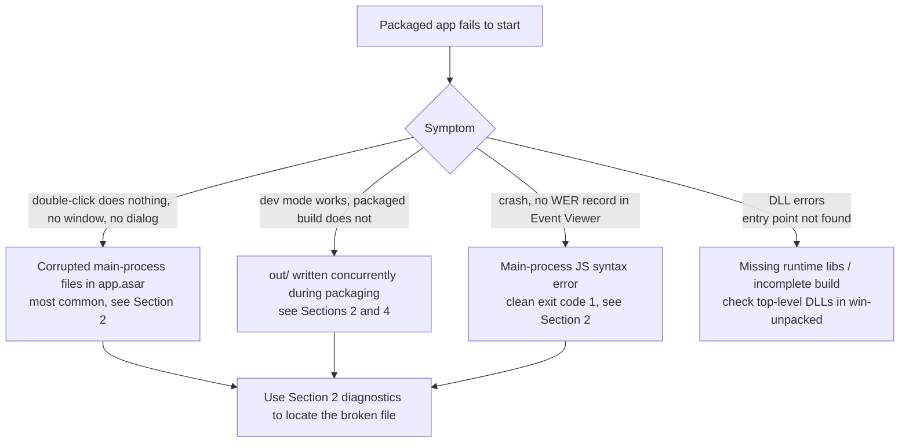

# Packaging & Installation Troubleshooting

> For contributors: how to diagnose a packaged build (NSIS / portable / win-unpacked)
> that fails to start.
> See also: [Developer guide](2-developer-guide.md), [Architecture overview](1-architecture-overview.md).

## 1. Symptom Quick Reference

| Symptom | Likely cause | Where to look |
| --- | --- | --- |
| Installed app: double-click does nothing, no window, no error dialog | Corrupted main-process file inside `app.asar` (most common) | Section 2 |
| Dev mode (`npm run dev`) works, packaged build does not | `out/` was written concurrently during packaging | Sections 2 & 4 |
| Installed app exits quickly, no WER crash record in Event Viewer | Main-process JS syntax error (graceful exit code 1) | Diagnostic commands in Section 2 |
| "Entry point not found" DLL error dialog | Missing runtime / incomplete artifact | Check top-level DLLs in `win-unpacked` |
| Packaging aborts with `gyp: buildcheck.gypi not found` (cpu-features) | An optional dependency's install step was skipped, so its gyp fragment is missing | See Section 6 |

> A failed packaged app usually leaves **no logs at all**: `snowLog` writes via the Rust
> `writeAppLog` into SQLite, but the process dies before logging initializes, so neither
> `~/.snow/log` nor the app log table has any record.
> Key signal: the process exits within seconds with code `1` (Node/Electron default exit
> code for uncaught exceptions).



## 2. Case Study: v0.1.16 packaged build would not start (2026-08-05)

### 2.1 Symptoms

- `npm run build:win` succeeded (both NSIS and portable were produced);
- After install, double-clicking `Snow App.exe`: no window, no error, process vanishes
  within seconds (exit code 1);
- `npm run dev` worked perfectly.

### 2.2 Root cause

`out/main/index.js` inside `release/win-unpacked/resources/app.asar` was **corrupted**
(truncated tail; `SyntaxError: Unexpected token '}'`). Electron fails to parse the main
process module at startup → process exits with code 1.

Cause: **`out/` was being written concurrently while packaging ran** (dev mode and the
packaging build both write `out/main/index.js`), so electron-builder packed a half-written
file into `app.asar`.

Key evidence chain:

- Read the real bytes inside the asar with `ELECTRON_RUN_AS_NODE=1` and compared the hash
  against the local `out/main/index.js` — they differed;
- `import()` of the asar's main-process file threw `SyntaxError: Unexpected token '}'`
  (the local file parsed fine);
- Swapping the 0.1.15 `app.asar` into the 0.1.16 `win-unpacked` made the app start
  normally → the problem was the asar content.

### 2.3 Fix

1. Stop all dev processes (e.g. `Get-Process electron | Stop-Process -Force` — do not kill
   the CLI's own process);
2. Delete `out/` (`Remove-Item out -Recurse -Force`);
3. Re-run `npm run build:win`;
4. Verify the new artifact starts (Section 3).

## 3. Verifying a Packaged Build Starts

### 3.1 Process liveness test (fastest)

```powershell
$p = Start-Process -FilePath "release\win-unpacked\Snow App.exe" -PassThru
Start-Sleep -Seconds 15
if (Get-Process -Id $p.Id -ErrorAction SilentlyContinue) { "ALIVE" } else { "DEAD" }
Stop-Process -Id $p.Id -Force -ErrorAction SilentlyContinue
```

A healthy app shows ~4 `Snow App` processes (main + renderer + GPU + utility), and files
under `%APPDATA%\snow-app` (e.g. `Local Storage`, `Preferences`) get updated.

### 3.2 Main-process file integrity (locate the corrupted file)

```powershell
$env:ELECTRON_RUN_AS_NODE = "1"
& "node_modules\electron\dist\electron.exe" -e "const fs=require('fs'),c=require('crypto');
  const a='release/win-unpacked/resources/app.asar';
  const b=fs.readFileSync(a+'/out/main/index.js');
  const l=fs.readFileSync('out/main/index.js');
  console.log('asar:', c.createHash('md5').update(b).digest('hex'), b.length);
  console.log('local:', c.createHash('md5').update(l).digest('hex'), l.length);
  console.log('identical:', b.equals(l));"
```

- `identical: false` with equal sizes → the asar file is corrupted or was read while
  being written;
- Go further: `import()` the asar's file from a temp dir containing
  `{"type":"module"}` `package.json` to validate syntax.

### 3.3 Exit code

```powershell
node -e "const {spawn}=require('child_process');
  const p=spawn('release/win-unpacked/Snow App.exe',['--version'],{stdio:['ignore','pipe','pipe']});
  p.on('exit',c=>console.log('exit',c))"
```

`--version` should print `v37.x.x` and exit 0; exit 1 with no output means the main
process failed during module loading.

## 4. Prevention

1. **Always stop dev mode before packaging**: `npm run dev` and `npm run build:win` must
   not run at the same time — both write `out/`, and concurrent writes can corrupt the
   main-process bundle;
2. Clean `out/` before packaging (`Remove-Item out -Recurse -Force`) so the artifact comes
   from this build only;
3. Note that packaging may include uncommitted changes — `git log -1 --format="%ci"`
   shows when the current commit was made;
4. Run the startup check in Section 3 before releasing.
5. If packaging fails on cpu-features / `buildcheck.gypi`, generate the gyp fragment first (Section 6); `build.npmRebuild: false` is a fallback switch that must be re-evaluated when adding nan/V8-ABI native dependencies.

## 5. Diagnostic Tool Caveats

- **Do not rely on `@electron/asar`'s `extractAll` / `extractFile` for integrity checks**:
  for some files (especially top-level files and unpacked entries) it reads wrong offsets
  or stubs, which is misleading;
- `getRawHeader`'s `offset` values are **relative** (relative to the data region), so
  reading raw bytes by offset also yields wrong content;
- Reliable way: `ELECTRON_RUN_AS_NODE=1 electron.exe -e "require('fs').readFileSync('app.asar/<path>')"`
  (Electron's `fs` natively supports asar paths and returns the exact bytes the app loads).

## 6. Case Study: Packaging Aborted by a Failed Native Rebuild (2026-09-15)

### 6.1 Symptoms

`npm run build:win` aborts during the electron-builder phase and `release/` stays empty:

```
• executing @electron/rebuild  electronVersion=37.10.3 arch=x64
• preparing       moduleName=cpu-features arch=x64
⨯ gyp: buildcheck.gypi not found (cwd: node_modules/cpu-features) while reading
  includes of deps\cpu_features\cpu_features.gyp
⨯ node-gyp failed to rebuild 'node_modules/cpu-features'
```

### 6.2 Root cause

`cpu-features` (an optional acceleration dependency of `ssh2`, built with `nan`/V8 ABI, so
it must be rebuilt for Electron) generates its gyp fragment during install:

```
"install": "node buildcheck.js > buildcheck.gypi && node-gyp rebuild"
```

When that step is skipped (npm ignores a failed optional-dependency install, or the
install was interrupted), `buildcheck.gypi` is missing — it is **not part of the published
npm package** (verify with `npm pack buildcheck@0.0.2`), so reinstalling `buildcheck`
never restores it.

### 6.3 Fix

```bash
# 1) Generate the gyp fragment (idempotent)
cd node_modules/cpu-features && node buildcheck.js > buildcheck.gypi

# 2) Package again (requires VS C++ toolchain + Python; @electron/rebuild rebuilds
#    cpu-features and node-pty)
cd ../.. && npm run build:win
```

If the machine genuinely cannot compile native modules (e.g. no VS Build Tools C++
workload), rely on the fallback switch `package.json` → `build.npmRebuild: false`,
which skips `@electron/rebuild`. Impact assessment: `node-pty` is N-API based and ships
`prebuilds/win32-x64` (no rebuild needed); when `cpu-features` is missing or not rebuilt,
`ssh2` falls back to pure JS (performance only). **Note**: when adding other nan/V8-ABI
native dependencies, re-evaluate this switch and restore rebuilding.

### 6.4 Verification

- Packaging logs show `finished moduleName=cpu-features arch=x64` and
  `completed installing native dependencies`;
- Or verify the artifact per Section 3 (the asar main-process file matches the local one,
  and the native binding lives in `app.asar.unpacked/native/`).
