# Agent Runtime and Tool Orchestration

> This document describes the actual runtime boundary from model request through tool-result feedback. The key rule is: **the main agent loop runs in Renderer; provider streaming, MCP execution, and persistence run in Rust.**

## 1. Component View

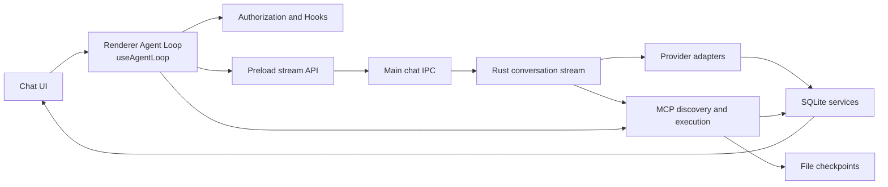

Responsibility boundaries:

- `useAgentLoop.ts` owns the per-conversation loop, stream state, tool rounds, pause/abort, and queued input.
- Preload and `chatHandlers.ts` provide only `streamId`-isolated stream transport.
- Rust provider adapters own request formats, stream parsing, and persistence of each model exchange.
- `mcp/tools.rs` owns discovery, mandatory policy, routing, privacy masking, and checkpoint integration.

### 1.1 Master Agent Lifecycle Architecture

From user input dispatch in UI to final persistence and convergence, the macro lifecycle of the Agent Loop progresses across 5 distinct phases:

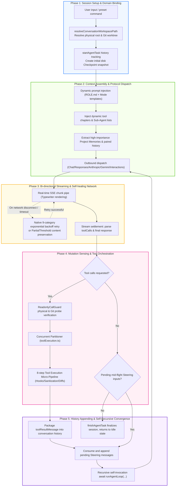

### 1.2 Session Initialization and Git Worktree Isolation Flow

To ensure parallel conversations across different branches or isolated worktrees operate without disk write collisions, session execution domains enforce strict transaction locks and path resolution:

```mermaid
sequenceDiagram
    autonumber
    actor User as User (UI)
    participant Selector as WorktreeSessionSelector
    participant RustWT as native worktrees.rs
    participant DB as SQLite (conversations)
    participant Loop as useAgentLoop

    User->>Selector: Switch session binding to isolated worktree (worktreeId)
    Selector->>RustWT: git:worktrees:set-conversation
    Note over RustWT: Uses with_write_lock & with_write_retry to prevent database locked
    RustWT->>DB: Atomically persist binding

    User->>Loop: Submit message
    Loop->>Loop: resolveConversationWorkspacePath()
    Note over Loop: Resolves relative paths to physical worktree root (e.g. /modules/tasks)
    Loop->>Loop: Injects executionWorkspaceRoot into request contract, anchoring tools & checkpoints
```

## 2. Model Adapter Layer

The unified entry `native/src/api/conversation/stream.rs::create_response_stream` dispatches five streaming protocols by `request_method`:

| request_method | Adapter directory              | Protocol & Endpoint             | Key Capabilities                                                                                           |
| -------------- | ------------------------------ | ------------------------------- | ---------------------------------------------------------------------------------------------------------- |
| `chat`         | `native/src/api/chat/`         | OpenAI Chat Completions         | Multi-turn conversation, function calls, typewriter streaming                                              |
| `responses`    | `native/src/api/responses/`    | OpenAI Responses API            | Responses protocol, Fast Mode override, multimodal & reasoning                                             |
| `anthropic`    | `native/src/api/anthropic/`    | Anthropic Messages API          | Claude 3.x/3.7 series, adaptive thinking blocks, tool use                                                  |
| `gemini`       | `native/src/api/gemini/`       | Google Gemini (GenerateContent) | Native Gemini protocol, system instructions, function calls                                                |
| `interactions` | `native/src/api/interactions/` | Google Interactions API         | Next-gen Google Interactions protocol (`alt=sse`), server-side search tool separation, paired tool history |

Adapters share responsibility for provider payloads, normalized-message conversion, SSE or equivalent stream parsing, text/thinking/tool-call/usage accumulation, and `store_chat_exchange`. Tool definitions are generated by `tools_as_openai_chat_json`, `tools_as_openai_responses_json`, `tools_as_anthropic_json`, `tools_as_gemini_json`, and `tools_as_interactions_json`; cross-protocol tool-history conversion is centralized in `api/conversation/tool_messages.rs`. All protocol streams share unified exponential-backoff retries and partial-text recovery via `api/retry.rs`.

API profile resolution prefers an explicit request profile, then the persisted conversation binding, then the globally active profile. A sub-agent always resolves its configured profile and has main-conversation-only Plan/Goal Mode forcibly disabled.

### 2.1 Dynamic Context Assembly and System Prompt Injection Pipeline

Before dispatching each model stream request, the native Rust layer (`native/src/api/conversation/context.rs`) dynamically constructs and validates multimodal context according to session mode, tool availability, project memory, and conversation history:

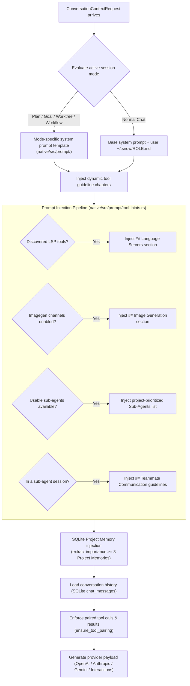

## 3. Streaming Event Protocol

1. Renderer calls `window.snow.createResponseStream(request, onChunk, onStreamId)`.
2. `apiConfigApi.ts` synchronously creates a `streamId`, registers a `chat:create-response:chunk` listener, then invokes Main.
3. `chatHandlers.ts` validates parameters and calls `native.createResponseStream`.
4. Main receives Rust callbacks and uses `safeSend` to emit `{ streamId, chunk }`.
5. Preload forwards only chunks matching the current `streamId`.
6. `createStreamChunkHandler` updates text, thinking, tool execution IDs, and stream metrics; the invoke Promise returns the final `ResponsesApiResult`.

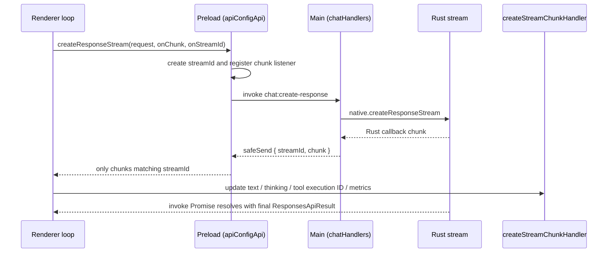

This chain is unrelated to `src/main/app/sessionProxy.ts`, which configures Electron network proxies. Rust-side outbound requests (including the provider adapters on this chain) apply the same proxy configuration centrally in `api/http_client.rs`.

### 3.1 Transport Retry and Partial Content Recovery

Snow App integrates a resilient streaming retry engine at the native Rust layer (`native/src/api/retry.rs`), defending against upstream provider hiccups, network drops, and idle timeouts:

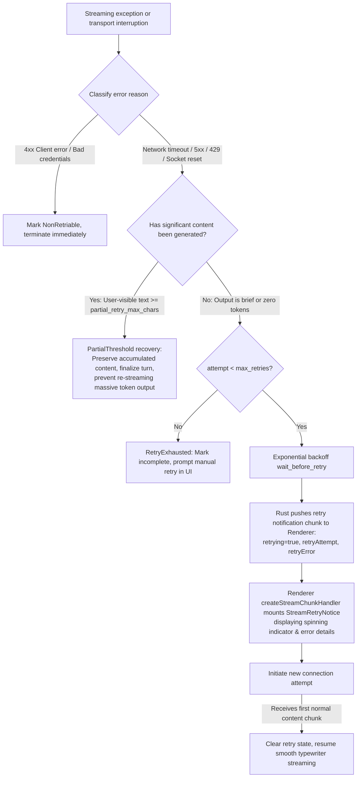

1. **Retry Configuration Parameters** (derived from `api_configs` profiles):
   - `max_retries`: Maximum automated retry attempts per stream request (default 3).
   - `retry_base_delay_ms`: Base exponential backoff delay (default 1000ms), backing off by $base \times 2^{(attempt-1)}$.
   - `stream_idle_timeout_sec`: Streaming idle watchdog (default 60s; if the upstream provider ceases sending data chunks for this duration, `idle_timeout` triggers and invokes retry).
   - `partial_retry_max_chars`: Mid-stream partial preservation threshold (default 1000 characters).
2. **Error Classification Matrix (`DEFAULT_RETRY_CATEGORIES`)**:
   - Covers 9 categories: `network` (connection reset/refused, DNS failure), `serverError` (500/502/503/504), `rateLimit` (429), `overloaded` (529), `idleTimeout` (stream idle stall), `stream` (unexpected EOF, truncated chunk), `nonSse`, `unavailable`, and `terminated`.
   - Explicitly rejects retrying unrecoverable 4xx errors (e.g., invalid API key, malformed request) to avoid futile loops.
3. **Mid-stream Partial Threshold Protection (`StreamRecoveryOutcome::PartialThreshold`)**:
   - If an in-flight stream disconnects after emitting substantial content, and **user-visible content reaches `partial_retry_max_chars`**, Snow App preserves the generated partial text as the final turn response rather than restarting from zero. This protects against double billing and runaway context expansion on long outputs.
4. **Renderer UI Retry Awareness (`StreamRetryNotice`)**:
   - When Rust enters a retry attempt, it dispatches `{ retrying: true, retryAttempt: N, retryError: string }` chunks;
   - `createStreamChunkHandler` flags the message as `isRetrying` and renders the `StreamRetryNotice` component (with spinner, attempt counter, and collapsible error details);
   - Once the new connection streams its first payload chunk, the retry banner smoothly disappears and normal typing resumes.
5. **Terminal Disposition and Cancellation**:
   - The `empty_response` / `retry_exhausted` terminal is only attached when the provider finished normally (`status=completed`) with zero payload; `cancelled` (user stop) and `failed` (explicit provider failure) pass through unchanged, with `status` carrying the meaning (the same rule as the cancelled exemption in `classify_final_stream_warning`).
   - `src/renderer/components/mainContent/chatMessages/utils/responseDisposition.ts` is the single disposition entry point for both live responses and reloaded rows: `error` / `failed` take the error branch, `cancelled` settles silently, `incomplete` / `length` / `max_tokens` show the interruption notice, and unknown values with zero payload fall back to incomplete (never a silent blank bubble).
   - Cancellation settlement is idempotent (`utils/messageSettlement.ts::settleInterruptedMessages`): the stop button, cascading sub-agent / workflow-node aborts and the agent loop's cancellation branches share one implementation, so a message never stays stuck in "sending" / "retrying".

## 4. Renderer Main Loop

Each conversation has independent session state, `runId`, `streamId`, AbortController, pause state, and queued input, so switching conversations does not stop background runs.

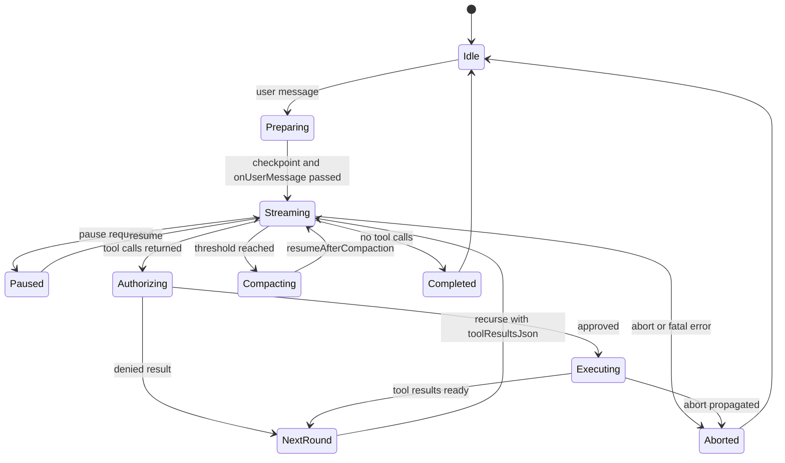

### 4.1 Core Invocation Chain and Execution Sequence

The Agent Loop is located at `src/renderer/components/mainContent/chatMessages/hooks/useAgentLoop.ts`, structured as an event-driven, self-recursing state machine (`runAgentLoop`).

```mermaid
sequenceDiagram
    autonumber
    actor User as User (UI)
    participant Loop as useAgentLoop (Renderer)
    participant Guard as ReadonlyCallGuard
    participant IPC as Electron IPC (Preload/Main)
    participant Native as Rust Runtime
    participant Model as LLM Provider
    participant MCP as MCP Tool Runtime

    User->>Loop: handleSendMessage(message, options)
    Note over Loop: 1. Initialize session, file checkpoint, and TaskHistory
    Loop->>Loop: Launch initial recursion runAgentLoop()

    loop Recursive Agent Loop Iterations
        Loop->>IPC: window.snow.createResponseStream()
        IPC->>Native: native.createResponseStreamWithContext()
        Native->>Model: Outbound streaming request (SSE / HTTP stream)

        par Real-time streaming chunks
            Model-->>Native: Text / thinking / tool call chunks
            Native-->>IPC: chat:stream:chunk
            IPC-->>Loop: createStreamChunkHandler() updates UI state
        end

        Model-->>Native: Stream finished
        Native-->>Loop: Promise resolve (full response & toolCalls)

        alt Branch A: Model returns final content (no tool calls)
            Loop->>Loop: Check pending mid-flight inputs via consumeSteering()
            alt Steering inputs pending
                Loop->>Loop: Append user steering message, recurse runAgentLoop()
            else No steering
                Note over Loop: finishAgentTask(), exit loop, return to Idle
            end

        else Branch B: Model invokes tools (toolCalls.length > 0)
            Loop->>Guard: await readonlyGuard.filterToolCalls()
            Note over Guard: Actively inspects physical file fingerprints & Git status!<br/>Allows call if modified; deduplicates only when fully unchanged

            Loop->>Loop: requestToolAuthorizations() (YOLO / user prompt)
            Loop->>MCP: toolExecutor() executes tools
            MCP-->>Loop: Structured tool results

            Loop->>Guard: await readonlyGuard.recordToolExecutions()
            Note over Guard: Capture physical/Git snapshots; invalidate read cache on mutating calls

            Loop->>Loop: Format toolResultMessage and append to session history
            Loop->>Loop: Allocate next Assistant placeholder message
            Note over Loop: Self-recurse: await runAgentLoop(nextAssistantId, ...)
        end
    end
```

The execution flow comprises 7 key stages:

1. **Input Preparation (`handleSendMessage`)**: Validates text, parses tags, binds workspace root and worktree/branch, creates initial file checkpoint, and begins task history (`startAgentTask`).
2. **Environment & Stream Dispatch (`runAgentLoop`)**: Checks `isRunCancelled`, connects to `pauseController` for interactive pauses, and sends outbound request via `createResponseStream`.
3. **Bi-directional Streaming**: Rust parses SSE chunks per provider, IPC routes chunks by `streamId`, and `createStreamChunkHandler` renders streaming text and reasoning.
4. **Response Disposition & Steering**: Resolves final response. If no tools are called, checks `consumeSteering` for pending mid-flight messages; if none, concludes the run.
5. **Readonly Guard & Mutation Sensing (`ReadonlyCallGuard`)**: Prevents unbounded repetitive read loops while eliminating false positives through physical and Git status inspection (see Section 4.2).
6. **Tool Authorization & Execution**: Evaluates permissions (YOLO mode / user approval dialog) and executes MCP tools, terminals, or sub-agents.
7. **History Appending & Self-Recursion**: Formats `role: "tool"` messages and recurses into `runAgentLoop` with `toolResultsJson` until convergence.

### 4.2 Readonly Call Guard and Mutation Perception Algorithm

#### 4.2.1 Motivation

LLMs executing multi-step tasks can occasionally hallucinate or enter repetitive read loops with identical arguments (e.g., repeatedly reading the same unchanged file).
However, a rigid tool-name whitelist or call-history check fails whenever external factors (external editor edits, Git checkouts, sub-agent modifications, or compiler outputs) change files on disk without explicit parent tool calls, causing false positive `DUPLICATE_READONLY_TOOL_CALL` errors and abrupt stream terminations.

Snow App addresses this via **`ReadonlyCallGuard` (`readonlyCallGuard.ts`)**, providing adaptive mutation perception:

#### 4.2.2 Dual-layer Inspection Mechanism

When an identical read-only call is detected, the guard actively checks environmental state:

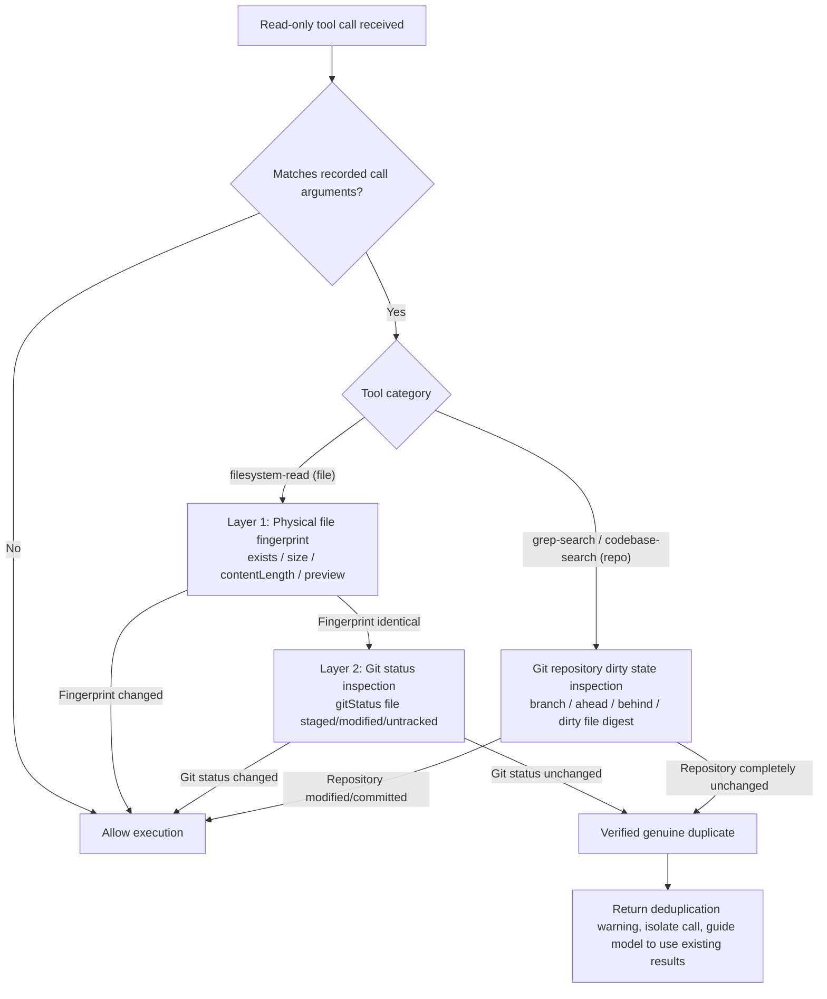

1. **Physical File Inspection (`captureFileSnapshot`)**:
   - Inspects file existence, byte `size`, character `contentLength`, and content prefix `preview`;
   - Any difference between current state and snapshot immediately invalidates the cached read and allows execution.
2. **Git Repository Status Inspection (`captureGitSnapshot`)**:
   - Locates Git repository via `window.snow.teamResolveRepo` and queries `window.snow.gitStatus`;
   - For file reads: verifies whether the specific file is modified, staged, or untracked in Git;
   - For search tools (`grep-search`, `codebase-search`): verifies overall repository dirty digest and commit/branch changes.
3. **Broadened Mutating Tools**:
   - Expands `mayMutateWorkspace` beyond basic file writes to include `terminal-send`, `terminal-open`, `sub-agents-activate`, `sub-agents-continue`, `lsp-rename`, `workflow-generate`, and external MCP write tools.
4. **Resilient Recovery Protocol**:
   - In duplicate recovery rounds (`disableTools: true`), provides a graceful text fallback if the model produces no text, eliminating abrupt stream cutoffs.

### 4.3 Mid-flight Steering

When users send additional messages while the agent is streaming or executing tools, the main loop does not abort the in-progress run. Instead, inputs are queued as **Steering items (`takePendingSteering`)**:

1. After the current tool execution turn settles, `consumeSteering` extracts pending inputs;
2. Appends user instructions to `nextMessages`;
3. Passes them into the next recursive `runAgentLoop` invocation, allowing the agent to adapt dynamically to user guidance without losing prior tool results.

```mermaid
sequenceDiagram
    autonumber
    actor User as User (UI)
    participant Input as ChatInput
    participant Loop as useAgentLoop
    participant Tools as ToolExecutor
    participant DB as SQLite Storage

    Note over Loop,Tools: Agent executing long-running tools or commands...
    User->>Input: Submit steering correction (e.g. "Don't edit file A, edit B instead")
    Input->>Loop: Queue in pendingSteering (does not abort in-flight process)

    Tools-->>Loop: Turn tools complete, generate toolResultMessage

    Loop->>Loop: consumeSteering(effectiveKey)
    Note over Loop: Extract steering inputs, append as role: "user" right after tool results

    alt Needs further recursion
        Loop->>Loop: Allocate next Assistant placeholder card
        Loop->>Loop: await runAgentLoop(nextAssistantId, nextMessages)
        Note over Loop: Model perceives both previous tool results and fresh user corrections!
    else Reached final answer (model produces text without tool calls)
        Loop->>DB: store_chat_exchange (atomically save assistant message & token usage)
        Loop->>DB: finishAgentTask (finalize task changes and metrics)
        Loop->>User: Render completed state, return input box to ready
    end
```

### 4.4 Agent Business-level Retries and Self-Healing

Beyond transport-level network and timeout retries, the Agent Loop supports three tiers of business-level self-healing:

1. **Continuable Authorization Rejection (`rejectionKeepsAiFlow`)**:
   - When a user rejects a sensitive tool execution but provides feedback, or when security policies block sensitive commands;
   - The refusal reasoning is embedded as a `role: "tool"` response. The loop continues, enabling the model to adapt its strategy and choose an approved path.
2. **Duplicate-only Recovery Turn**:
   - When a batch consists entirely of unchanged read-only duplicates, the system issues a request with `disableTools: true` and an `internalRecoveryPrompt`, instructing the model to summarize existing findings rather than repeating calls.
3. **Sub-agent and Workflow Execution Recovery**:
   - Sub-agent or workflow node failures return structured `{ success: false, error }` summaries rather than crashing the primary session, allowing the parent agent to formulate alternative approaches.

### 4.5 Parallel Tool Orchestration and Execution Pipeline

When the model returns multiple concurrent tool calls within a single round, the renderer-side tool executor (`src/renderer/components/mainContent/chatMessages/hooks/toolExecution.ts`) routes them through a concurrent partitioner and per-tool lifecycle pipeline:

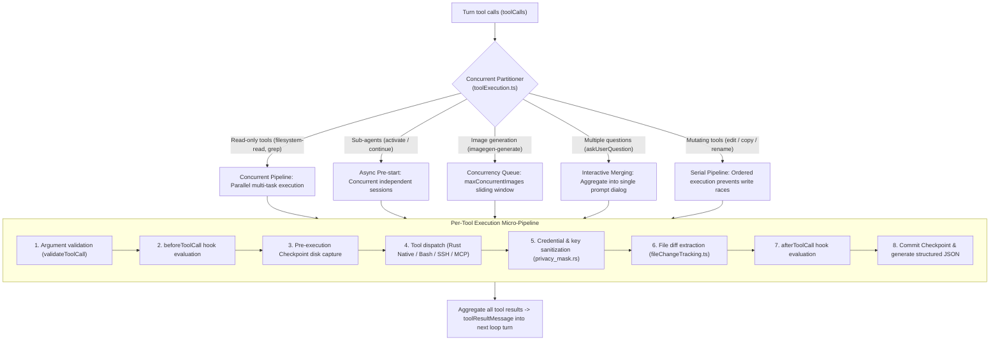

A round streams the model, parses `toolCallsJson`, creates an executor from the authorization result, executes tools, builds structured `toolResultsJson`, and recurses into the next round. It stops when no tool call remains or first consumes queued user input. A local file checkpoint is created before the loop; `onUserMessage` runs before the first round and `onStop` runs during final cleanup.

## 5. Tool Discovery

`collect_all_mcp_tools` filters and merges tools in this order:

1. Resolve global and project scope.
2. Expose codebase tools only when a project exists, codebase is enabled, and vector chunks exist.
3. Expose imagegen only when at least one channel is enabled.
4. Read 14 built-in services in fixed order; Plan approval appears only in Plan Mode requests.
5. Apply global and project server/tool enable states (global disable wins); terminal is disabled by default and requires explicit project enablement.
6. Inject the Skills tool dynamically.
7. Discover external stdio/HTTP MCP tools in parallel; one server failure is logged without failing all discovery.

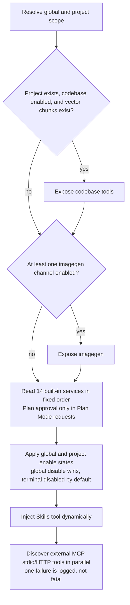

Sub-agents use `collect_allowed_mcp_tools`. Their `tools_json` must be a string array; only built-in sub-agents may use `*`. Missing or globally/project-disabled tools are rejected rather than silently expanding authority. External MCP supports `server/discover` with a legacy initialize fallback.

**Tool-domain system-prompt injection**: beyond tool visibility, system-prompt construction (`native/src/api/conversation/context.rs`) dynamically appends per-domain guidance sections, with **injection conditions kept consistent with tool visibility** — a disabled domain is never injected, so the prompt never steers the model toward invisible tools:

- **`## Language Servers`**: all five providers collect final `allowed_tools` first, then reuse that same list for `ConversationContextRequest` and payload serialization. `native/src/mcp/servers/lsp/prompt_context.rs::ToolSnapshot` renders each actual name after global/project switches, capabilities and sub-agent whitelist filtering; it neither uses four representative tools as a domain gate nor independently rediscovers tools. Grep descriptions are generated after the final list is formed; result hints intersect call-time scope/allowed-tools. Available does not mean running, and running does not mean index-ready. Prompts promise neither completed prewarming, instantaneous responses nor diagnostics equivalent to a successful build.
- **`## Image Generation`** (imagegen domain, `build_system_prompt_section` in `native/src/mcp/servers/imagegen/mod.rs`): injected when at least one usable image-generation channel is configured and the domain scope allows it. It lists the usable channels (id / name / protocol, non-sensitive summary) and mandates that multiple images MUST be produced by parallel `imagegen-generate` calls (one call per image; legacy `prompts` / `n>1` are NOT the multi-image path); ≥2 consecutive parallel calls are merged into a single `ImageGenGallery` grid by the UI.
- **Investigation-phase tool list**: `native/src/prompt/tool_hints.rs` reads that same request-local snapshot to replace `__ANALYSIS_TOOLS_LINES__` in Plan / Goal / WorkFlow templates. LSP, codebase, grep, filesystem-read and CodeLens are checked individually; disabled baseline tools disappear and empty tools produce an empty list. Keep CodeLens for uncovered languages/extensions/operations and incomplete scans; forwarding still respects the sub-agent whitelist.
- The LSP section is appended to the prompt tail with stable ordering to avoid unnecessary prefix changes. Tool-collection failure preserves the request's tool-less result rather than re-querying and expanding authority. Main and sub-agent requests share pure routing generation without a cross-session visibility cache.

Document synchronization and result trust form a separate LSP boundary: `ensure_open` compares actual disk text and synchronizes didOpen/didChange; diagnostics no longer read/write persistent result caches (old data is not deleted). Workspace searches may use `workspaceRoot` to name an explicit absolute local directory. Complete candidates and metadata such as `partial_symbol_search` constrain automatic addressing; UI partial/warnings and running badges must not be interpreted as complete verification. See [current LSP behavior and pending acceptance matrix](7-lsp-external-language-server-design.md).

### 5.1 LSP conditional MUST and execution boundaries

Semantic tasks **MUST** use LSP when the corresponding tool is visible and supports the target language/operation. Explain disabled, unauthorized, uncovered, backed-off or unhealthy cases and use visible fallbacks. Evaluate language coverage, negotiated capabilities and health per tool; a global language union or running process is not proof of every capability. Failed startup enters backoff instead of repeated spawn during cooldown; grep remains for literal search. The 11 semantic labels and both i18n key families match the [tool reference](../3-reference/2-builtin-tools-reference.md), preserving IDs and historical keys.

Diagnostics use a `filePaths` array (1..30); other read-only batch tools also use arrays: symbols `filePaths` (1..10), hover/goto `items` (1..10 each), and references `items` (1..5). Even one target must use an array; single-target fields are not compatible. Reject missing/invalid arrays, empty arrays/paths and oversized batches; deduplicate physical paths while preserving order. Report each file/target status and aggregate batch status/summary; ambiguous, partial or failed results are not complete. Read-only batch concurrency is capped at 3.

Rename apply consumes a content-bound `previewId` (5-minute TTL, at most 32 per session, single-use) and still needs write authorization; changed contents require another preview. The UI does not display raw capabilities or apply automatically. Multi-file application is not transactional: retain `appliedFiles/error/requiresNewPreview` for the model and UI, never claim rollback. Read-only batches are capped at concurrency 3 and preserve input order. Rust LSP module tests verified the batch contract; live language-server runtime acceptance was outside this validation scope. See [LSP design §0.6–0.8](7-lsp-external-language-server-design.md).

## 6. Tool Calls and Checkpoints

`call_mcp_tool` sanitizes polluted names, validates Plan special tools, blocks writes before Plan approval, checks global and project enable state, checks the sub-agent allowlist, resolves local/SSH workspace context, anchors local relative paths to the project root, augments pre-tool checkpoint capture, routes by tool type, privacy-masks output, and updates the post-tool checkpoint.

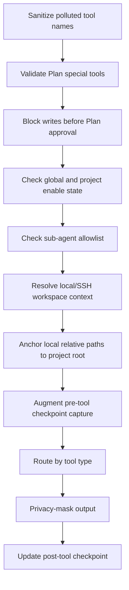

Routes include bash, grep, remote filesystem, browser, user interaction, app control, terminal, imagegen, external MCP, and ordinary built-ins. Cancellable remote execution returns an execution ID through a `tool_execution` chunk. Checkpoint capture lets parent and sub-agent file changes share one preview and restoration boundary.

## 7. Authorization and Mandatory Policy

Renderer `useToolAuthorization.ts` composes these policies:

- YOLO Mode can auto-approve ordinary tools.
- The global `permissions.alwaysApprovedTools` (`~/.snow/permissions.json`) is merged with project-level approvals into the no-confirmation list; choosing “always allow” persists a project approval. The Project tool permissions panel can add/remove project-level approvals and shows the global list read-only.
- Bash checks sensitive-command patterns first; sensitive commands cannot be bypassed by “approve all.”
- Interactive bash relies on the interactive terminal UI and does not show a duplicate sensitive-command dialog.
- The `toolConfirmation` Hook may approve or deny before ordinary user confirmation.
- Pending confirmations suspend on a Promise until the user decides.

Rust is the second boundary: `bash.rs` verifies short-lived one-use authorization tokens for sensitive commands, while `call_mcp_tool` enforces Plan Mode and sub-agent allowed-tools. Frontend convenience policy never replaces backend enforcement.

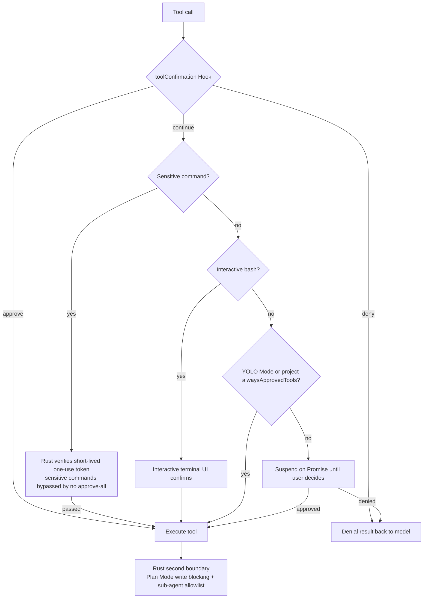

## 8. Hooks

Supported Hook types are `onUserMessage`, `beforeToolCall`, `toolConfirmation`, `afterToolCall`, `onSubAgentComplete`, `beforeSubAgentStart`, `beforeCompress`, `onSessionStart`, and `onStop`.

Command Hook exit code 0 passes and can inject stdout as Hook Context; 1 is a soft warning and specific decision JSON may open a user-decision UI; 2 or greater aborts. Blocking outcomes are normalized by `hookOutcome.ts`; fire-and-forget Hooks such as `onStop` never block final cleanup.

The tool lifecycle is:

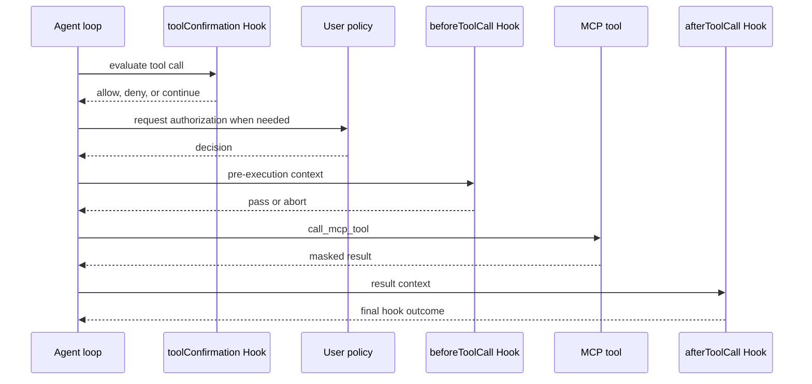

Parallel image generation and parallel sub-agents have batch-specific handling. Their Hook lifecycle remains, but invocation must not be assumed universally serial.

## 9. Sub-agents

After the model calls `sub-agents-activate`, Renderer runs `beforeSubAgentStart`, creates an independent conversation/session, and persists `running`. The sub-agent loads its own system prompt, `tools_json`, and API profile and streams in an independent Renderer loop.

While building the main session's system prompt, Snow queries `sub_agent_configs` and **dynamically injects the available sub-agent list** (with `agentId`, name, and purpose) together with a selection rule — the main agent picks the best-matching `agentId` instead of defaulting to the built-in `agent_general`. The list resolves like activation: **project-scoped sub-agents of the current project (`directory_id`) take priority** and override the global one on the same `agentId`; sub-agents of other projects are not injected.

A sub-agent inherits parent checkpoint IDs so its file changes remain inside the parent's rollback boundary. Rust also enforces allowed-tools and blocks writes while the parent Plan is unapproved. A sub-agent cannot call or grant Plan approval. Completion persists `completed` or `failed`, runs `onSubAgentComplete`, and makes the conversation read-only; later queued input is forwarded to the parent. Parent abort propagates to active sub-agents, and startup cancels stale `running` sessions.

Activation runs in parallel with the main agent (pre-started by the Renderer) and returns a structured JSON tool result when it ends; the main agent never auto-retries — the model decides the next step from the result. Normal completion returns `{success: true, conversationId, agentName, summary}` (`onSubAgentComplete` may append context on pass, append a warning on warn, or replace the summary on abort). An API stream failure returns the failure content as the final output and marks the message as error. An exception returns `{success: false, error}`, persists the session as `failed`, broadcasts the failure event, and forwards messages the user queued inside the sub-conversation to the parent. A user interrupt returns "Sub-agent interrupted by user". An unapproved parent Plan stops the sub-agent immediately and returns control to the main loop. There is no global sub-agent timeout (only per-tool timeouts); stopping the main agent recursively cancels the whole descendant tree via `childSubAgentIds` (aborting streams, rejecting pending authorizations, killing bash child processes), and app startup cleans up stale `running` sessions.

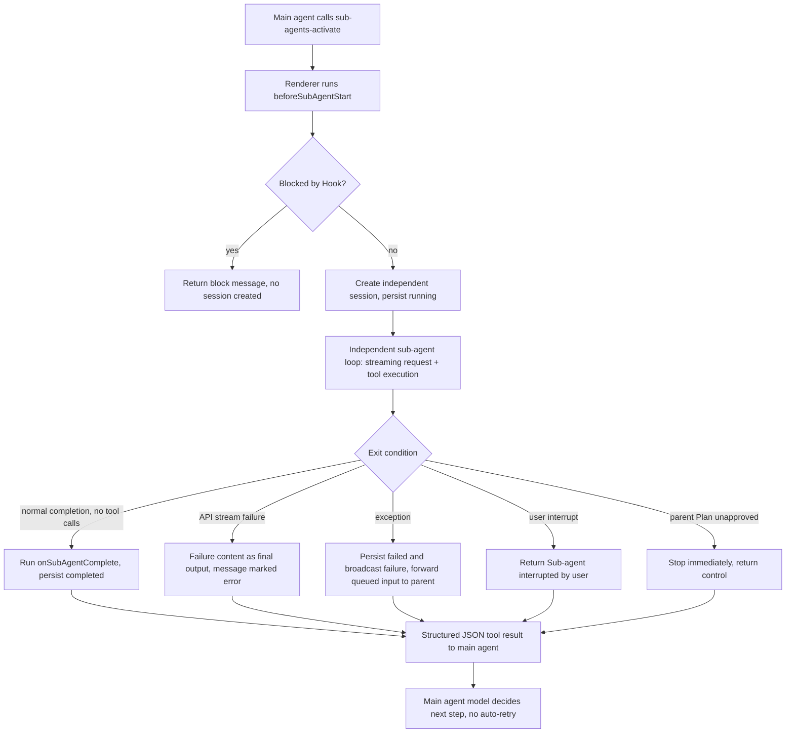

## 10. Context Compaction

Compaction is manual or automatic when total tokens reach `autoCompressThreshold`:

1. A local workspace attempts a temporary checkpoint; SSH skips local file checkpoints.
2. Run `beforeCompress`.
3. Stream a request with `contextCompaction: true` and `checkpointId`; compaction exposes no tools.
4. Rust generates a handoff from the complete valid context and persists a `status = 'context_compaction'` boundary with real usage and checkpoint ID.
5. Renderer reloads database messages; automatic compaction resumes the original loop with `resumeAfterCompaction`.
6. Failure deletes the temporary checkpoint.

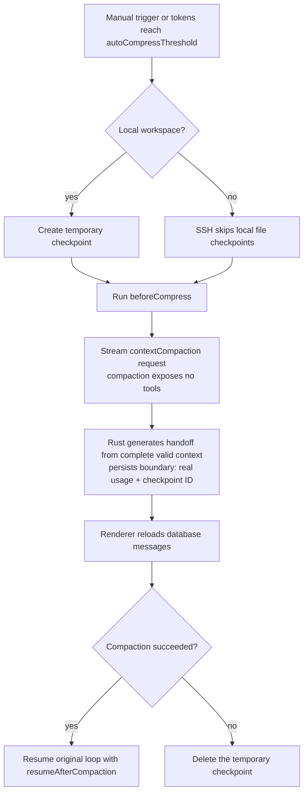

## 11. Rollback

`useRollback.ts` aborts the current stream, cancels summary generation, computes the checkpoint diff and TODOs to remove, and shows a preview. After confirmation it waits for stream and summary Promises to finish, avoiding races with SQLite write transactions. The user may truncate conversation only or also call `restoreCheckpoint` for files.

Rolling back the first message may delete the conversation; other cases call `truncateConversation` and clean obsolete checkpoints. A `context_compaction` boundary must be truncated using that boundary's own `responseId`, not misclassified as a first message.

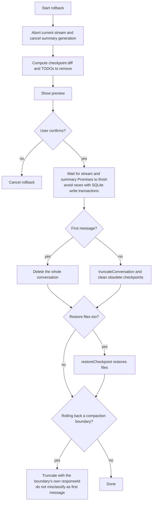

## 12. Persistence

At the end of a model stream, each provider adapter calls `store_chat_exchange` with the user message, assistant content, thinking, `tool_calls_json`, response/checkpoint IDs, token usage, and compaction state. Renderer then executes tools. The next round carries `toolResultsJson` in a tool-role message, which is persisted with the next model exchange. `usage_records` accounts for successful, failed, and compaction requests.

## 13. End-to-End Sequence

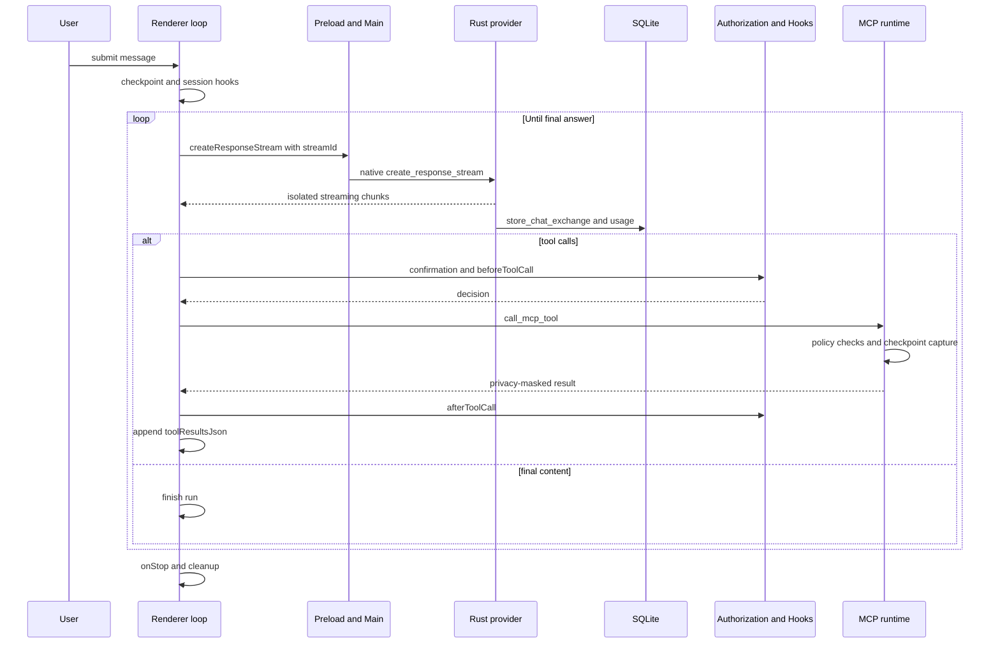

## 14. State Invariants

- Chunks must be filtered by `streamId`; listeners are removed after completion or abort.
- A conversation accepts updates only from its current `runId`; an old Promise must not overwrite a newer run.
- Sub-agent authority cannot exceed explicit allowed-tools and project enablement.
- Before Plan approval, Renderer UX and Rust write blocking must both hold.
- The model exchange is persisted first; tool results enter the next round as structured tool-role history.
- Rollback waits for asynchronous work that may still write to the database.

## 15. Source Anchors

| Topic                            | Files                                                                                                             |
| -------------------------------- | ----------------------------------------------------------------------------------------------------------------- |
| Main loop and stream state       | `src/renderer/components/mainContent/chatMessages/hooks/useAgentLoop.ts`, `agentLoopHelpers.ts`                   |
| Tool execution and authorization | `toolExecution.ts`, `useToolAuthorization.ts`                                                                     |
| Hooks                            | `hooks/hookOutcome.ts`, `useToolAuthorization.ts`, `native/src/hooks/`                                            |
| Sub-agents                       | `hooks/subAgentActivation.ts`, `native/src/api/conversation/sub_agent.rs`, `native/src/mcp/servers/sub_agents.rs` |
| Compaction and rollback          | `hooks/useCompaction.ts`, `hooks/useRollback.ts`, `native/src/exports/checkpoint.rs`                              |
| Stream IPC                       | `src/preload/modules/apiConfigApi.ts`, `src/main/ipc/handlers/chatHandlers.ts`, `src/main/utils/safeSend.ts`      |
| Provider dispatch                | `native/src/api/conversation/stream.rs`, `tool_messages.rs`                                                       |
| MCP discovery and call           | `native/src/mcp/builtin.rs`, `native/src/mcp/tools.rs`, `native/src/mcp/external/`                                |
| Conversation and usage storage   | `native/src/storage/services/chat_conversations.rs`, `usage_records.rs`                                           |
