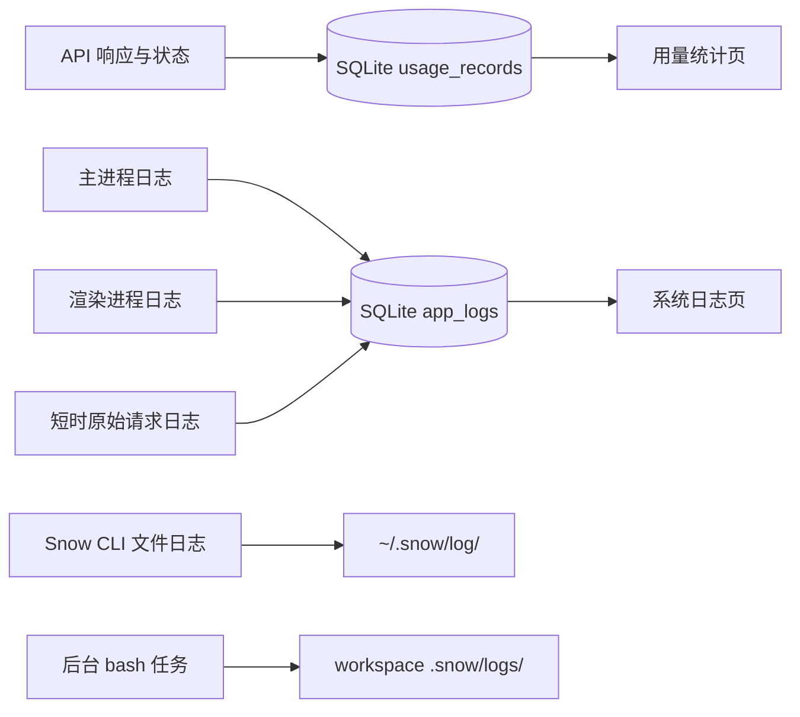

# 20-用量统计与系统日志

> 本指南说明「用量统计」（设置页 id：`usage-settings`）与「系统日志」（`system-logs`）设置页的实际统计口径、三个相互独立的日志源、数据生命周期和排障安全边界。

## 数据流总览

`usage_records` 和 Snow App 的 `app_logs` 都保存在 Snow App 数据目录 `~/.snowapp/snowapp.db`（SQLite）中。请注意目录归属：`~/.snowapp/` 是 Snow App 的应用数据目录，`~/.snow/` 是 Snow CLI 的用户配置/日志目录；`~/.snow/log/` 中的文件日志不是 Snow App 的 SQLite 系统日志。`<workspace>/.snow/logs/` 是工作区内的后台任务输出，也不是应用日志。三者的清理操作互不影响。

## 用量统计

### 记录内容

每次落账记录可包含：

- conversation 与 response 标识；
- model、API profile/config 和请求方法；
- input、output、cache creation、cache read token；
- status；
- 是否来自子代理；
- directory/project；
- 本地时间 `created_at`。

数据保存在 SQLite 表 `usage_records`。底层列表 API 支持 conversation 和 directory 可选过滤，但当前设置页面的明细表没有使用这些筛选参数。

### 统计口径

页面使用以下口径：

- 总 token = input token + output token；
- cache read 是 input 的子集，不会再次加到总 token；
- 有效 cache read = cache read 与 input 中的较小值；
- 非缓存 input = input − 有效 cache read；
- 错误请求只统计 `status = 'error'` 的记录。

这些规则避免上游返回异常 cache 数值时出现负数或重复计数。

### 日期筛选的实际范围

日期按本地日边界构造：起始日 `00:00:00`，结束日 `23:59:59`。预设包括今天、昨天、近 7 天、近 30 天、本月、上月和自定义。

> **重要：日期筛选并不会统一过滤页面中的所有区域。**

| 页面区域         | 实际范围                                                               |
| ---------------- | ---------------------------------------------------------------------- |
| 顶部汇总卡片     | 受当前日期范围影响                                                     |
| 每日热力图       | 固定请求约一年范围，不随顶部日期筛选变化                               |
| “用量记录”明细表 | 当前请求所有记录，每页 20 条；未传日期、conversation 或 directory 筛选 |

因此，汇总卡片的数量与明细表当前页不能直接一一对应。

## SQLite 系统日志

### 浏览与筛选

「系统日志」页面读取 SQLite 表 `app_logs`，每页 50 条。页面可按日期以及 `DEBUG`、`INFO`、`WARN`、`ERROR` 或全部级别筛选。底层 API 支持 module 筛选，但当前 UI 没有 module 输入框。

日志字段可包括：`level`、`module`、`func`、`line`、`message`、`input`、`output`、`duration`、`context`、`error`、`source` 和 `created_at`。日志来自 main 与 renderer；renderer 经 IPC 写入时，`source` 被强制标记为 `renderer`。详情字段支持复制。

### 清空行为

清空按钮采用两步确认：第一次点击进入确认状态，必须在 3 秒内再次点击才会执行。底层执行 `DELETE FROM app_logs`。

> **警告：清空会删除整个 `app_logs` 表中的日志，不只是当前日期、级别或页面显示的筛选结果。**

## 原始 API 请求日志

开启请求日志后，完整原始 API 请求 JSON 会写入 `app_logs`，记录形式为：

- level：`DEBUG`；
- module：`api_request`；
- func：provider；
- message：endpoint；
- input：完整 payload JSON。

payload 可能包含系统提示词、用户内容、工具输入、文件片段和其他敏感数据，因此 UI 会在开启前再次确认。

### 自动关闭

- 默认开启时长为 5 分钟；
- 预设为 1、5、10、15、30 分钟；
- 滑块范围为 1–30 分钟；
- 开启时先保存过期时间，再打开开关；
- UI 每秒更新倒计时并在到期时关闭；
- Rust 写入路径也会检查过期时间，即使日志页面已关闭，到期后仍会停止写入并复位开关。

开关和 expiry 都保存在 SQLite `system_settings`。建议仅在普通日志不足时短时开启，复现一次后立即关闭，并清理不再需要的敏感日志。

## Snow CLI 文件日志：`~/.snow/log/`

`~/.snow/log/` 属于 **Snow CLI**，不是 Snow App 数据目录。Snow App 内的 `config` 日志 scope 已移除，不会读取或删除此目录。Snow CLI 文件日志仅供 CLI 自身排障；在 Snow App 中诊断应用/会话错误，请使用设置 → 系统日志，或调用只读内置工具 `config-logs-read` 查询 `~/.snowapp/snowapp.db` 的 `app_logs` 表。

## Snow App 内置日志工具：`config-logs-read`

该工具只读查询 Snow App SQLite `app_logs`，支持 `level`、`module`、时间范围和分页（最多 100 条/页）；可选字符串过滤参数为空或仅空白时等同未提供。返回的 `items`、`total`、`hasMore` 始终由运行时限定为调用它的当前会话，覆盖模型传入的 `conversationId`。额外的 `systemSummary` 提供相同级别/模块/时间筛选条件下的应用级计数（不受分页影响）：`total`、`withoutConversationId`、固定的 `bySource.main/renderer` 与 `byLevel.DEBUG/INFO/WARN/ERROR`。摘要不输出其他会话或未关联记录的标识、正文、context/error、路径、请求/响应体。没有 conversationId 的记录也可能是新写入的应用级日志，并非必然为旧记录；它们只参与计数，不进入详情。因此当前会话 `total=0` 不表示系统没有日志，请对照 `systemSummary.total`。

当前会话 API 日志会返回限长的 `requestBody` / `responseBody`；采集时对敏感字段名和当前 API Key 脱敏，且从不记录请求头。响应体是规范化后的 provider 结果，不是逐字节原始流。当前会话 context/error 仍可能包含路径或用户信息，分享前需脱敏。

如需查看系统日志 UI 中的完整条目，请到设置 → 系统日志查看。AI 工具只返回当前会话的脱敏、截断请求/响应体。请求日志可能记录用户内容与提示词，默认开启 5 分钟、最长 30 分钟，到期自动关闭；仅在排障时短时开启，复现后及时关闭。

## 后台任务日志：`<workspace>/.snow/logs/`

bash 工具以 `detach:true` 启动后台任务时，stdout/stderr 写入 `<workspace>/.snow/logs/<name>-<timestamp>.log`。它既不属于 `app_logs`，也不属于 `~/.snow/log/`。

停止任务不会自动等于删除日志文件。诊断和清理时必须先确认工作区及具体文件，避免把另一个项目的后台输出当成应用日志。

## 推荐诊断流程

1. 记录问题发生时间、项目、API profile、模型和复现步骤。
2. 在用量页确认请求是否落账、状态是否为 error、token 是否异常。
3. 牢记日期筛选只影响顶部汇总，不会过滤热力图和当前明细表。
4. 在系统日志页按当天和 `ERROR` / `WARN` 过滤；也可调用 `config-logs-read` 按时间、级别、模块筛选。工具自动注入当前 `conversationId`，并可读取 API 日志中的脱敏/截断请求体与响应体。
5. 展开 `module`、`func`、`context`、`error` 等字段；复制前检查秘密。
6. 仅在普通日志不足时，短时开启原始请求日志。
7. 复现一次后立即关闭请求日志。
8. `~/.snow/log/` 是 Snow CLI 的文件日志目录，不是 Snow App 日志；Snow App 内没有读取它的 config scope。
9. 若问题来自后台命令，再检查当前工作区的 `<workspace>/.snow/logs/`。

## 分享前脱敏

分享日志、截图或数据库前，至少移除：

- API key、Authorization、Cookie 与自定义请求头；
- 系统提示词、ROLE 内容、用户消息和工具输入；
- 文件内容片段、私人图片信息；
- 用户名、主目录、工作区路径和内网地址；
- 可关联 conversation、response、project 或 profile 的标识符。

不要把“仅在本机存储”等同于“可以安全公开”。数据库备份和原始请求日志都应按敏感数据处理。

## 生命周期与删除边界

| 数据源            | 存储位置                  | 生命周期                                                           | 删除边界                                       |
| ----------------- | ------------------------- | ------------------------------------------------------------------ | ---------------------------------------------- |
| 用量记录          | SQLite `usage_records`    | 源码未定义自动保留期；持续保留，直到数据库迁移、恢复或未来显式清理 | 当前用量页没有清空入口                         |
| 系统与请求日志    | SQLite `app_logs`         | 源码未定义自动轮换；持续增长，直到用户清空或数据库被替换           | UI 清空删除整表日志；筛选条件不限制删除范围    |
| 请求日志开关      | SQLite `system_settings`  | 到 expiry 自动关闭并复位                                           | 关闭开关不会自动删除已写入的 payload           |
| Snow CLI 文件日志 | `~/.snow/log/`            | 独立 CLI 文件；Snow App 不读取/删除，无 App 统一自动保留期         | 由 Snow CLI 管理                               |
| 后台任务日志      | `<workspace>/.snow/logs/` | 随工作区文件保留                                                   | 不受系统日志 UI 影响；工作区文件由用户自行管理 |

完整备份和存储边界参见[数据存储位置参考](../3-参考手册/4-数据存储位置.md)。
