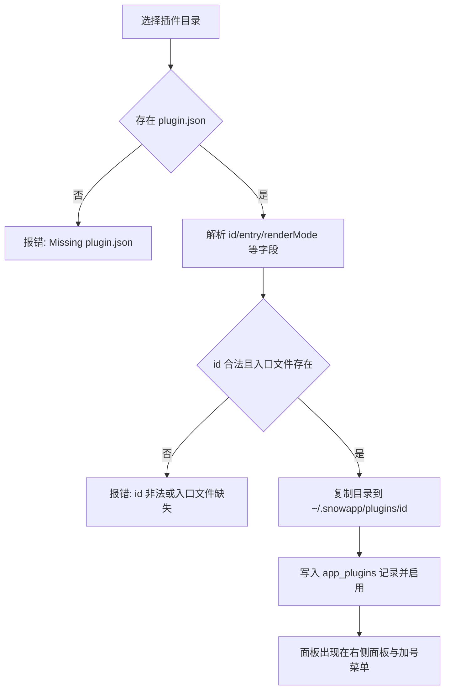

# 24-插件开发与安装（Plugins）

> 适用：Snow App 桌面端（Windows / macOS / Linux）。插件是**本地目录形式**的扩展包，为右侧面板提供自定义标签页；本文同时覆盖「安装与卸载」和「自己写一个插件」。

## 目标

- 从本地目录安装插件，并在右侧面板打开它提供的面板；
- 会写 `plugin.json` 清单与入口模块，能读取元数据、保存设置、声明隐私域；
- 让 AI 通过 `config` 工具的 `plugins` 域**自动完成安装、启停、重载与卸载**，不必打开设置界面。

## 前置条件

- 插件目录必须包含 `plugin.json` 与清单里声明的入口文件（`entry`，默认 `index.js`），入口文件缺失会直接安装失败。
- 插件以**本地代码**运行：`renderMode: "esm"` 的入口在主窗口渲染进程里作为 ES 模块执行，拥有与页面相同的 DOM 与网络能力；`renderMode: "iframe"` 的入口在独立沙箱文档中运行，只能通过桥访问受限 API。请只安装可信来源的插件。
- 安装时目录总大小上限 **128 MB**，并会跳过 `.git` 与 `node_modules`。
- 单个文本文件读取上限 8 MB，单个二进制资源上限 16 MB。

## 入口

侧边栏底部的 **插件** 按钮（带已安装数量角标）打开插件管理弹窗（设置页之外，无独立设置页 id）。弹窗工具栏提供 **从目录安装** 与 **刷新** 两个动作；每行显示插件的版本、作者与渲染模式，声明了隐私数据域的插件会用琥珀色标签逐个列出所申请的数据（文案跟随界面语言，如「API 密钥」「会话消息」），并在下方展示清单里的 `note` 说明。弹窗只做管理，打开面板请用顶栏加号菜单的「插件」分组或右侧面板的插件入口。

## 操作步骤

### 1. 安装插件

1. 点击 **从目录安装**，在系统目录选择框里选中插件目录（包含 `plugin.json` 的那一层）。
2. 后端读取并校验清单，把目录复制到 `~/.snowapp/plugins/<pluginId>/`（Windows 为 `C:\Users\<用户名>\.snowapp\plugins\<pluginId>\`），写入应用数据库并**默认启用**。
3. 同名插件（`id` 相同）重复安装是**原地替换**：目录被新内容覆盖，已保存的启用状态保留。



### 2. 管理已安装插件

列表每行显示名称、版本、作者、渲染模式与安装路径，并提供：

- **启用开关**：立即生效；禁用后其面板不再出现在加号菜单，已打开的面板会提示「插件已禁用」。
- **重新读取清单**：手工修改过安装目录里的 `plugin.json` 后用它重新解析（清单 `id` 与记录不一致会报错）。
- **在文件夹中显示**：定位到 `installPath`。
- **卸载**：二次确认后删除数据库记录并**删除插件目录**（不可恢复）。

### 3. 打开插件面板

插件在 `panels` 里声明的每个面板都会出现在顶栏 **加号菜单** 的「插件」分组与右侧面板标签体系中；点击即以右侧面板标签打开，多个面板可同时打开。面板标题按当前界面语言从 `panels[].title` 解析。

### 4. 编写一个插件

最小目录结构：

```text
my-plugin/
  plugin.json
  index.js
  locales/
    zh-CN.json
  style.css
```

`plugin.json` 示例：

```json
{
  "id": "com.example.hello",
  "name": { "default": "Hello", "zh-CN": "你好" },
  "description": { "default": "Demo panel", "zh-CN": "示例面板" },
  "version": "1.0.0",
  "author": "You",
  "license": "MIT",
  "icon": "lucide:Sparkles",
  "renderMode": "esm",
  "entry": "index.js",
  "panels": [
    {
      "id": "main",
      "title": { "default": "Hello", "zh-CN": "你好" },
      "icon": "lucide:Sparkles"
    }
  ],
  "locales": { "zh-CN": "locales/zh-CN.json" },
  "styles": ["style.css"],
  "privacy": {
    "scopes": ["apiKeys"],
    "note": "只读取 API 档案用于展示模型列表。"
  }
}
```

字段说明（均为解析后的实际语义）：

| 字段                              | 类型               | 必填 | 默认值         | 约束与说明                                                                                                                       |
| --------------------------------- | ------------------ | ---- | -------------- | -------------------------------------------------------------------------------------------------------------------------------- |
| `id`                              | 字符串             | 是   | —              | 仅字母、数字、`.`、`-`、`_`，最长 96 字符，不能以 `.` 开头；同时是安装目录名与数据库主键                                         |
| `name`                            | 字符串或本地化对象 | 否   | `id`           | 对象键支持 `default`、`zh-CN`、`zh-TW`、`en`，其余键原样保留                                                                     |
| `description`                     | 字符串或本地化对象 | 否   | `name.default` | 同上                                                                                                                             |
| `version`                         | 字符串             | 否   | `1.0.0`        | 仅展示                                                                                                                           |
| `author` / `homepage` / `license` | 字符串             | 否   | 空             | 仅展示                                                                                                                           |
| `icon`                            | 字符串             | 否   | 空             | `lucide:IconName` 用内置图标；其它值按插件目录内**相对路径**读取为图片；`http(s):` 与 `data:` 前缀不作为资源解析                 |
| `renderMode`                      | `esm` 或 `iframe`  | 否   | `esm`          | 大小写不敏感，非法值回退 `esm`                                                                                                   |
| `entry`                           | 字符串             | 否   | `index.js`     | 相对插件目录的路径，**必须存在**，否则安装失败                                                                                   |
| `panels`                          | 数组               | 否   | `[]`           | 每项 `id` 必填；`title`（也接受 `name`）缺省为 `id`；`entry` 缺省沿用顶层 `entry`；`icon` 缺省沿用插件图标；`widthHint` 原样透传 |
| `locales`                         | 对象               | 否   | `{}`           | 语言标签到语言包文件相对路径的映射                                                                                               |
| `styles`                          | 字符串数组         | 否   | `[]`           | CSS 文件相对路径，面板挂载时注入、卸载时移除                                                                                     |
| `privacy`                         | 数组或对象         | 否   | `[]`           | 数组形式为敏感域列表；对象形式取 `scopes`（也接受 `domains`）与 `note`；也接受 `permissions` 作为键名                            |
| `privacyNote`                     | 字符串             | 否   | 空             | 只有 `privacy` 用对象形式时的 `note` 会被读取并展示                                                                              |
| `minAppVersion`                   | 字符串             | 否   | 空             | 当前仅记录与展示，**不做版本拦截**                                                                                               |

### 5. 写入口模块（`renderMode: "esm"`）

入口会被当作 ES 模块动态导入，可任选一种导出方式：

```javascript
// 方式一：默认导出 React 组件（注入 props: api / locale / panelId / panel / pluginId / isActive）
export default function Panel({ api, isActive }) {
  const { React } = window.SnowAppPlugin;
  const [count, setCount] = React.useState(0);
  return React.createElement(
    "button",
    { onClick: () => setCount(count + 1) },
    api.t("clicked", {
      defaultValue: "已点击 {{count}} 次",
      values: { count },
    }),
  );
}

// 方式二：导出 mount(container, api)，返回清理函数或 { unmount }
export function mount(container, api) {
  container.textContent = api.name;
  return () => {
    container.replaceChildren();
  };
}
```

挂载前宿主会注入全局对象 `window.SnowAppPlugin`：

| 成员                      | 说明                                                   |
| ------------------------- | ------------------------------------------------------ |
| `React` / `createElement` | 宿主 React 实例，避免插件自带副本                      |
| `icons`                   | lucide 图标命名空间（也可用 `api.ui.icon(name)`）      |
| `api`                     | 与 `mount(container, api)` 收到的同一个运行时 API 对象 |
| `locale`                  | 当前界面语言（`en` / `zh-CN` / `zh-TW`）               |
| `plugin`                  | `{ id, version, installPath }`                         |

`renderMode: "iframe"` 时不注入上述全局对象，入口在沙箱文档中通过 `window.SnowPlugin` 访问桥接 API，字段为 `runtime: "iframe"`、`plugin: {id, name, version}`、`locale`、`t`、`metadata`、`storage`、`assets`、`on`、`log`，语义与下表一致（iframe 只能请求 `metadata`、`storage`、`assets` 三类能力）。

### 6. 运行时 API

| API                                                                      | 说明                                                                                                                                        |
| ------------------------------------------------------------------------ | ------------------------------------------------------------------------------------------------------------------------------------------- |
| `api.id` / `api.version` / `api.name` / `api.installPath` / `api.locale` | 插件标识与当前语言                                                                                                                          |
| `api.t(key, { defaultValue, values })`                                   | 语言包取词，`key` 缺失时回退 `defaultValue` 或键名；`{{name}}` 按 `values` 插值                                                             |
| `api.metadata.get(domain \| domain[], { params })`                       | 采集元数据域，返回 `{ generatedAt, domains, denied, withheld, unknown }`                                                                    |
| `api.metadata.subscribe(domain, listener, { params, intervalMs })`       | 订阅：`live` 域随运行时快照变化（200 ms 防抖）推送，其余域按 `intervalMs`（最小 1000 ms）轮询；不传间隔只推一次初值；返回 `{ unsubscribe }` |
| `api.metadata.domains()`                                                 | 列出域清单与授权状态：`{ id, scope, granted, live, sensitiveFields }`                                                                       |
| `api.storage.get / set / remove / all`                                   | 插件私有持久化（应用数据库 `app_plugin_values` 表），值为字符串                                                                             |
| `api.storage.getJson / setJson`                                          | 上述接口的 JSON 便捷封装                                                                                                                    |
| `api.assets.resolve(relativePath)`                                       | 按相对路径读取插件目录内的图片等资源，返回 data URL；失败返回 `null`                                                                        |
| `api.ui.React` / `api.ui.icon(name)`                                     | 与 `window.SnowAppPlugin.React` / 图标查找等价                                                                                              |
| `api.log(...args)`                                                       | 带 `[plugin:<id>]` 前缀的日志                                                                                                               |

`params` 常用键：`projectId`、`projectPath`、`directoryId`、`conversationId`（缺省取当前激活项目/会话），以及各域自己的分页与过滤参数。

`runtime` 域是实时数据源：`conversation` 是焦点会话的完整快照，含 `conversationId`、`sessionKey`、`title`、`directoryId`、`isStreaming`、`isPaused`、`isAborting`、`streamTokenCount`、`streamElapsedMs`、`streamTtftMs`、`streamStartedAt`、`runTtftMs`、`lastRunDurationMs`、`streamingConversationIds` 等；`streamingSessions` 列出所有正在运行的会话（含新会话槽位），每项含 `sessionKey`、`conversationId`、`title`、`directoryId`、`isStreaming`、`isPaused`、`isAborting`、`messageCount`、`tokenCount`、`elapsedMs`、`ttftMs`、`runTtftMs`、`startedAt`、`lastRunDurationMs`、`runTokenUsage`。`startedAt` 是本轮 run 的墙钟起点，实时墙钟时长按 `Date.now() - startedAt` 计算，实时速度按 `tokenCount / elapsedMs` 计算，与输入框上方的流式指标条同源。`chatInput` 是输入区的实时数据（由输入区在挂载期间发布，输入区未挂载时保留最后一次发布值）：`conversationId` 是输入区当前绑定的会话（null = 新会话输入区），`maxContextTokens` 是会话生效 API 档案的上下文窗口上限，`isLoadingApiConfig` 是 API 配置加载态。配合 `conversation.tokenUsage`（Rust 已归一化，cache read 是 input 的子集）即可复刻输入框右侧的 Token 用量环：`total = inputTokens + outputTokens`，占比按 `min(total / maxContextTokens, 1)` 计算（`maxContextTokens` 为空时退回以 total 为分母的满环口径），`isLoadingApiConfig` 为 `true` 时按占位环处理，避免把加载中的配置误判为满容量。

### 7. 可读取的元数据域与隐私声明

未在 `privacy` 中声明的**整域敏感域**在 `denied` 中返回 `{ reason: "privacy-declaration-missing", scope }`，`domains` 里不会出现该域。可用域共 34 个：**每个域的可用参数、返回字段与典型用途见 [插件元数据域参考](../3-参考手册/6-插件元数据域参考.md)**；下表先给出声明要求总览：

| 域                                                                                                                                                                                                   | 整域隐私域                  | 说明                                                                                                                      |
| ---------------------------------------------------------------------------------------------------------------------------------------------------------------------------------------------------- | --------------------------- | ------------------------------------------------------------------------------------------------------------------------- |
| `app`、`theme`、`settings`、`apiProfiles`、`mcp`、`subAgents`、`hooks`、`skills`、`lsp`、`permissions`、`codebase`、`projects`、`scheduledTasks`、`runtime`、`panels`、`ide`、`imageLibrary`、`pets` | —                           | 这 18 个域无需声明即可读取；`theme`、`settings`、`apiProfiles`、`mcp`、`subAgents`、`scheduledTasks` 仍会剥离个别敏感字段 |
| `privacy`                                                                                                                                                                                            | `privacyConfig`             | 隐私过滤设置                                                                                                              |
| `systemPrompts`                                                                                                                                                                                      | `systemPrompts`             | 系统提示词                                                                                                                |
| `customHeaders`                                                                                                                                                                                      | `customHeaders`             | 自定义请求头方案                                                                                                          |
| `personalization`                                                                                                                                                                                    | `personalization`           | 全局 ROLE 规则                                                                                                            |
| `conversations`、`messages`                                                                                                                                                                          | `conversations`、`messages` | 会话与消息                                                                                                                |
| `memos`、`memory`                                                                                                                                                                                    | `memos`、`memory`           | 备忘录与项目记忆                                                                                                          |
| `logs`、`usage`、`git`、`ssh`、`userscripts`、`remoteControl`、`plugins`                                                                                                                             | 同名域                      | 日志、用量、Git、SSH、油猴脚本、远控、插件清单                                                                            |
| `browser`                                                                                                                                                                                            | `browserData`               | 浏览器密码、书签、下载与导入源                                                                                            |

字段级敏感字段（`apiKey`、`visionApiKey`、`secret`、`password`、`token`、`credentials` 等）命中名称即按对应域剥离，被剥离的路径记录在 `withheld[domain]` 中。对象形式声明示例：`"privacy": { "scopes": ["apiKeys", "privacyConfig"], "note": "说明用途" }`。`api.metadata.domains()` 可用于在面板里自查某个域是否已授权。

域的完整字段清单、live 域与轮询差异、需求到域的对照表和可直接复制的示例见 [插件元数据域参考](../3-参考手册/6-插件元数据域参考.md)：动手写面板前先按需求找到对应域，再按该域的参数与字段取数，可以省掉大量试错。

### 8. 本地化与样式

- 语言包是**扁平 JSON**（`{"key": "文案"}`），文件名与键名自定；`api.t` 取不到时按 `defaultValue`、键名依次回退。
- `locales` 按当前语言精确匹配 → 同语言小写匹配 → 主语言（`zh` / `en`）匹配 → `default` → 首个条目的顺序挑选文件。
- `styles` 里的 CSS 以 `<style data-snow-plugin="<id>">` 注入文档头，面板卸载时移除；选择器建议加插件前缀避免影响应用界面。
- 面板图标可用 `panels[].icon` 单独覆盖插件图标（同样是 `lucide:Name` 或相对路径）。

### 9. 让 AI 自动安装插件（`config` 工具的 `plugins` 域）

不必打开插件弹窗，AI 可以直接写文件并安装：

```text
# 1) 先把插件目录写到磁盘（filesystem 工具）
filesystem-create ./my-plugin/plugin.json
filesystem-create ./my-plugin/index.js

# 2) 安装（key 用 "new"，真实 id 以 plugin.json 为准）
config-set scope=plugins key="new" value={sourceDir: "/abs/path/my-plugin"}
#   也接受 value={sourcePath: "/abs/path/my-plugin/plugin.json"}

# 3) 查看 / 启停 / 重载清单
config-list scope=plugins
config-get  scope=plugins key=com.example.hello
config-set  scope=plugins key=com.example.hello value={enabled: false}
config-set  scope=plugins key=com.example.hello value={rescan: true}

# 4) 卸载（需用户确认；deleteFiles 缺省 true，连目录一起删）
config-delete scope=plugins key=com.example.hello confirmed=true
config-delete scope=plugins key=com.example.hello value={deleteFiles: false} confirmed=true
```

要点：

- `sourceDir` 与 `sourcePath` 都接受绝对路径、`~/` 路径与相对当前工作目录的路径；传文件路径时取其所在目录。
- 安装使用与 UI 完全相同的存储层，因此复制目录、跳过清单、注册数据库、默认启用等行为一致；**面板宿主不会自动刷新列表**，打开插件弹窗或面板时会重新读取。
- 卸载是破坏性操作：`config-delete` 要求先经用户确认再携带 `confirmed: true`。

## 验证

- `config-list scope=plugins` 返回 `items` 中包含新插件、`enabled` 为 `true`，`pluginsDirectory` 指向 `~/.snowapp/plugins`。
- 安装目录内存在 `plugin.json` 与入口文件，目录名为 `plugin.json` 里的 `id`。
- 插件弹窗列表出现该插件；顶栏加号菜单的「插件」分组出现其面板，点击后右侧面板打开且无加载错误。
- 面板需要元数据的域已授权时 `api.metadata.get` 的 `denied` 为空。

## 常见问题与恢复

| 现象                                                                                   | 原因与处理                                                                                  |
| -------------------------------------------------------------------------------------- | ------------------------------------------------------------------------------------------- |
| `Missing plugin.json in '...'`                                                         | 选中的目录不含清单文件；请选择包含 `plugin.json` 的那一层                                   |
| `Plugin id is required and may only contain letters, digits, dot, dash and underscore` | `id` 缺失或含非法字符（如空格、中文、以 `.` 开头）                                          |
| `Plugin entry file 'index.js' is missing`                                              | `entry` 指向的文件不存在（复制前先确认文件已写入）                                          |
| `Plugin directory is too large to install (limit 128 MB)`                              | 目录过大；`node_modules` 与 `.git` 虽被跳过，仍需自行清理其它大文件                         |
| `Plugin manifest id 'x' does not match 'y'`                                            | 重新读取清单时 `plugin.json` 的 `id` 被改过；改回原 id 或按新 id 重新安装（旧记录需卸载）   |
| 面板提示入口无效                                                                       | 入口未导出默认 React 组件，也未导出 `mount(container, api)` / `render(...)`                 |
| `denied` 中出现 `privacy-declaration-missing`                                          | 在 `plugin.json` 的 `privacy` 中声明对应敏感域后重新读取清单（可重装或 `rescan`）           |
| 手工改了安装目录后界面没变                                                             | 点 **重新读取清单** 或 `config-set ... value={rescan: true}`；列表本身可用 **刷新** 重载    |
| 卸载后想保留源码                                                                       | 用 `value={deleteFiles: false}` 卸载（或先备份 `~/.snowapp/plugins/<id>/`），目录不会被删除 |

## 实现锚点

- `native/src/storage/plugins.rs`：清单解析、目录复制、安装/重载/启停/卸载
- `native/src/storage/models.rs::PluginRecord`、`native/src/storage/database.rs`：`app_plugins` / `app_plugin_values` 表
- `native/src/exports/storage/plugins.rs`：napi 导出
- `src/main/ipc/handlers/pluginHandlers.ts`：`plugins:*` IPC 通道
- `src/renderer/plugins/pluginStore.ts`、`src/renderer/plugins/manifest.ts`、`src/preload/types/plugins.ts`：渲染层视图模型与解析
- `src/renderer/plugins/pluginRuntime.ts`、`src/renderer/plugins/pluginApi.ts`、`src/renderer/plugins/pluginIframeBridge.js`：ESM / iframe 两种运行时装配与 API
- `src/renderer/plugins/metadata/domains.ts`、`src/renderer/plugins/metadata/index.ts`：元数据域与隐私剥离
- `src/renderer/components/rightPanel/PluginPanelContent.tsx`、`src/renderer/components/sidebar/PluginsModal.tsx`：面板宿主与管理弹窗
- `native/src/mcp/servers/config/plugins_scope.rs`、`native/src/mcp/servers/config/mod.rs`：`config` 工具的 `plugins` 域
- 安装目录与数据位置见 [数据存储位置](../3-参考手册/4-数据存储位置.md)；`config` 域字段见 [内置工具参考](../3-参考手册/2-内置工具参考.md)
