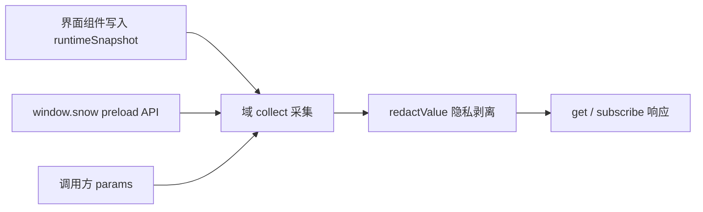

# 6-插件元数据域参考

> 适用：Snow App 桌面端插件（`renderMode` 为 `esm` 或 `iframe`）。本文逐域列出插件通过 `api.metadata` 能读取的应用元数据：域 id、隐私声明要求、实时性、可用参数与返回结构，并提供「需求 → 域」对照。写入应用数据使用独立的 `api.write`（201 个写动作、按动作声明敏感域），调用形态、失败判定与动作速查表见 [24-插件开发与安装](../2-使用指南/24-插件开发与安装.md) 的「可写能力」章节。清单编写与安装流程同样见该文档。

## 1. 作用域与来源

元数据由渲染层采集，只有三种来源：

| 来源        | 说明                                                                                                                                 |
| ----------- | ------------------------------------------------------------------------------------------------------------------------------------ |
| 实时快照    | `src/renderer/plugins/runtimeSnapshot.ts` 中由界面组件持续写入的运行时状态（焦点会话、流式指标、右侧面板、激活项目等），变化时可推送 |
| preload API | `window.snow.*` 中与设置面板同源的查询接口，按需读取应用数据库与 Rust 层                                                             |
| 调用上下文  | 当前插件记录本身（`plugins` 域）与调用方传入的 `params`                                                                              |

元数据域本身是**只读**能力：`api.metadata` 无法写入任何应用数据。写入应用数据使用独立的 `api.write`——读写共用同一套 `privacy` 声明规则，写动作的 `scope` 非空时同样必须声明（见第 7 章）；插件私有数据仍用 `api.storage` 保存。



### 1.1 调用形态

```javascript
const response = await api.metadata.get(["conversations", "memos"], {
  params: { directoryId: "local:D:/repo" },
});

const sub = api.metadata.subscribe(
  "runtime",
  (next) => render(next.domains.runtime),
  { intervalMs: 2000 },
);
sub.unsubscribe();

const list = api.metadata.domains(); // [{ id, scope, granted, live, sensitiveFields }]
```

`get` 与 `subscribe` 返回同一个响应对象：

| 字段          | 类型     | 说明                                                                         |
| ------------- | -------- | ---------------------------------------------------------------------------- |
| `generatedAt` | number   | 采集时刻（epoch 毫秒）                                                       |
| `domains`     | object   | 域 id → 采集结果；该域采集过程抛错时不会出现在这里                           |
| `denied`      | object   | 域 id → `{ reason, scope }`；`reason` 目前只有 `privacy-declaration-missing` |
| `withheld`    | object   | 域 id → 被剥离的字段路径数组（如 `["0.apiKey", "api.apiKey"]`）              |
| `unknown`     | string[] | 不存在的域 id                                                                |

`get(domain)` 的 `domain` 可为单个字符串或字符串数组；传空数组等价于请求全部 34 个域（未声明的敏感域仍会被拒绝）。

界面上有同一份清单的入口：侧边栏底部 **插件** → 工具栏 **元数据清单** 打开「插件可获取的应用元数据」弹窗，按分组列出全部 34 个域、一句话说明、隐私声明要求、实时/轮询与可用参数，并支持关键词搜索；每个插件行上的「可读元数据 n/34」用同一份定义标出该插件已声明（可读）与未声明（读取会被拒绝）的域。弹窗内以「可读元数据 / 可写能力」两个标签页并列展示（可写能力页按同一份定义列出 201 个写动作、所需 `scope` 与声明状态），插件行上的「可写能力 n/201」徽章给出该插件已声明的写动作数量，详见 [24-插件开发与安装](../2-使用指南/24-插件开发与安装.md)。

### 1.2 参数（`params`）

| 键                  | 缺省取值                                              | 适用域与说明                                                                                              |
| ------------------- | ----------------------------------------------------- | --------------------------------------------------------------------------------------------------------- |
| `projectId`         | 当前激活项目（`runtime.activeDirectory.directoryId`） | 项目/代码类域；`mcp`、`lsp`、`skills`、`hooks`、`subAgents`、`permissions`、`codebase` 用它决定项目级数据 |
| `directoryId`       | 同上                                                  | `projects`、`memos`、`memory`、`git`、`ssh`、`usage`                                                      |
| `projectPath`       | 当前激活项目路径                                      | `git`（仓库路径）                                                                                         |
| `conversationId`    | 焦点会话（`runtime.conversation.conversationId`）     | `messages`、`settings.conversationModes`、`settings.conversationRuntime`                                  |
| `limit` / `offset`  | 记忆 200/0、备忘录 200/0、日志 200/0、用量记录 100/0  | 列表类域分页                                                                                              |
| `page` / `pageSize` | 1 / 50                                                | `codebase.indexedFiles`                                                                                   |
| `since` / `until`   | 用量：最近 30 天 → 现在；日志：空                     | ISO 时间字符串                                                                                            |
| `profileName`       | 空（全部档案）                                        | `usage`                                                                                                   |
| `level` / `module`  | 空                                                    | `logs`                                                                                                    |

参数缺省、类型不符或数据不可用时，对应字段为 `null`（不是抛错）；数组字段在同样情况下也为 `null`。

### 1.3 实时性与刷新

| 类型                 | 推送方式                                                                   | 域                                                                             |
| -------------------- | -------------------------------------------------------------------------- | ------------------------------------------------------------------------------ |
| 实时（`live: true`） | 运行时快照变化后 200 ms 防抖重新采集并推送                                 | `projects`、`git`、`conversations`、`messages`、`runtime`、`panels`、`plugins` |
| 非实时               | 只在 `subscribe` 时推一次初值；传 `intervalMs`（最小 1000 ms）后按间隔轮询 | 其余 27 个域                                                                   |

`api.metadata.domains()` 的 `live` 字段可用于在面板里区分「订阅即实时」与「需要轮询」的域。

## 2. 需求 → 域对照

| 想做的界面/功能                             | 读取的域                                            | 关键字段                                                        |
| ------------------------------------------- | --------------------------------------------------- | --------------------------------------------------------------- |
| 会话列表、标题、置顶、消息数                | `conversations`                                     | `items[]`、`pinned[]`、`active`                                 |
| 读取某会话的消息正文与思维链                | `messages`                                          | `items[]`（含 `content`、`thinking`、`toolCallsJson`）          |
| 复刻流式指标条（token、耗时、TTFT）         | `runtime`                                           | `conversation.*`、`streamingSessions[]`                         |
| 复刻输入框 Token 用量环                     | `runtime` + `conversations`                         | `chatInput.maxContextTokens`、`conversation.tokenUsage`         |
| 读取当前输入框内容                          | `runtime`                                           | `chatInput.inputText`（原始内容，含 `@@file:...@@` 等标签标记） |
| 观察右侧面板打开了哪些标签                  | `panels`                                            | `tabs[]`、`activeTabId`                                         |
| 项目（工作区）列表、合集、迁移记录          | `projects`                                          | `directories[]`、`collections[]`、`relinks[]`                   |
| 备忘录面板（待办/已完成计数）               | `memos`                                             | `summary`、`items[]`                                            |
| 项目记忆浏览与统计                          | `memory`                                            | `stats`、`items[]`                                              |
| 定时任务看板                                | `scheduledTasks`                                    | 任务数组（含 `nextRunAt`、`runCount`）                          |
| 用量统计图表                                | `usage`                                             | `summary`、`daily[]`、`models[]`、`records`                     |
| 日志查看器                                  | `logs`                                              | `items[]`、`total`                                              |
| Git 状态、分支、团队身份                    | `git`                                               | `status`、`branches[]`、`identity`                              |
| 代码库索引进度与文件清单                    | `codebase`                                          | `indexStats`、`indexedFiles`、`resumableSessions[]`             |
| API 档案/模型下拉                           | `apiProfiles`                                       | 档案数组（`profileName`、`advancedModel` 等）                   |
| 跟随应用主题配色                            | `theme`                                             | `mode`、`custom`、`fontFamily`                                  |
| 读取应用开关（lite / 自动格式化 / 快捷键…） | `settings`                                          | 见 4.1.3                                                        |
| MCP 服务器与工具清单                        | `mcp`                                               | `servers[]`、`projectServersWithTools[]`                        |
| 子代理、Hooks、Skills、LSP 清单             | `subAgents`、`hooks`、`skills`、`lsp`               | 各自数组                                                        |
| 工具授权与敏感命令规则                      | `permissions`                                       | `alwaysApprovedTools[]`、`sensitiveCommands[]`                  |
| 隐私过滤设置                                | `privacy`                                           | `enabled`、`mode`、`toolResults`                                |
| 系统提示词、自定义请求头、全局 ROLE         | `systemPrompts`、`customHeaders`、`personalization` | 记录数组 / 文件内容                                             |
| 应用版本、引擎、存储位置、内存占用          | `app`                                               | `appVersion`、`engine`、`storageLocations`                      |
| SSH 凭据、~/.ssh/config 主机、远程草稿      | `ssh`                                               | `credentials[]`、`configHosts[]`、`remoteDrafts[]`              |
| 手机远控配对与隧道状态                      | `remoteControl`                                     | `pairing`、`tunnel`                                             |
| 浏览器密码/书签/下载/导入源                 | `browser`                                           | 四个数组                                                        |
| 油猴脚本清单                                | `userscripts`                                       | 脚本数组                                                        |
| 图库图片与相册                              | `imageLibrary`                                      | `images[]`、`albums[]`                                          |
| 桌面宠物清单与设置                          | `pets`                                              | `installed[]`、`settings`                                       |
| 读取已安装插件（含自身）                    | `plugins`                                           | 插件数组                                                        |
| 打开外部 IDE                                | `ide`                                               | `id`、`name`、`executable`                                      |

## 3. 域速查表

| 域                | 隐私声明          | 实时 | 主要参数                                               | 一句话                                         |
| ----------------- | ----------------- | ---- | ------------------------------------------------------ | ---------------------------------------------- |
| `app`             | —                 | 否   | —                                                      | 版本、更新、引擎、存储位置、环境信息           |
| `theme`           | 字段级            | 否   | —                                                      | 主题模式、调色板、字体、背景、流式光标         |
| `settings`        | 字段级            | 否   | `conversationId`                                       | 应用开关、快捷键、会话模式与运行参数、Git 扫描 |
| `privacy`         | `privacyConfig`   | 否   | —                                                      | 隐私过滤开关、模式与 API 配置                  |
| `permissions`     | —                 | 否   | `projectId`                                            | 工具放行清单、只读工具、敏感命令规则           |
| `ide`             | —                 | 否   | —                                                      | 可用于「在编辑器中打开」的 IDE 列表            |
| `pets`            | —                 | 否   | —                                                      | 已安装宠物与宠物窗口设置                       |
| `plugins`         | `plugins`         | 是   | —                                                      | 已安装插件清单                                 |
| `apiProfiles`     | 字段级            | 否   | —                                                      | API 档案（密钥已剥离）                         |
| `systemPrompts`   | `systemPrompts`   | 否   | —                                                      | 系统提示词条目                                 |
| `customHeaders`   | `customHeaders`   | 否   | —                                                      | 自定义请求头方案                               |
| `personalization` | `personalization` | 否   | —                                                      | 全局 ROLE 规则文件                             |
| `mcp`             | 字段级            | 否   | `projectId`                                            | MCP 服务器、工具与项目级状态                   |
| `subAgents`       | 字段级            | 否   | `projectId`                                            | 子代理配置                                     |
| `hooks`           | —                 | 否   | `projectId`                                            | 全局与项目级 Hooks                             |
| `skills`          | —                 | 否   | `projectId`                                            | 可用 Skills 与项目覆盖                         |
| `lsp`             | —                 | 否   | `projectId`                                            | LSP 服务器、生效配置与会话状态                 |
| `codebase`        | —                 | 否   | `projectId`、`page`、`pageSize`                        | 代码库索引范围、统计、文件与断点会话           |
| `conversations`   | `conversations`   | 是   | `directoryId`                                          | 项目会话列表与焦点会话                         |
| `messages`        | `messages`        | 是   | `conversationId`                                       | 会话消息（含思维链与工具调用 JSON）            |
| `runtime`         | —                 | 是   | —                                                      | 实时运行时快照（会话、流式、面板、项目）       |
| `panels`          | —                 | 是   | —                                                      | 右侧面板标签状态                               |
| `memos`           | `memos`           | 否   | `directoryId`、`limit`、`offset`                       | 备忘录条目与计数                               |
| `memory`          | `memory`          | 否   | `directoryId`、`limit`、`offset`                       | 项目记忆条目与统计                             |
| `scheduledTasks`  | 字段级            | 否   | —                                                      | 定时任务定义与运行状态                         |
| `usage`           | `usage`           | 否   | `since`、`until`、`profileName`、`limit`、`offset`     | 用量汇总、日/模型维度与明细                    |
| `logs`            | `logs`            | 否   | `level`、`module`、`since`、`until`、`limit`、`offset` | 系统日志分页                                   |
| `projects`        | —                 | 是   | `directoryId`                                          | 项目列表、合集、迁移记录与激活项目             |
| `git`             | `git`             | 是   | `projectPath`、`projectId`                             | 仓库状态、分支与团队身份                       |
| `ssh`             | `ssh`             | 否   | `directoryId`                                          | SSH 凭据、config 主机与远程草稿                |
| `remoteControl`   | `remoteControl`   | 否   | —                                                      | 手机远控配对状态与隧道状态                     |
| `browser`         | `browserData`     | 否   | —                                                      | 密码、书签、下载与导入源                       |
| `userscripts`     | `userscripts`     | 否   | —                                                      | 油猴脚本清单                                   |
| `imageLibrary`    | —                 | 否   | —                                                      | 图库图片、相册与目录                           |

「字段级」表示整域可用，但命中敏感字段名的值会在未声明对应隐私域时被剥离；第 4 章逐域列出。

## 4. 逐域字段参考

各小节固定给出：隐私声明要求、实时性、参数与返回结构。所有接口的失败回退都是 `null`。

### 4.1 应用与外观

#### 4.1.1 `app`

无需声明 · 非实时 · 无参数

| 字段                                  | 类型           | 说明                                                                                             |
| ------------------------------------- | -------------- | ------------------------------------------------------------------------------------------------ |
| `appVersion`                          | string \| null | 应用版本（`app:get-version`）                                                                    |
| `updateStatus`                        | object \| null | `{ available, version, downloading, progress, downloaded, error, releaseNotes, releaseNotesZh }` |
| `engine`                              | string \| null | Rust 引擎信息字符串                                                                              |
| `processMemoryBytes`                  | number \| null | 应用进程常驻内存（字节）                                                                         |
| `storageLocations`                    | object \| null | `{ databasePath, archiveDbPath, checkpointDir, uploadDir, checkpointRoot, uploadRoot }`          |
| `pluginsDirectory`                    | string \| null | 插件安装根目录（`~/.snowapp/plugins`）                                                           |
| `locale`                              | string         | 界面语言（`en` / `zh-CN` / `zh-TW`）                                                             |
| `language` / `platform` / `userAgent` | string         | `navigator` 对应值                                                                               |
| `hardwareConcurrency`                 | number         | 逻辑核心数                                                                                       |
| `timezone`                            | string         | IANA 时区                                                                                        |
| `startedAt`                           | number         | 渲染进程 `performance.timeOrigin`                                                                |
| `now`                                 | number         | 采集时刻（epoch 毫秒）                                                                           |

#### 4.1.2 `theme`

字段级敏感：`backgroundValue` → `privacyConfig` · 非实时 · 无参数

| 字段           | 类型                          | 说明                                                   |
| -------------- | ----------------------------- | ------------------------------------------------------ |
| `mode`         | `system` \| `light` \| `dark` | 主题模式                                               |
| `presetId`     | string                        | 预设主题 id                                            |
| `custom`       | object                        | `{ light: ThemePalette, dark: ThemePalette }`          |
| `background`   | object                        | `{ enabled, imagePath, opacity, blur }`                |
| `fontFamily`   | string                        | 界面字体                                               |
| `streamCursor` | object                        | `{ iconType, lucideName, svgPath, iconSize }` 流式光标 |

`ThemePalette` 键：`bgPrimary`、`bgSecondary`、`bgTertiary`、`bgHover`、`bgActive`、`chromeBg`、`appBg`、`borderColor`、`borderLight`、`borderSubtle`、`textPrimary`、`textSecondary`、`textTertiary`、`textMuted`、`accentGreen`、`accentGreenBg`、`accentGreenText`、`accentRed`、`accentRedBg`、`accentRedText`、`accentBlue`、`accentBlueBg`、`accentBlueText`、`accentColor`、`onSolid`、`selectionBg`、`focusRing`。

#### 4.1.3 `settings`

字段级敏感：`proxyPassword` → `privacyConfig`、`apiKey` → `apiKeys` · 非实时 · 参数：`conversationId`

| 字段                  | 类型            | 说明                                                                                                              |
| --------------------- | --------------- | ----------------------------------------------------------------------------------------------------------------- |
| `liteMode`            | boolean \| null | 精简模式（关闭 Browser / App Control / Terminal 内置工具）                                                        |
| `autoFormat`          | boolean \| null | 文件编辑后自动 Prettier                                                                                           |
| `yoloMode`            | boolean \| null | 免确认模式（只读镜像，无法由此修改）                                                                              |
| `requestLogging`      | object \| null  | `{ enabled: boolean, expiresAt: number }` 请求体日志开关与到期时间                                                |
| `keyboardShortcuts`   | object \| null  | 12 个动作 → `{ key, enabled, foregroundOnly }`；`key` 形如 `mod+f`                                                |
| `conversationModes`   | object \| null  | `{ planMode, goalMode, worktreeMode, workflowMode, goalModeTokenBudget }`，`null` 表示跟随全局默认                |
| `conversationRuntime` | object \| null  | `{ thinkingStrength, responsesFastMode }` 会话级运行覆盖                                                          |
| `gitScan`             | object \| null  | `{ maxDepth, ignoredFolders, changeDebounceMs, remotePollIntervalMs, statusLimit, autoRefresh, confirmPullPush }` |
| `imageLibraryDir`     | string \| null  | 图库目录（空串表示默认目录）                                                                                      |
| `storageLocations`    | object \| null  | 同 `app.storageLocations`                                                                                         |

#### 4.1.4 `privacy`

**整域敏感：`privacyConfig`** · 非实时 · 无参数

| 字段          | 类型    | 说明                                                                           |
| ------------- | ------- | ------------------------------------------------------------------------------ |
| `enabled`     | boolean | 隐私过滤总开关                                                                 |
| `mode`        | string  | `local` 或 `api`                                                               |
| `api`         | object  | `{ url, apiKey, model }`（`apiKey` 为全局敏感字段，未声明 `apiKeys` 时被剥离） |
| `toolResults` | object  | `{ tools: string[] }` 参与过滤的工具全名                                       |

#### 4.1.5 `permissions`

无需声明 · 非实时 · 参数：`projectId`

| 字段                   | 类型             | 说明                                                                                       |
| ---------------------- | ---------------- | ------------------------------------------------------------------------------------------ |
| `alwaysApprovedTools`  | string[] \| null | 全局免确认工具全名                                                                         |
| `readonlyTools`        | string[] \| null | 内置只读工具全名                                                                           |
| `projectApprovedTools` | string[] \| null | 项目级免确认工具（无项目上下文时为 `null`）                                                |
| `sensitiveCommands`    | object[] \| null | `{ id, commandId, pattern, description, enabled, isPreset, sortOrder, source, updatedAt }` |

#### 4.1.6 `ide`

无需声明 · 非实时 · 无参数

| 字段                         | 类型   | 说明                             |
| ---------------------------- | ------ | -------------------------------- |
| `id` / `name` / `executable` | string | IDE 标识、显示名与可执行文件路径 |

返回值为 IDE 数组（用于「在编辑器中打开」类面板）。

#### 4.1.7 `pets`

无需声明 · 非实时 · 无参数

| 字段        | 类型             | 说明                                                                                                                    |
| ----------- | ---------------- | ----------------------------------------------------------------------------------------------------------------------- |
| `installed` | object[] \| null | 宠物清单：`{ id, displayName, description, spritesheetFile, dirPath, spritesheetPath, source, version, columns, rows }` |
| `settings`  | object \| null   | `{ enabled, activePetId, scale }`                                                                                       |

#### 4.1.8 `plugins`

**整域敏感：`plugins`** · 实时 · 无参数

返回插件数组（来自渲染层插件 store，只读）。每项：

| 字段                                                                                | 类型                | 说明                                                             |
| ----------------------------------------------------------------------------------- | ------------------- | ---------------------------------------------------------------- |
| `pluginId` / `name` / `description` / `version` / `author` / `homepage` / `license` | string / 本地化对象 | 清单元数据（`name`、`description` 为 `{ default, zh-CN, ... }`） |
| `icon`                                                                              | string              | `lucide:Name`、相对路径或 URL                                    |
| `renderMode` / `entry`                                                              | string              | `esm` 或 `iframe`；入口文件相对路径                              |
| `panels`                                                                            | object[]            | `{ id, title, entry, icon, widthHint }`                          |
| `privacy` / `privacyNote`                                                           | string[] / string   | 声明的敏感域与说明                                               |
| `enabled`                                                                           | boolean             | 是否启用                                                         |
| `installPath` / `sourcePath`                                                        | string              | 安装目录与来源目录                                               |
| `minAppVersion`                                                                     | string              | 最低应用版本（当前不做拦截）                                     |
| `createdAt` / `updatedAt`                                                           | string              | 安装与更新时间                                                   |

### 4.2 AI 与配置

#### 4.2.1 `apiProfiles`

字段级敏感：`apiKey`、`visionApiKey` → `apiKeys` · 非实时 · 无参数

返回 API 档案数组，关键字段：`profileName`、`displayName`、`isActive`、`baseUrl`、`baseUrlMode`、`requestMethod`、`advancedModel`、`basicModel`、`supportsVision`、`visionModel`、`maxContextTokens`、`maxTokens`、`enableAutoCompress`、`autoCompressThreshold`、`systemPromptIdsJson`、`customHeaderSchemeId`、`sortOrder`、`source`、`updatedAt`。

#### 4.2.2 `systemPrompts`

**整域敏感：`systemPrompts`** · 非实时 · 无参数

返回系统提示词数组：`{ promptId, name, content, isActive, sortOrder, scope, projectId, updatedAt }`（`scope` 为 `global` 或 `project`）。

#### 4.2.3 `customHeaders`

**整域敏感：`customHeaders`** · 非实时 · 无参数

返回请求头方案数组：`{ schemeId, name, headersJson, isActive, sortOrder, updatedAt }`。

#### 4.2.4 `personalization`

**整域敏感：`personalization`** · 非实时 · 无参数

| 字段       | 类型   | 说明                                        |
| ---------- | ------ | ------------------------------------------- |
| `filePath` | string | 全局 ROLE 文件绝对路径（`~/.snow/ROLE.md`） |
| `content`  | string | 文件内容（不存在时为空串）                  |

#### 4.2.5 `mcp`

字段级敏感：`env`、`headers`、`url` → `mcpSecrets` · 非实时 · 参数：`projectId`

| 字段                      | 类型             | 说明                                                                                                                                            |
| ------------------------- | ---------------- | ----------------------------------------------------------------------------------------------------------------------------------------------- |
| `servers`                 | object[] \| null | 全局服务器：`{ serverId, name, transportType, url, command, argsJson, envJson, headersJson, enabled, timeoutMs, sortOrder, source, updatedAt }` |
| `projectServers`          | object[] \| null | 项目级服务器（无项目时为 `null`）                                                                                                               |
| `tools`                   | object[] \| null | 全局工具：`{ name, description, inputSchemaJson, enabled }`                                                                                     |
| `projectServersWithTools` | object[] \| null | 项目级服务器 + 工具状态：`{ id, name, source, globalEnabled, enabled, tools[], toolsPending, error }`                                           |

#### 4.2.6 `subAgents`

字段级敏感：`systemPrompt`、`toolsJson` → `subAgents` · 非实时 · 参数：`projectId`

返回子代理数组：`{ agentId, name, description, systemPrompt, toolsJson, configProfile, model, builtin, sortOrder, source, projectId, updatedAt }`。

#### 4.2.7 `hooks`

无需声明 · 非实时 · 参数：`projectId`

| 字段      | 类型             | 说明                                                                                                                                                                                                                                                   |
| --------- | ---------------- | ------------------------------------------------------------------------------------------------------------------------------------------------------------------------------------------------------------------------------------------------------ |
| `global`  | object[] \| null | 全局 Hook：`{ hookType, scope, projectId, rulesJson, updatedAt }`；`hookType` 取值为 `onUserMessage`、`beforeToolCall`、`toolConfirmation`、`afterToolCall`、`onSubAgentComplete`、`beforeCompress`、`onSessionStart`、`onStop`、`beforeSubAgentStart` |
| `project` | object[] \| null | 项目级 Hook（无项目时为 `null`）                                                                                                                                                                                                                       |

#### 4.2.8 `skills`

无需声明 · 非实时 · 参数：`projectId`

| 字段        | 类型             | 说明                                                                                 |
| ----------- | ---------------- | ------------------------------------------------------------------------------------ |
| `available` | object[] \| null | 可用技能：`{ id, name, description, location, source, path, allowedTools, enabled }` |
| `project`   | object[] \| null | 项目级技能（额外含 `defaultEnabled`）                                                |

#### 4.2.9 `lsp`

无需声明 · 非实时 · 参数：`projectId`

| 字段        | 类型             | 说明                                                                                                                                          |
| ----------- | ---------------- | --------------------------------------------------------------------------------------------------------------------------------------------- |
| `servers`   | object[] \| null | 全局配置：`{ lang, command, argsJson, fileExtensionsJson, installCommand, initializationOptionsJson, enabled, sortOrder, source, updatedAt }` |
| `effective` | object[] \| null | 项目生效配置（全局 + 项目覆盖合并后的同结构数组）                                                                                             |
| `sessions`  | object[] \| null | 运行时会话：`{ lang, projectRoot, status, restartCount, lastUsedMs, error }`，`status` 为 `running` / `dead` / `exited`                       |

### 4.3 会话、内容与运行

#### 4.3.1 `conversations`

**整域敏感：`conversations`** · 实时 · 参数：`directoryId`

| 字段          | 类型             | 说明                                          |
| ------------- | ---------------- | --------------------------------------------- |
| `directoryId` | string           | 实际生效的项目 id                             |
| `items`       | object[] \| null | 会话列表（按最近更新排序）                    |
| `pinned`      | object[] \| null | 置顶会话                                      |
| `active`      | object \| null   | 焦点会话实时状态（同 `runtime.conversation`） |

会话记录字段：`conversationId`、`title`、`summary`、`lastMessagePreview`、`messageCount`、`model`、`apiProfileName`、`status`、`directoryId`、`forkedFromConversationId`、`forkMessageCount`、`conversationType`、`parentConversationId`、`subAgentId`、`subAgentName`、`subAgentStatus`、`subAgentError`、`createdAt`、`updatedAt`、`inputTokens`、`outputTokens`、`cacheCreationInputTokens`、`cacheReadInputTokens`、`totalDurationMs`、`runInputTokens`、`runOutputTokens`、`runCacheCreationInputTokens`、`runCacheReadInputTokens`、`lastRunDurationMs`、`runTtftSumMs`、`runRequestCount`、`emoji`。

#### 4.3.2 `messages`

**整域敏感：`messages`** · 实时 · 参数：`conversationId`

| 字段             | 类型             | 说明                                                                                                                                                                                        |
| ---------------- | ---------------- | ------------------------------------------------------------------------------------------------------------------------------------------------------------------------------------------- |
| `conversationId` | string           | 实际生效的会话 id                                                                                                                                                                           |
| `live`           | object \| null   | 该会话的实时状态（同 `runtime.conversation`）                                                                                                                                               |
| `items`          | object[] \| null | 消息列表：`{ id, role, content, thinking, thinkingDurationMs, thinkingTokenCount, status, model, responseId, checkpointId, toolCallsJson, interruptionReason, recoveryOutcome, createdAt }` |
| `userMessages`   | object[] \| null | 用户消息摘要：`{ id, content, createdAt, isContextCompaction }`                                                                                                                             |

#### 4.3.3 `runtime`

无需声明 · 实时 · 无参数

| 字段                        | 类型           | 说明                                                                                                                                                                                                                                                                                                                                                                                                                                                            |
| --------------------------- | -------------- | --------------------------------------------------------------------------------------------------------------------------------------------------------------------------------------------------------------------------------------------------------------------------------------------------------------------------------------------------------------------------------------------------------------------------------------------------------------- |
| `conversation`              | object \| null | 焦点会话：`{ conversationId, sessionKey, title, directoryId, isStreaming, isPaused, isAborting, messageCount, pendingMessageCount, tokenUsage, runTokenUsage, conversationTokenUsage, streamElapsedMs, streamTtftMs, streamStartedAt, runTtftMs, lastRunDurationMs, streamTokenCount, planMode, goalMode, liteMode, yoloMode, fileChangeStats, streamingConversationIds, completedConversationIds, attentionRequiredConversationIds, subAgentSessions, todos }` |
| `chatInput`                 | object \| null | 输入区数据：`{ conversationId, inputText, maxContextTokens, isLoadingApiConfig }`（`conversationId` 为 `null` 表示新会话输入区；`inputText` 为输入框原始内容，保留 `@@file:...@@`、`@@image:...@@` 等标签标记，空串表示未输入）                                                                                                                                                                                                                                 |
| `streamingSessions`         | object[]       | 运行中的会话：`{ sessionKey, conversationId, title, directoryId, isStreaming, isPaused, isAborting, messageCount, tokenCount, elapsedMs, ttftMs, runTtftMs, startedAt, lastRunDurationMs, runTokenUsage }`                                                                                                                                                                                                                                                      |
| `panels`                    | object         | 右侧面板状态（同 `panels` 域）                                                                                                                                                                                                                                                                                                                                                                                                                                  |
| `activeDirectory`           | object \| null | 激活项目记录（`directoryId`、`name`、`path`、`kind`、`isActive`、`pathState` 等）                                                                                                                                                                                                                                                                                                                                                                               |
| `activeSessionDirectoryIds` | string[]       | 当前有运行中会话的项目 id                                                                                                                                                                                                                                                                                                                                                                                                                                       |
| `revisions`                 | object         | `{ workspace, memories, scheduledTasks, conversationList, plugins }` 变更计数，用于判断某类数据是否刚变化                                                                                                                                                                                                                                                                                                                                                       |
| `locale`                    | string         | 当前界面语言                                                                                                                                                                                                                                                                                                                                                                                                                                                    |

实时指标口径：`startedAt` 是本轮 run 的墙钟起点，实时时长按 `Date.now() - startedAt` 计算；实时速度按 `tokenCount / elapsedMs` 计算，与界面流式指标条同源。

`chatInput.inputText` 由输入区在挂载期间发布，反映最后一次发布值（输入框未挂载时保留旧值）：插件可用它做「输入框内容预览」类面板；ESM 面板还会通过入口 props 直接注入同名 `inputText`（见 [24-插件开发与安装](../2-使用指南/24-插件开发与安装.md)）。

#### 4.3.4 `panels`

无需声明 · 实时 · 无参数

| 字段                           | 类型           | 说明                                                                                   |
| ------------------------------ | -------------- | -------------------------------------------------------------------------------------- |
| `tabs`                         | object[]       | `{ id, type, title, isActive, pluginId, panelId }`；插件面板带 `pluginId` 与 `panelId` |
| `activeTabId`                  | string \| null | 当前激活标签                                                                           |
| `isCollapsed` / `isFullscreen` | boolean        | 面板收起与全屏状态                                                                     |

#### 4.3.5 `memos`

**整域敏感：`memos`** · 非实时 · 参数：`directoryId`、`limit`、`offset`

| 字段      | 类型           | 说明                                                                                                                                     |
| --------- | -------------- | ---------------------------------------------------------------------------------------------------------------------------------------- |
| `summary` | object \| null | `{ total, pending, done }`                                                                                                               |
| `items`   | object \| null | `{ items, total, hasMore }`；条目为 `{ id, memoId, directoryId, content, status, createdAt, updatedAt }`，`status` 为 `pending` / `done` |

#### 4.3.6 `memory`

**整域敏感：`memory`** · 非实时 · 参数：`directoryId`、`limit`、`offset`

| 字段    | 类型           | 说明                                                                                                                                                                                                                                                       |
| ------- | -------------- | ---------------------------------------------------------------------------------------------------------------------------------------------------------------------------------------------------------------------------------------------------------- |
| `stats` | object \| null | `{ total, active, pending, archived }`                                                                                                                                                                                                                     |
| `items` | object \| null | `{ items, total, hasMore }`；条目为 `{ memoryId, kind, title, content, source, status, importance, tags, conversationId, lastRecalledAt, recallCount, createdAt, updatedAt }`，`kind` 取值为 `fact` / `decision` / `preference` / `pitfall` / `task_state` |

#### 4.3.7 `scheduledTasks`

字段级敏感：`prompt`、`preScript` → `scheduledTasks` · 非实时 · 无参数

返回定时任务数组：

| 字段                                                       | 类型                      | 说明                                                                                             |
| ---------------------------------------------------------- | ------------------------- | ------------------------------------------------------------------------------------------------ |
| `id` / `directoryId` / `name`                              | string                    | 任务标识、所属项目（空串 = 全局任务）与名称                                                      |
| `prompt`                                                   | string                    | 触发时发送给 AI Loop 的提示词（未声明 `scheduledTasks` 时被剥离）                                |
| `scheduleJson`                                             | string                    | 计划定义 JSON：`{ type: "once" \| "recurring", executeAt?, mode?, intervalMs?, hour?, minute? }` |
| `status`                                                   | string                    | `pending` / `running` / `completed` / `error`                                                    |
| `paused`                                                   | boolean                   | 是否暂停                                                                                         |
| `nextRunAt` / `lastRunAt` / `createdAt` / `updatedAt`      | string                    | 计划与时间戳                                                                                     |
| `runCount` / `skipCount`                                   | number                    | 执行次数与前置脚本跳过次数                                                                       |
| `lastError` / `lastSkipReason` / `lastSkippedAt`           | string                    | 最近失败原因与跳过原因                                                                           |
| `preScript` / `preScriptTimeoutMs` / `runOnScriptError`    | string / number / boolean | 前置脚本配置                                                                                     |
| `apiProfile` / `basicModel` / `model` / `thinkingStrength` | string                    | 触发会话使用的模型覆盖                                                                           |
| `history`                                                  | object[]                  | `{ runAt, status, durationMs, error }`，最多 20 条                                               |

#### 4.3.8 `usage`

**整域敏感：`usage`** · 非实时 · 参数：`since`、`until`、`profileName`、`conversationId`、`directoryId`、`limit`、`offset`

| 字段           | 类型             | 说明                                                                                                                                                                                                                                                                                      |
| -------------- | ---------------- | ----------------------------------------------------------------------------------------------------------------------------------------------------------------------------------------------------------------------------------------------------------------------------------------- |
| `profileNames` | string[] \| null | 有用量记录的档案名                                                                                                                                                                                                                                                                        |
| `summary`      | object \| null   | `{ totalInputTokens, totalOutputTokens, totalCacheCreationInputTokens, totalCacheReadInputTokens, totalRequests, errorRequests, totalTokens, effectiveCacheReadTokens, nonCachedInputTokens }`                                                                                            |
| `daily`        | object[] \| null | `{ date, totalRequests, errorRequests, totalInputTokens, totalOutputTokens, totalCacheCreationInputTokens, totalCacheReadInputTokens, totalTokens }`                                                                                                                                      |
| `models`       | object[] \| null | `{ model, totalRequests, errorRequests, ...同上 token 字段 }`                                                                                                                                                                                                                             |
| `records`      | object \| null   | `{ items, total }`；明细为 `{ id, conversationId, responseId, model, apiProfileName, requestMethod, inputTokens, outputTokens, cacheCreationInputTokens, cacheReadInputTokens, status, isSubAgent, directoryId, createdAt, totalTokens, effectiveCacheReadTokens, nonCachedInputTokens }` |

#### 4.3.9 `logs`

**整域敏感：`logs`** · 非实时 · 参数：`level`、`module`、`since`、`until`、`limit`、`offset`

| 字段    | 类型             | 说明                                                                                                     |
| ------- | ---------------- | -------------------------------------------------------------------------------------------------------- |
| `items` | object[] \| null | `{ id, level, module, func, line, message, input, output, duration, context, error, source, createdAt }` |
| `total` | number           | 命中总条数                                                                                               |

### 4.4 项目与代码

#### 4.4.1 `projects`

无需声明 · 实时 · 参数：`directoryId`

| 字段                        | 类型             | 说明                                                                                                                                                                                                                                             |
| --------------------------- | ---------------- | ------------------------------------------------------------------------------------------------------------------------------------------------------------------------------------------------------------------------------------------------ |
| `directories`               | object[] \| null | 项目记录：`{ directoryId, name, path, kind, isActive, sortOrder, source, pathState, lastKnownPath, updatedAt }`；`kind` 为 `local` / `ssh`，`pathState` 为 `ok` / `missing` / `mismatch` / `offline` / `permission_error` / `remote` / `unknown` |
| `collections`               | object[] \| null | 项目合集：`{ collectionId, name, sortOrder, memberDirectoryIds, createdAt, updatedAt }`                                                                                                                                                          |
| `relinks`                   | object[] \| null | 位置迁移记录：`{ relinkId, oldDirectoryId, newDirectoryId, oldPath, newPath, movedBy, createdAt, undoneAt }`                                                                                                                                     |
| `active`                    | object \| null   | 激活项目（同 `runtime.activeDirectory`）                                                                                                                                                                                                         |
| `activeSessionDirectoryIds` | string[]         | 有运行中会话的项目 id                                                                                                                                                                                                                            |

#### 4.4.2 `git`

**整域敏感：`git`** · 实时 · 参数：`projectPath`、`projectId`

| 字段       | 类型             | 说明                                                                                                                                                                                            |
| ---------- | ---------------- | ----------------------------------------------------------------------------------------------------------------------------------------------------------------------------------------------- |
| `repoPath` | string           | 查询使用的仓库路径                                                                                                                                                                              |
| `status`   | object \| null   | `{ isRepo, currentBranch, upstream, ahead, behind, files[], stagedCount, unstagedCount, untrackedCount, statusLimitHit }`；`files[]` 为 `{ path, oldPath, indexStatus, workdirStatus, status }` |
| `branches` | object[] \| null | `{ name, isCurrent, isRemote, remoteName }`                                                                                                                                                     |
| `identity` | object \| null   | 团队身份：`{ isRepo, repoPath, name, email, remoteUrl, hasIdentity, error }`                                                                                                                    |

#### 4.4.3 `codebase`

无需声明 · 非实时 · 参数：`projectId`、`page`、`pageSize`

| 字段                | 类型             | 说明                                                                                                                                                     |
| ------------------- | ---------------- | -------------------------------------------------------------------------------------------------------------------------------------------------------- |
| `projectScope`      | object \| null   | `{ projectId, enabled, enableAgentReview, enableReranking }` 项目级三态覆盖                                                                              |
| `indexStats`        | object \| null   | `{ totalChunks, totalFiles, totalSizeBytes, isIndexed }`                                                                                                 |
| `indexedFiles`      | object \| null   | `{ items, total, page, pageSize }`；`items[]` 为 `{ relativePath, filePath, chunkCount, startLine, endLine, sizeBytes, updatedAt }`                      |
| `resumableSessions` | object[] \| null | 可续跑的索引会话：`{ sessionId, projectId, status, totalFiles, processedFiles, totalChunks, processedChunks, currentFile, error, createdAt, updatedAt }` |

### 4.5 连接与资产

#### 4.5.1 `ssh`

**整域敏感：`ssh`** · 非实时 · 参数：`directoryId`

| 字段           | 类型             | 说明                                                                                                  |
| -------------- | ---------------- | ----------------------------------------------------------------------------------------------------- |
| `credentials`  | object[] \| null | `{ profileKey, host, port, username, authMethod, privateKeyPath, encryptedSecret }`（密钥为密文引用） |
| `configHosts`  | object[] \| null | `~/.ssh/config` 主机：`{ alias, host, user, port, identityFile }`                                     |
| `remoteDrafts` | object[] \| null | 远程草稿：`{ id, profileId, workspaceId, remotePath, baseVersionJson, content, status, updatedAt }`   |

#### 4.5.2 `remoteControl`

**整域敏感：`remoteControl`** · 非实时 · 无参数

| 字段      | 类型           | 说明                                                                                                                                                                                                                                                     |
| --------- | -------------- | -------------------------------------------------------------------------------------------------------------------------------------------------------------------------------------------------------------------------------------------------------- |
| `pairing` | object \| null | `{ enabled, running, host, port, configuredPort, pairingUrls[], generation, token, tokenPinned, tokenStorageAvailable, wan }`；`wan` 为 `{ enabled, localPort, publicOrigin, pairingUrl, token, tokenPinned }`。**令牌属高敏感信息**，仅在确有需要时读取 |
| `tunnel`  | object \| null | `{ config, stage, listenerPort, attempt, nextRetryAt, endpoint, error }`；`config` 只暴露 `hasToken`、`hasCaCertificate` 等布尔标记                                                                                                                      |

#### 4.5.3 `browser`

**整域敏感：`browserData`** · 非实时 · 无参数

| 字段            | 类型             | 说明                                                                                                        |
| --------------- | ---------------- | ----------------------------------------------------------------------------------------------------------- |
| `passwords`     | object[] \| null | `{ id, origin, username, createdAt, updatedAt }`（**不含明文密码**）                                        |
| `bookmarks`     | object[] \| null | `{ id, title, url, folder, createdAt }`                                                                     |
| `downloads`     | object[] \| null | `{ id, url, filename, path, state, receivedBytes, totalBytes, startedAt, endedAt }`                         |
| `importSources` | object[] \| null | `{ id, name, profile, accountName, passwordDb, cookieDb, passwordCount, cookieCount, bookmarkCount, note }` |

#### 4.5.4 `userscripts`

**整域敏感：`userscripts`** · 非实时 · 无参数

返回脚本数组：`{ scriptId, name, version, description, namespace, author, enabled, runAt, noframes, grant, matches, includes, excludes, requires, filePath, createdAt, updatedAt }`。

#### 4.5.5 `imageLibrary`

无需声明 · 非实时 · 无参数

| 字段        | 类型             | 说明                                                                                                              |
| ----------- | ---------------- | ----------------------------------------------------------------------------------------------------------------- |
| `images`    | object[] \| null | `{ id, relativePath, fileName, mimeType, sizeBytes, width, height, prompt, model, provider, createdAt, albumId }` |
| `albums`    | object[] \| null | `{ id, name, createdAt, coverPath, imageCount }`                                                                  |
| `directory` | string \| null   | 图库根目录绝对路径                                                                                                |

## 5. 示例

### 5.1 实时 Token 用量环

```javascript
export function mount(container, api) {
  container.innerHTML = "<div class='ring'>--</div>";
  const render = (response) => {
    const runtime = response.domains.runtime;
    if (!runtime) return;
    const usage = runtime.conversation?.tokenUsage;
    const total = usage ? usage.inputTokens + usage.outputTokens : 0;
    const limit = runtime.chatInput?.isLoadingApiConfig
      ? null
      : runtime.chatInput?.maxContextTokens;
    const ratio = limit ? Math.min(total / limit, 1) : total > 0 ? 1 : 0;
    container.firstChild.textContent = limit
      ? `${Math.round(ratio * 100)}%`
      : `~${total}`;
  };
  const subscription = api.metadata.subscribe("runtime", render);
  return () => subscription.unsubscribe();
}
```

### 5.2 项目备忘录列表（轮询）

```javascript
const subscription = api.metadata.subscribe(
  "memos",
  ({ domains, denied }) => {
    if (denied.memos) {
      showDeclareHint(denied.memos.scope); // 需要在 plugin.json 声明 "memos"
      return;
    }
    renderList(domains.memos?.items?.items ?? []);
  },
  { intervalMs: 5000 },
);
```

### 5.3 跨域组合：会话 + 用量

```javascript
const response = await api.metadata.get(["conversations", "usage"], {
  params: { directoryId: activeProjectId, since, until, limit: 20 },
});
const rows = response.domains.conversations?.items ?? [];
const tokensByConversation = new Map(
  (response.domains.usage?.records?.items ?? []).map((record) => [
    record.conversationId,
    record.totalTokens,
  ]),
);
```

### 5.4 Git 状态角标（实时）

```javascript
api.metadata.subscribe("git", ({ domains }) => {
  const status = domains.git?.status;
  paint(
    status?.isRepo
      ? `${status.currentBranch} ${status.ahead}/${status.behind}`
      : "—",
  );
});
```

## 6. 状态与错误

| 现象                                                                | 原因与处理                                                                                                                                   |
| ------------------------------------------------------------------- | -------------------------------------------------------------------------------------------------------------------------------------------- |
| `denied[domain] = { reason: "privacy-declaration-missing", scope }` | 该域是整域敏感域，需在 `plugin.json` 的 `privacy` 中声明对应 `scope`（如 `"privacy": { "scopes": ["conversations"] }`），随后重装或 `rescan` |
| `withheld[domain]` 出现字段路径                                     | 命中全局或域级敏感字段名（`apiKey`、`secret`、`password`、`token` 等）且未声明对应隐私域；声明确需该数据后再读取                             |
| `unknown: ["xxx"]`                                                  | 域 id 拼写错误；先用 `api.metadata.domains()` 列出现有 id                                                                                    |
| 某字段为 `null`                                                     | 采集失败或数据不可用（如未配置项目、未登录档案、命令失败）；`null` 是正常回退，不需要 try/catch                                              |
| 域整体缺失（既不在 `domains` 也不在 `denied`）                      | 该域 `collect` 抛错；重试或改用其它域，并在 `api.log` 记录排查                                                                               |
| `subscribe` 不推送                                                  | 非 `live` 域必须传 `intervalMs`（≥1000），否则只推一次初值                                                                                   |

## 7. 安全与兼容性

- 隐私声明必须与真实用途一致：声明了敏感域的插件会在插件弹窗中向用户展示琥珀色标签与说明文案；滥用声明会直接暴露给用户。
- 整域敏感域即使声明后也要遵循最小化原则：`remoteControl` 的 `token`、`ssh` 的密钥引用等高敏数据只在确有必要时读取，且不要写入插件持久化存储或日志。
- `browser.passwords` 永远不含明文密码；需要账号信息的场景请只用 `origin` 与 `username`。
- 域集合稳定，但**域内字段可能随版本新增**：解析时按需读取字段，不要假设字段全集；对未知字段保持宽容。
- 元数据读取仍是**只读**能力：`api.metadata` 不能写回应用数据；写入应用数据必须走独立的 `api.write`，并按每个写动作的 `scope` 在 `plugin.json` 的 `privacy` 中声明，规则与读取完全一致（`scope` 为 `null` 的公开动作除外）。
- 敏感写动作未声明对应 `scope` 时会被拒绝：`api.write` 返回 `ok: false` 与 `denied.reason = "write-declaration-missing"`（并附带所需 `scope`）；插件弹窗的「可写能力」徽章与「元数据清单」弹窗的「可写能力」标签页会按动作展示声明状态，便于用户核对。
- `iframe` 模式可用的能力为 `metadata`、`write`、`storage`、`assets`，域语义与 ESM 一致，但写入只有 `api.write.run` / `api.write.domains`，且拿不到 `window.snow` 的其它接口。

## 源码锚点

- `src/renderer/plugins/metadata/domains.ts::METADATA_DOMAINS`：34 个域的定义、参数解析与采集实现
- `src/renderer/plugins/metadata/index.ts::collectMetadata`、`::subscribeMetadata`、`::describeMetadataDomains`：隐私校验、字段剥离、订阅与轮询
- `src/renderer/plugins/metadata/catalog.ts::METADATA_DOMAIN_CATALOG`：34 个域的分组、可用参数与速览文案（界面清单数据源）
- `src/renderer/plugins/writes/index.ts::executeWrite`、`::describeWriteDomains`：写动作的隐私声明校验与 `api.write.domains()` 返回的动作清单（可写能力徽章与弹窗标签页的数据源）
- `src/renderer/plugins/writes/domains/`：`content.ts`、`system.ts`、`config.ts`、`admin.ts` 共 201 个写动作定义
- `src/renderer/components/sidebar/PluginMetadataCatalog.tsx`：用户侧「插件可获取的应用元数据」弹窗（含可读/可写两个标签页）
- `src/renderer/plugins/runtimeSnapshot.ts::RuntimeSnapshot`：`runtime` 与 `panels` 域的实时数据源
- `src/renderer/plugins/pluginApi.ts`：`api.metadata.get / subscribe / domains` 的插件侧包装
- `src/renderer/plugins/pluginIframeBridge.js`：iframe 运行时的能力白名单
- `src/preload/types/*.ts`：各域返回结构的权威类型（`chat.ts`、`settings.ts`、`workspace.ts` 等）
