# Agent 运行时与工具编排

> 本文描述 Snow App 从模型请求到工具结果回灌的实际运行时边界。核心结论：**主 Agent loop 在 Renderer；provider 流、MCP 执行和持久化在 Rust。**

## 1. 组件视图

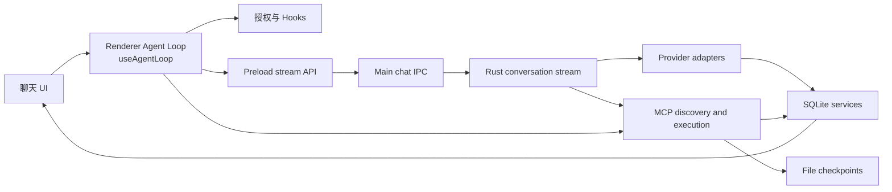

职责边界：

- `useAgentLoop.ts` 维护会话级循环、流状态、工具轮次、暂停/终止及排队消息。
- preload 与 `chatHandlers.ts` 只提供按 `streamId` 隔离的流传输。
- Rust provider 适配器负责请求格式、流解析和每轮模型交换落库。
- `mcp/tools.rs` 负责工具发现、强制策略、路由、隐私掩码和 checkpoint 衔接。

### 1.1 核心 Agent 链路执行全景（Master Lifecycle Architecture）

从用户在 UI 发起输入到最终落库收敛，Agent Loop 的宏观全生命周期分为 5 大演进阶段：

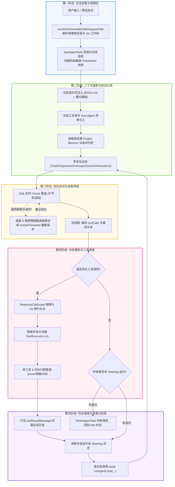

### 1.2 会话初始化与 Git 工作树隔离时序（Session & Worktree Isolation Flow）

为保证多会话在不同分支或隔离工作树（WorkTree）下并行工作且写操作不发生竞态碰撞，会话执行域采用严格的事务锁与路径解析流水线：

```mermaid
sequenceDiagram
    autonumber
    actor User as 用户 (UI)
    participant Selector as WorktreeSessionSelector
    participant RustWT as native worktrees.rs
    participant DB as SQLite (conversations)
    participant Loop as useAgentLoop

    User->>Selector: 切换会话绑定到独立分支/工作树 (worktreeId)
    Selector->>RustWT: git:worktrees:set-conversation
    Note over RustWT: 接入 with_write_lock 与 with_write_retry，杜绝 database locked
    RustWT->>DB: 原子持久化绑定关系

    User->>Loop: 点击发送消息
    Loop->>Loop: resolveConversationWorkspacePath()
    Note over Loop: 将相对路径解析为独立工作树真实物理路径 (如 /modules/tasks)
    Loop->>Loop: 将 executionWorkspaceRoot 写入请求契约，Checkpoint 与工具物理锚定
```

## 2. 模型适配层

统一入口 `native/src/api/conversation/stream.rs::create_response_stream` 根据 `request_method` 分派五种流式协议：

| request_method | 适配目录                       | 协议与端点                      | 特性支持                                                                                 |
| -------------- | ------------------------------ | ------------------------------- | ---------------------------------------------------------------------------------------- |
| `chat`         | `native/src/api/chat/`         | OpenAI Chat Completions         | 基础多轮对话、Function Call、流式打字机                                                  |
| `responses`    | `native/src/api/responses/`    | OpenAI Responses API            | 新一代 Responses 协议、Fast Mode、多模态、Reasoning 输出                                 |
| `anthropic`    | `native/src/api/anthropic/`    | Anthropic Messages API          | Claude 3.x/3.7 系列、自适应 Thinking 思考块、Tool Use 规范                               |
| `gemini`       | `native/src/api/gemini/`       | Google Gemini (GenerateContent) | 原生 Gemini 协议、系统指令注入、函数调用、Thinking 强度                                  |
| `interactions` | `native/src/api/interactions/` | Google Interactions API         | Google 新一代交互流协议（`alt=sse`）、独立 Function 与内置检索工具分离、成对工具历史转换 |

适配器共同负责 provider payload、规范化消息转换、SSE 或等价流解析、文本/thinking/tool calls/usage 累积及 `store_chat_exchange`。工具定义分别由 `tools_as_openai_chat_json`、`tools_as_openai_responses_json`、`tools_as_anthropic_json`、`tools_as_gemini_json`、`tools_as_interactions_json` 生成；工具历史跨协议转换集中在 `api/conversation/tool_messages.rs`。各协议流中断时均由 `api/retry.rs` 提供统一的指数退避重试与 Partial 截断保留保护。

API profile 解析优先考虑请求显式 profile、会话绑定 profile，再回退全局 active profile。子代理始终使用其配置 profile，并强制关闭主会话专属的 Plan/Goal Mode。

### 2.1 动态上下文组装与系统提示词注入流水线

在每一轮发起模型出站请求前，Rust 原生层（`native/src/api/conversation/context.rs`）会严格按照运行模式、工具可用性、项目记忆与历史消息完成多模态上下文的动态组装与校验：

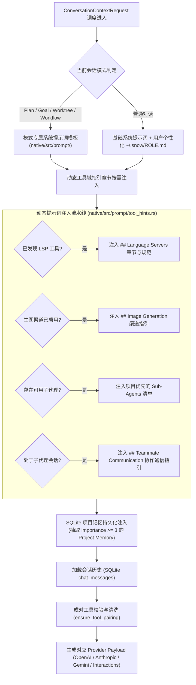

## 3. 流式事件协议

1. Renderer 调用 `window.snow.createResponseStream(request, onChunk, onStreamId)`。
2. `apiConfigApi.ts` 同步生成 `streamId`、注册 `chat:create-response:chunk` 监听，再 invoke 主进程。
3. `chatHandlers.ts` 校验参数并调用 `native.createResponseStream`。
4. Rust callback 到达后，Main 通过 `safeSend` 发送 `{ streamId, chunk }`。
5. preload 只把匹配 `streamId` 的 chunk 交给当前回调。
6. `createStreamChunkHandler` 更新文本、thinking、工具执行 ID和流指标；invoke Promise 返回最终 `ResponsesApiResult`。

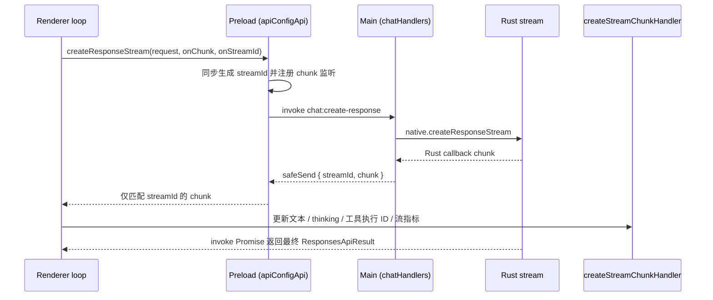

这条链与 `src/main/app/sessionProxy.ts` 无关；后者是 Electron 网络代理配置。Rust 侧出站请求（含本链路的 provider 适配器）在 `api/http_client.rs` 统一应用同一份代理配置。

### 3.1 流式重试机制与传输恢复（Transport Retry & Partial Recovery）

Snow App 底层集成了高韧性的流式断线与异常自动重试引擎（`native/src/api/retry.rs`），覆盖 Provider 闪断、空闲超时（Idle Timeout）以及网络波动：

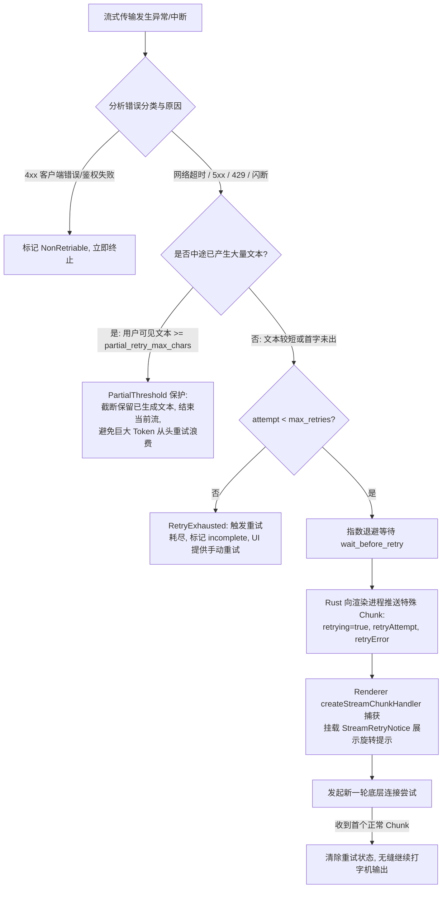

1. **核心重试参数配置**（来源于 `api_configs` 档案与全局规则）：
   - `max_retries`：每个请求最大自动重试次数（默认 3 次）。
   - `retry_base_delay_ms`：指数退避基数（默认 1000ms），后续按 $base \times 2^{(attempt-1)}$ 递增退避。
   - `stream_idle_timeout_sec`：流空闲心跳守护（默认 60s，若 Provider 超过该时间无任何新数据块，主动判定为 `idle_timeout` 并介入重试）。
   - `partial_retry_max_chars`：中途保留阈值（默认 1000 字符）。
2. **错误分类矩阵（`DEFAULT_RETRY_CATEGORIES`）**：
   - 自动匹配 9 类高频网络与服务错误：`network`（连接重置/拒绝/DNS）、`serverError`（500/502/503/504）、`rateLimit`（429）、`overloaded`（529）、`idleTimeout`（流空闲悬挂）、`stream`（流提前异常终止）、`nonSse`、`unavailable`、`terminated`。
   - 明确排除不可重试类型（如 401 密钥失效、400 格式错误），避免无谓消耗。
3. **Mid-stream Partial 阈值保护（`StreamRecoveryOutcome::PartialThreshold`）**：
   - 若流在已经输出了大段内容后意外断开，只要**用户可见的正文长度达到 `partial_retry_max_chars`**，系统会放弃重头重发，转而保留现有文本并平稳结算该轮次。这有效防止了长篇代码输出中断时，反复从头重试造成上下文爆棚与双倍计费。
4. **渲染层流式重试交互感知（`StreamRetryNotice`）**：
   - 当 Rust 层发起内部重试时，会通过 Chunk 管道向前端发射 `{ retrying: true, retryAttempt: N, retryError: string }`；
   - 前端 `createStreamChunkHandler` 感知后，将当前 Assistant 消息打上 `isRetrying` 标记，并呼出 `StreamRetryNotice` 组件（展示旋转动画、当前重试轮次与可折叠的错误详情）；
   - 新连接只要吐出第一个有效字符，重试标识自动抹去，界面无缝恢复流式输出。
5. **终态判定与取消语义（Terminal Disposition & Cancellation）**：
   - 只有 Provider 正常收尾（`status=completed`）且零载荷时，才会补 `empty_response` / `retry_exhausted` 终态；`cancelled`（用户主动停止）与 `failed`（服务商明确失败）一律原样透传，语义由 `status` 承载（与 `classify_final_stream_warning` 的 cancelled 豁免口径一致）。
   - `src/renderer/components/mainContent/chatMessages/utils/responseDisposition.ts` 是实时响应与落库回读的**唯一**判定入口：`error` / `failed` 走错误分支，`cancelled` 静默收尾，`incomplete` / `length` / `max_tokens` 显示中断提示，未知取值在零载荷时按未完成兜底（不会静默成一个没有任何提示的空白气泡）。
   - 取消收尾幂等（`utils/messageSettlement.ts::settleInterruptedMessages`）：用户点停止、级联中止子代理与工作流节点、agent loop 的取消分支共用同一实现，避免消息残留「发送中 / 重试中」。

## 4. Renderer 主循环

每个会话具有独立 session state、`runId`、`streamId`、AbortController、暂停状态和排队输入，因此切换会话不会终止后台运行。

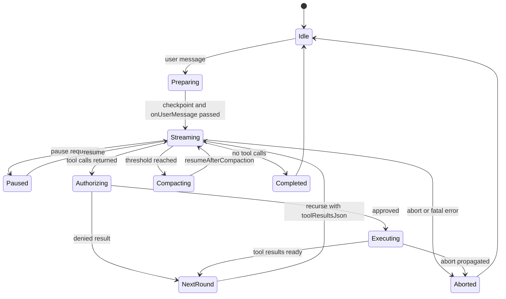

### 4.1 核心调用链路与执行时序

主循环（Agent Loop）位于 `src/renderer/components/mainContent/chatMessages/hooks/useAgentLoop.ts`，是以自递归推进（`runAgentLoop`）为骨架、事件驱动的状态机。

```mermaid
sequenceDiagram
    autonumber
    actor User as 用户 (UI)
    participant Loop as useAgentLoop (Renderer)
    participant Guard as ReadonlyCallGuard
    participant IPC as Electron IPC (Preload/Main)
    participant Native as Rust 运行时
    participant Model as LLM Provider
    participant MCP as MCP 工具执行域

    User->>Loop: handleSendMessage(message, options)
    Note over Loop: 1. 初始化会话、文件快照 Checkpoint 与 TaskHistory
    Loop->>Loop: 启动首轮递归 runAgentLoop()

    loop 递归步进循环 (Agent Loop Iterations)
        Loop->>IPC: window.snow.createResponseStream()
        IPC->>Native: native.createResponseStreamWithContext()
        Native->>Model: 发起流式请求 (SSE / HTTP Stream)

        par 流式实时回传 (打字机效果)
            Model-->>Native: 文本 / 思考 / 工具调用 Chunk
            Native-->>IPC: chat:stream:chunk
            IPC-->>Loop: createStreamChunkHandler() 实时更新 UI 状态
        end

        Model-->>Native: 响应流结束
        Native-->>Loop: Promise resolve (包含完整 response 与 toolCalls)

        alt 模式 A：模型返回终态回复 (无工具调用)
            Loop->>Loop: 检查中途追问指令 consumeSteering()
            alt 存在待消费 Steering
                Loop->>Loop: 插入用户追问，自递归 runAgentLoop() 继续处理
            else 无追问
                Note over Loop: finishAgentTask()，退出 Loop，恢复 Idle
            end

        else 模式 B：模型发起工具调用 (toolCalls.length > 0)
            Loop->>Guard: await readonlyGuard.filterToolCalls()
            Note over Guard: 主动检测物理文件指纹与 Git 仓库变动！<br/>文件/Git 已变更则放行，全无变动才拦截去重

            Loop->>Loop: requestToolAuthorizations() 权限判定 (YOLO/用户确认)
            Loop->>MCP: toolExecutor() 调度执行工具
            MCP-->>Loop: 返回结构化工具结果

            Loop->>Guard: await readonlyGuard.recordToolExecutions()
            Note over Guard: 捕获最新物理/Git快照；若执行写操作则失效只读缓存

            Loop->>Loop: 格式化 toolResultMessage 并追加到会话历史
            Loop->>Loop: 分配下一轮 Assistant 占位消息
            Note over Loop: 递归步进：await runAgentLoop(nextAssistantId, ...)
        end
    end
```

完整执行流程拆解为 7 个阶段：

1. **输入准备（`handleSendMessage`）**：校验输入文本、解析并注入上下文标签；绑定会话工作区执行根路径与分支；初始化当前轮次文件 Checkpoint 与任务追踪（`startAgentTask`）。
2. **环境校验与流调度（`runAgentLoop`）**：检查 `isRunCancelled` 取消标志；接入 `pauseController` 支持运行中途暂停与恢复；通过 `createResponseStream` 向主进程和 Rust 层派发带上下文的统一请求。
3. **双向流式回传**：Rust 层根据 Provider 协议解析 SSE 流块；主进程与 Preload 按 `streamId` 进行隔离过滤；`createStreamChunkHandler` 驱动界面以毫秒级刷新文本与思考内容。
4. **响应结算与终态检测**：流结束后解析 `toolCalls`。若无工具调用，调用 `consumeSteering` 检查用户是否在 AI 思考期间追加了新消息；若有则追加并推进下一轮，若无则完成任务。
5. **只读保护与变动感知（`ReadonlyCallGuard`）**：对工具列表进行过滤与探针检测，避免模型重复无意义读取导致死循环，同时杜绝误杀（详见 4.2 节）。
6. **工具授权与执行**：按项目权限规则和 YOLO 模式完成授权；调度 MCP 服务、终端执行器或子代理，获得标准化结果。
7. **历史追加与自递归步进**：打包 `role: "tool"` 消息，并携带 `toolResultsJson` 自递归进入下一轮 `runAgentLoop`，直至模型收敛完成。

### 4.2 只读工具去重防护与 Git / 物理状态感知算法

#### 4.2.1 背景与设计动机

LLM 在执行复杂多步任务时，有时会因上下文注意力偏离或幻觉，连续多次以相同参数重复调用只读工具（如 `filesystem-read` 同一路径或 `grep-search` 同一关键词）。
若不加约束，会导致无意义的 Token 消耗甚至无限请求死循环；然而，若仅依赖静态工具白名单或纯文本调用历史，一旦外部环境（外部编辑器保存、Git 分支切换、子代理执行、后台编译产物写入）修改了文件，系统会误判为“状态未改变”并强制拦截（抛出 `DUPLICATE_READONLY_TOOL_CALL` 错误甚至掐断 LLM 流）。

为此，Snow App 设计了统一的 **`ReadonlyCallGuard`（`readonlyCallGuard.ts`）**，将防护策略升级为**真实客体变动感知驱动的自适应防护算法**：

#### 4.2.2 双层探针检测机制

当检测到参数完全相同的只读调用时，Guard 不立即报错，而是主动执行两层真实环境检测：

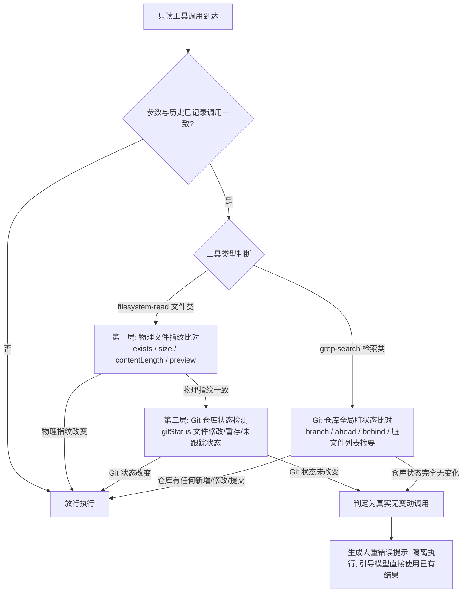

1. **单文件物理级检测（`captureFileSnapshot`）**：
   - 记录文件的存在状态、字节大小（`size`）、字符长度（`contentLength`）以及首段内容哈希摘要（`preview`）；
   - 只要任何一项与历史快照不一致（表明文件已被外部工具、进程或子代理修改），立即认定为发生变动，自动失效缓存并放行。
2. **Git 仓库版本级检测（`captureGitSnapshot`）**：
   - 通过 `window.snow.teamResolveRepo` 定位目标路径所属 Git 仓库；
   - 调用 `window.snow.gitStatus` 获取当前仓库的最新状态快照；
   - 对文件类调用：比对目标文件在 Git 脏文件列表中的具体状态（如是否 staged、modified、untracked）以及 commit 变动；
   - 对项目检索类调用（`grep-search`, `codebase-search` 等）：比对仓库全局指纹（`currentBranch + ahead + behind + stagedCount + unstagedCount + untrackedCount + fileDigest`）。只要代码仓库存在任何文件变动，检索即视为有效变动并放行。

#### 4.2.3 广义化副作用工具与缓存失效

不仅包含内置文件写工具，还将以下工具广义化纳入变动源（`mayMutateWorkspace`）：

- 文件创建、编辑与复制（`filesystem-create`, `filesystem-replace_edit`, `filesystem-copy`）；
- 终端与命令行执行（`bash-terminal-execute`, `terminal-send`, `terminal-open`）；
- 子代理与外部工作流（`sub-agents-activate`, `sub-agents-continue`, `workflow-generate`, `workflow-resume`）；
- 语言服务器批量重命名（`lsp-rename`）；
- 外部第三方写操作 MCP 工具。
  任何上述工具执行成功后，均会自动清空工作区的文件与检索只读快照。

#### 4.2.4 补救恢复协议与防流中断保障

若当前轮次所有工具调用全部被确认为无变动的重复调用，触发一次请求级补救尝试（`disableTools: true`，带有 `internalRecoveryPrompt` 引导模型不再调用工具并直接进行文本总结）。
若模型在该轮次仍违规返回 tool call 且未生成有效文本，系统提供友好的自动兜底收敛文案，彻底防止助手消息变为空白或导致响应流异常假死。

### 4.3 中途动态干预（Steering 机制）

用户在模型思考或工具执行耗时较长时，可以在输入框继续发送消息。
主循环不直接粗暴杀死当前正在运行的流，而是将新输入记录为 **Steering 待处理项（`takePendingSteering`）**：

1. 当前轮次的工具执行完毕后，执行 `consumeSteering`；
2. 将用户中途插入的指令以标准 `user` 角色消息追加至 `nextMessages`；
3. 随后一并交给下一轮 `runAgentLoop`，使 AI 能在知晓上一轮工具执行结果的同时，即时顺应用户的最新指令调整行动方向。

```mermaid
sequenceDiagram
    autonumber
    actor User as 用户 (UI)
    participant Input as ChatInput
    participant Loop as useAgentLoop
    participant Tools as ToolExecutor
    participant DB as SQLite 存储层

    Note over Loop,Tools: AI 正在执行长耗时工具或命令...
    User->>Input: 中途输入修正指令 (如 "别改 A 文件，改 B 文件")
    Input->>Loop: 暂存至 pendingSteering 队列 (不粗暴强制杀掉正在执行的子进程)

    Tools-->>Loop: 本轮工具执行完毕，产生 toolResultMessage

    Loop->>Loop: consumeSteering(effectiveKey)
    Note over Loop: 提取中途指令，以 role: "user" 消息紧随 tool 结果之后拼接

    alt 仍需继续迭代
        Loop->>Loop: 创建下一个 Assistant 占位卡片
        Loop->>Loop: await runAgentLoop(nextAssistantId, nextMessages)
        Note over Loop: AI 在下一轮中同时看到上一轮的工具结果与用户的最新修正！
    else 达成终态 (模型给出最终答复且无工具调用)
        Loop->>DB: store_chat_exchange (原子写入 assistant 消息与 token usage)
        Loop->>DB: finishAgentTask (持久化该任务全部文件变更与指标)
        Loop->>User: 界面完成态渲染，恢复输入区为就绪态
    end
```

### 4.4 Agent 业务级重试与故障自愈

区别于传输层（网络/超时）的底层重试，Agent 循环在业务与编排层设计了三级自愈机制：

1. **授权拒绝携带理由续跑（Continuable Rejection）**：
   - 当用户在授权弹窗中拒绝执行某工具并填写理由，或系统拦截了敏感命令（`sensitiveCommands`）时，`rejectionKeepsAiFlow` 判定为可继续；
   - 拒绝原因包装在 `role: "tool"` 结果中回灌给模型，Loop 继续递归，让 AI 在知悉用户限制或安全边界的前提下，自主换用安全路径完成目标。
2. **只读重复调用收敛补救（Duplicate-only Recovery Turn）**：
   - 发生全重复无变动读取时，系统不会直接抛错终止会话，而是自动发起一次 `disableTools: true` 的恢复请求；
   - 提示词注入 `internalRecoveryPrompt`，引导模型基于已有上下文直接总结并给出最终答复。
3. **子代理与外部执行域失败闭环**：
   - 子代理或工作流节点执行失败时，均以标准化结构体 `{ success: false, error }` 回传父会话，不会造成主会话崩溃；父会话模型据此进行重试重构或降级处理。

### 4.5 并行工具调度与微执行管道（Parallel Tool Orchestration Pipeline）

当模型在同一轮次中并发返回多个工具调用时，渲染进程工具执行器（`src/renderer/components/mainContent/chatMessages/hooks/toolExecution.ts`）通过智能并发分流器与单工具微管道协同调度：

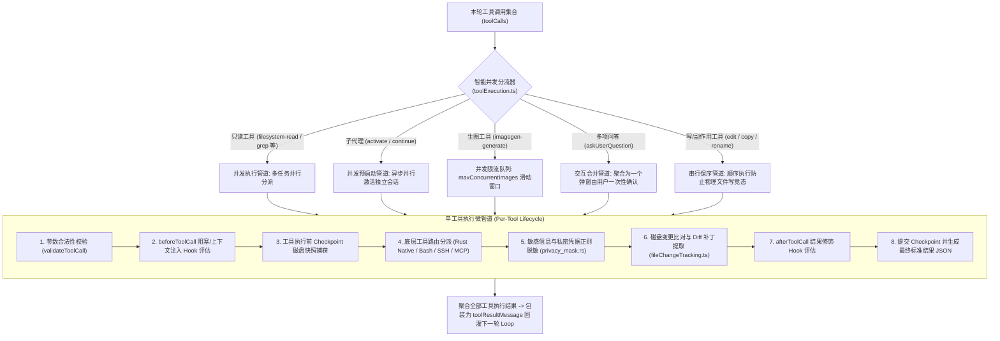

一轮的核心步骤是：调用模型流、解析 `toolCallsJson`、按授权结果构造 executor、执行工具、生成结构化 `toolResultsJson`，再递归进入下一轮。没有工具调用时结束，或先消费已排队的用户消息。循环开始前创建本地文件 checkpoint；`onUserMessage` 在首轮前执行，`onStop` 在最终清理时执行。

## 5. 工具发现

`collect_all_mcp_tools` 的过滤与合并顺序：

1. 解析全局 scope 与项目 scope。
2. 仅当项目存在、启用 codebase 且已有向量 chunk 时暴露 codebase 工具。
3. 仅当至少一个 imagegen channel 启用时暴露 imagegen。
4. 按固定顺序读取 14 个内置服务；Plan approval 只在 Plan Mode 请求中出现。
5. 应用全局与项目级 server/tool enable 状态（全局禁用优先）；terminal 默认禁用，须项目显式开启。
6. 动态加入 Skills 工具。
7. 并行发现外部 MCP 的 stdio/HTTP 工具；单个服务失败只记录错误，不使全部发现失败。

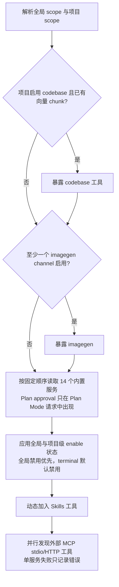

子代理使用 `collect_allowed_mcp_tools`。其 `tools_json` 必须是字符串数组；仅内置子代理可使用 `*`。全局或项目禁用的工具会被拒绝，而不是静默扩大权限。外部 MCP 支持 `server/discover`，并保留 legacy initialize fallback。

**工具域系统提示词注入**：工具可见性之外，系统提示词构建（`native/src/api/conversation/context.rs`）还会按工具域动态追加指引章节，且**注入条件与工具可见性保持一致**——用户禁用的工具域绝不注入，避免诱导调用不可见工具：

- **`## Language Servers`**：五个 provider 先收集最终 `allowed_tools`，再让 `ConversationContextRequest` 与 payload 序列化复用同一列表。`native/src/mcp/servers/lsp/prompt_context.rs::ToolSnapshot` 按全局/项目开关、能力与子代理白名单过滤后的实际名称逐项生成章节；不再用四个代表工具判断整个域，不独立重新发现工具。grep 描述也在最终列表形成后生成，结果提示与调用阶段 scope/allowed-tools 求交。可用不代表 running，更不代表索引 ready；提示词不保证预热完成、瞬时响应或诊断等价于构建通过。
- **`## Image Generation`**（imagegen 域，`native/src/mcp/servers/imagegen/mod.rs` 的 `build_system_prompt_section`）：配置了至少一个可用生图渠道且域 scope 允许时注入。列出可用渠道（id / 名称 / 协议，非敏感摘要），并强制多图 MUST 并行多次调用 `imagegen-generate`（一次一图，legacy 的 `prompts` / `n>1` 不是多图路径）；连续 ≥2 个并行调用由 UI 自动合并为 `ImageGenGallery` 统一网格。
- **调查阶段工具清单**：`native/src/prompt/tool_hints.rs` 读取同一个请求级快照，替换 Plan / Goal / WorkFlow 模板的 `__ANALYSIS_TOOLS_LINES__`。LSP、codebase、grep、filesystem-read 和 CodeLens 都逐项判断；禁用底行不出现，工具为空时清单也为空。未覆盖语言/扩展名/操作或扫描不完整时保留 CodeLens，并在内部转发时继续遵守子代理白名单。
- LSP 章节追加在提示词末尾，稳定顺序避免不必要的前缀变化；工具收集失败时沿用请求的无工具结果，不重新查询放大权限。主请求和子代理使用同一套纯路由生成器，不新增跨会话可见性缓存。

LSP 文档同步与结果可信度是另一层边界：`ensure_open` 比较实际磁盘全文并同步 didOpen/didChange；诊断不再读写持久结果缓存（不删除旧数据）。工作区搜索可用 `workspaceRoot` 显式指定绝对本地目录，完整候选与 `partial_symbol_search` 等元数据约束自动寻址；UI 的 partial/warnings 与 running 徽章都不应被解释为已完整验证。详见 [LSP 当前行为与待验收矩阵](7-LSP外部语言服务器接入设计.md)。

### 5.1 LSP 条件 MUST 与执行边界

语义任务在对应工具实际可见且支持目标语言/操作时 **MUST** 使用 LSP；禁用、权限排除、未覆盖、启动退避或健康失败时说明原因并使用可见兜底。逐工具判断语言覆盖、协商能力和健康，不把全局语言并集或 running 当成全部能力就绪。失败启动进入退避，冷却期避免反复 spawn；grep 仍用于字面检索。11 个语义显示名称及两组 i18n key 与 [工具参考](../3-参考手册/2-内置工具参考.md) 同步，ID 和历史 key 不改。

诊断使用 `filePaths` 数组（1..30），其他只读批量工具同样采用数组：symbols `filePaths`（1..10），hover/goto `items`（各 1..10），references `items`（1..5）；只有一项时也必须用数组，不兼容单点字段。拒绝缺失/错误数组、空数组或空路径及超限；路径按物理文件去重并保持顺序。每文件/目标分别报告状态，批次汇总 status 与 summary；歧义、部分或失败结果不能归为 complete。只读批次并发上限 3。

重命名 apply 必须消费内容绑定的 `previewId`（TTL 5 分钟、每会话最多 32 个、单次），仍须写入授权；内容改变要重做预览。UI 不展示原值、不自动 apply。跨文件应用非事务，模型和 UI 必须保留 `appliedFiles/error/requiresNewPreview`，不得假称回滚。只读批次并发上限为 3、按输入顺序返回；模块测试已验证批次契约，但未在真实语言服务器会话中验收。完整契约见 [LSP 设计 §0.6–0.8](7-LSP外部语言服务器接入设计.md)。

## 6. 工具调用与 checkpoint

`call_mcp_tool` 依次执行：清洗污染工具名、校验 Plan 特殊工具、阻止未批准 Plan 的写入、校验全局与项目 enable 状态、校验子代理白名单、解析本地/SSH workspace、把本地相对路径落到项目根、补充工具前 checkpoint、按工具类型路由、隐私掩码输出、更新工具后 checkpoint。

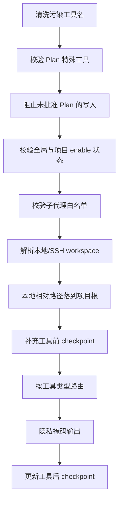

路由包含 bash、grep、remote filesystem、browser、user interaction、app control、terminal、imagegen、external MCP 和普通 builtin。可取消的远程执行通过 `tool_execution` chunk 返回 execution ID。checkpoint capture 使主代理与子代理的文件修改可被统一预览和恢复。

## 7. 授权与强制策略

Renderer `useToolAuthorization.ts` 组合以下策略：

- YOLO Mode 可自动放行普通工具。
- 全局 `permissions.alwaysApprovedTools`（`~/.snow/permissions.json`）与项目级授权合并为免审批列表；用户选择“始终允许”时持久化到项目授权设置，「项目工具授权」面板可添加/删除项目级授权，并只读展示全局列表。
- bash 先匹配敏感命令；敏感命令不能被“全部批准”绕过。
- interactive bash 由交互终端 UI 承担确认，不重复弹单独敏感命令框。
- `toolConfirmation` Hook 可在普通用户确认之前放行或拒绝。
- 待确认请求使用 Promise 挂起，直到用户选择。

Rust 侧是第二道边界：`bash.rs` 对敏感命令验证短期单次 authorization token，`call_mcp_tool` 强制 Plan Mode 和子代理 allowed-tools。前端便捷策略不能替代后端强制检查。

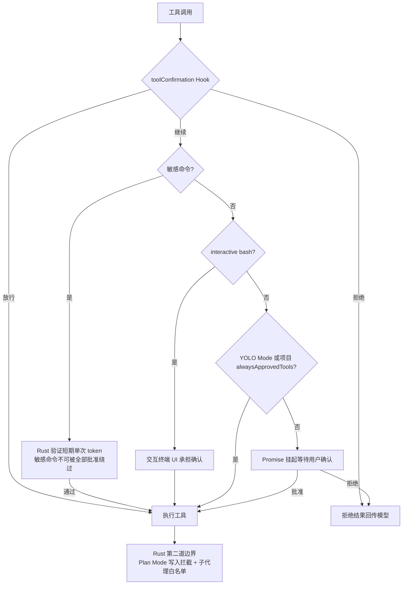

## 8. Hooks

支持的 Hook 类型为：`onUserMessage`、`beforeToolCall`、`toolConfirmation`、`afterToolCall`、`onSubAgentComplete`、`beforeSubAgentStart`、`beforeCompress`、`onSessionStart`、`onStop`。

命令 Hook 退出码：0 表示通过，stdout 可作为 Hook Context；1 表示软警告，特定 decision JSON 可触发用户决策；2 及以上表示中止。阻塞型 Hook 的结果通过 `hookOutcome.ts` 统一解释；`onStop` 等 fire-and-forget Hook 不阻塞主清理。

工具链顺序为：

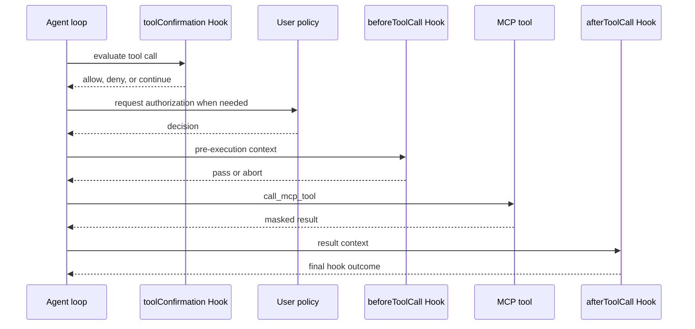

并行 imagegen 和并行子代理有批次专用逻辑，Hook 生命周期保持，但不能假设所有调用严格串行。

## 9. 子代理

模型调用 `sub-agents-activate` 后，Renderer 先运行 `beforeSubAgentStart`，再创建独立 conversation/session 并持久化 `running`。子代理读取自身系统提示词、`tools_json` 和 API profile，在独立 Renderer loop 中流式运行。

主会话构建系统提示词时，会从 `sub_agent_configs` 查询并**动态注入可用子代理清单**（`agentId`、名称、用途描述）与选择规则——主 Agent 据此挑选最匹配的 `agentId`，而不是默认使用内置 `agent_general`。清单解析与激活一致：**当前项目（`directory_id`）的项目级子代理优先**，同 `agentId` 覆盖全局；其他项目的子代理不注入。

子代理继承父会话 checkpoint IDs，使文件改动纳入父会话回滚范围；Rust 同时限制 allowed-tools，并在父 Plan 尚未批准时阻止写入。子代理不能调用或授予 Plan approval。完成后会话标记 `completed` 或 `failed`，执行 `onSubAgentComplete`，随后变为只读；其后续排队输入转发父会话。父 abort 会传播到活动子代理，应用启动会把遗留 `running` 状态取消。

激活与主代理并行执行（渲染进程预启动），结束时以结构化 JSON 作为工具结果回传主代理，主代理不做自动重试，由模型根据结果决定下一步：正常完成返回 `{success: true, conversationId, agentName, summary}`（`onSubAgentComplete` 可 pass 追加上下文、warn 追加警告或 abort 替换 summary）；API 流失败时把失败内容作为最终输出并标记消息为 error；异常时返回 `{success: false, error}`，会话持久化 `failed` 并广播失败事件，子会话中用户排队插入的消息转发父会话；用户中断返回 "Sub-agent interrupted by user"；父会话 Plan 未批准时立即停止并把控制权交还主循环。子代理没有独立的全局超时（只有单工具层超时）；停止主代理会通过 `childSubAgentIds` 递归级联取消全部后代子代理（中止流、拒绝挂起授权、杀掉 bash 子进程），应用启动时清理遗留 `running` 会话。

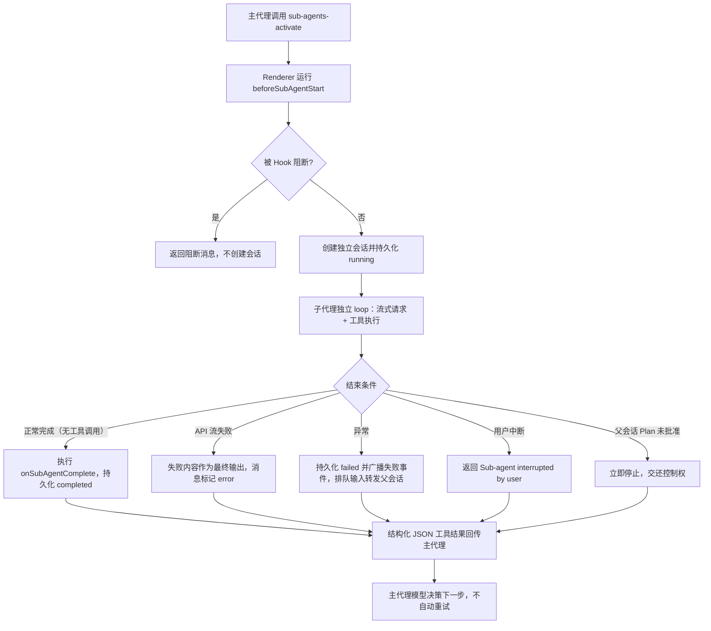

## 10. 上下文压缩

压缩可由用户手动触发，或在 token 总量达到 `autoCompressThreshold` 时自动触发：

1. 本地 workspace 尝试创建临时 checkpoint；SSH 跳过本地文件 checkpoint。
2. 执行 `beforeCompress`。
3. 发送 `contextCompaction: true` 和 `checkpointId` 的模型流；压缩请求不暴露工具。
4. Rust 使用完整有效上下文生成 handoff，并以 `status = 'context_compaction'`、真实 usage 和 checkpoint ID 持久化边界。
5. Renderer 重载数据库消息；自动压缩以 `resumeAfterCompaction` 恢复原循环。
6. 失败时删除本次临时 checkpoint。

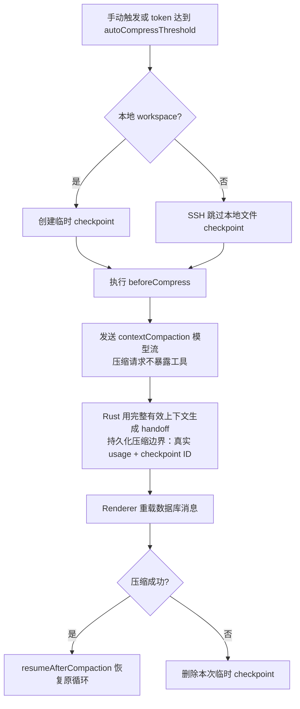

## 11. 回滚

`useRollback.ts` 先 abort 当前流并取消 summary generation，计算 checkpoint diff 和将删除的 TODO，展示预览。确认后等待流与 summary Promise 完全结束，避免和 SQLite 写事务竞态。用户可选择只截断对话，或同时调用 `restoreCheckpoint` 恢复文件。

首条消息回滚可删除整个 conversation；其余情况调用 `truncateConversation` 并清理废弃 checkpoint。回滚 `context_compaction` 边界时必须使用边界自身 `responseId` 截断，不能把整段会话误判为首条消息。

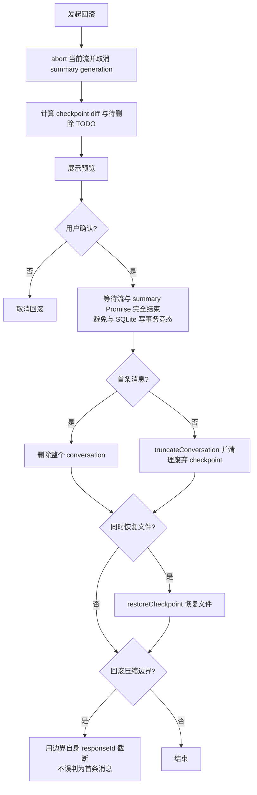

## 12. 数据落库

每个 provider 适配器在模型流结束后调用 `store_chat_exchange`，保存用户消息、assistant 内容、thinking、`tool_calls_json`、response/checkpoint ID、token usage 和 compaction 状态。Renderer 随后执行工具；下一轮的 tool-role 消息携带 `toolResultsJson`，并在下一次模型交换中持久化。`usage_records` 对成功、失败和压缩调用分别记账。

## 13. 端到端时序

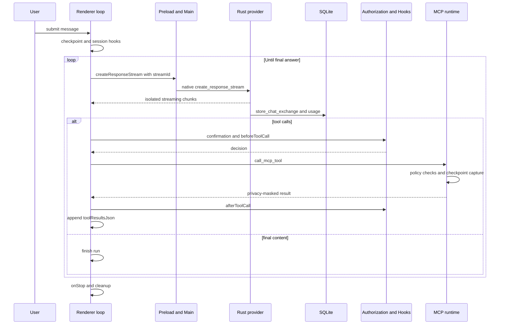

## 14. 状态不变量

- chunk 必须按 `streamId` 过滤；完成或 abort 后移除监听。
- 同一会话只接受当前 `runId` 的更新，旧 Promise 不得覆盖新运行。
- 子代理权限不得超过显式 allowed-tools 和项目启用范围。
- Plan 未批准时，Renderer UX 与 Rust 写入拦截必须同时成立。
- 模型交换先落库，工具结果在下一轮作为结构化 tool-role 历史进入。
- 回滚前必须等待仍可能写库的异步任务收敛。
- 工作树执行域一致性：处于工作树模式（WorkTree Mode）时，会话的物理执行根目录（`executionWorkspaceRoot`）必须在请求契约中自包含传递，并与底层 Checkpoint 记录目录（`manifest.work_dir`）及前端变更面板保持 100% 对称；系统提示词中的工作目录必须等于真实物理根目录。
- 会话状态落库原子性：新会话升级落库（Session Migration）状态持久化必须顺序/原子执行，禁止并发向 SQLite 派发多个裸写事务；Rust 存储层所有写操作必须接入 `with_write_lock` 和 `with_write_retry`。

## 15. 源码锚点

| 主题               | 文件                                                                                                                      |
| ------------------ | ------------------------------------------------------------------------------------------------------------------------- |
| 主循环与流状态     | `src/renderer/components/mainContent/chatMessages/hooks/useAgentLoop.ts`、`agentLoopHelpers.ts`                           |
| 工具执行与授权     | `toolExecution.ts`、`useToolAuthorization.ts`                                                                             |
| 工作树执行域与绑定 | `native/src/storage/services/git/worktrees.rs`、`utils/conversationHelpers.ts`、`chatInput/useConversationFileChanges.ts` |
| Hooks              | `hooks/hookOutcome.ts`、`useToolAuthorization.ts`、`native/src/hooks/`                                                    |
| 子代理             | `hooks/subAgentActivation.ts`、`native/src/api/conversation/sub_agent.rs`、`native/src/mcp/servers/sub_agents.rs`         |
| 压缩与回滚         | `hooks/useCompaction.ts`、`hooks/useRollback.ts`、`native/src/exports/checkpoint.rs`                                      |
| 流 IPC             | `src/preload/modules/apiConfigApi.ts`、`src/main/ipc/handlers/chatHandlers.ts`、`src/main/utils/safeSend.ts`              |
| Provider 分派      | `native/src/api/conversation/stream.rs`、`tool_messages.rs`                                                               |
| MCP 发现与调用     | `native/src/mcp/builtin.rs`、`native/src/mcp/tools.rs`、`native/src/mcp/external/`                                        |
| 会话与 usage 存储  | `native/src/storage/services/chat_conversations.rs`、`usage_records.rs`                                                   |
