# 功能模块架构与数据流图集

> 本图集按功能拆分可维护的 Mermaid 源码。图中只保留稳定边界；实现变化时，应同时更新“维护说明”和源码锚点，而不是把所有内部函数塞进一张巨图。

## 1. 聊天与会话

**用途与边界**：Renderer 管理消息 UI、每会话 Agent loop 和流状态；Rust 规范化 provider 请求、解析流并持久化模型交换。

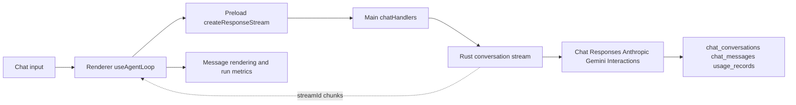

**Agent 迭代与状态感知数据流**：

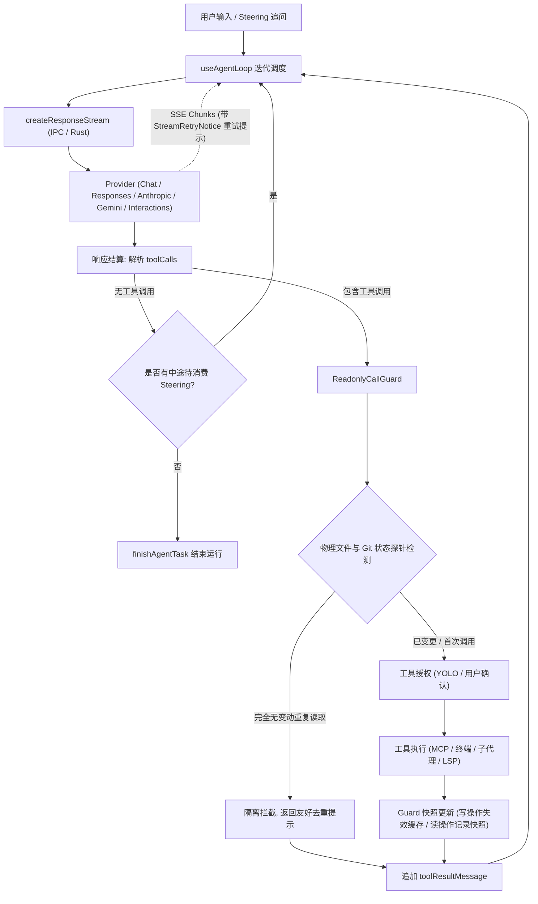

**维护说明**：不要把 `sessionProxy.ts` 画进 AI 流；工具结果由 Renderer 生成 `toolResultsJson` 后进入下一模型轮次。只读工具经由 `ReadonlyCallGuard` 结合 Git 状态和文件物理指纹进行主动变动感知。

**源码锚点**：`src/renderer/components/mainContent/chatMessages/hooks/useAgentLoop.ts`、`src/renderer/components/mainContent/chatMessages/hooks/readonlyCallGuard.ts`、`src/preload/modules/apiConfigApi.ts`、`src/main/ipc/handlers/chatHandlers.ts`、`native/src/api/conversation/stream.rs`、`native/src/api/interactions/`、`native/src/storage/services/chat_conversations.rs`。

## 2. MCP 工具发现与调用

**用途与边界**：Rust 生成模型可见工具集合并执行工具；Renderer 负责用户授权和调用轮次，不负责绕过 Rust 策略。

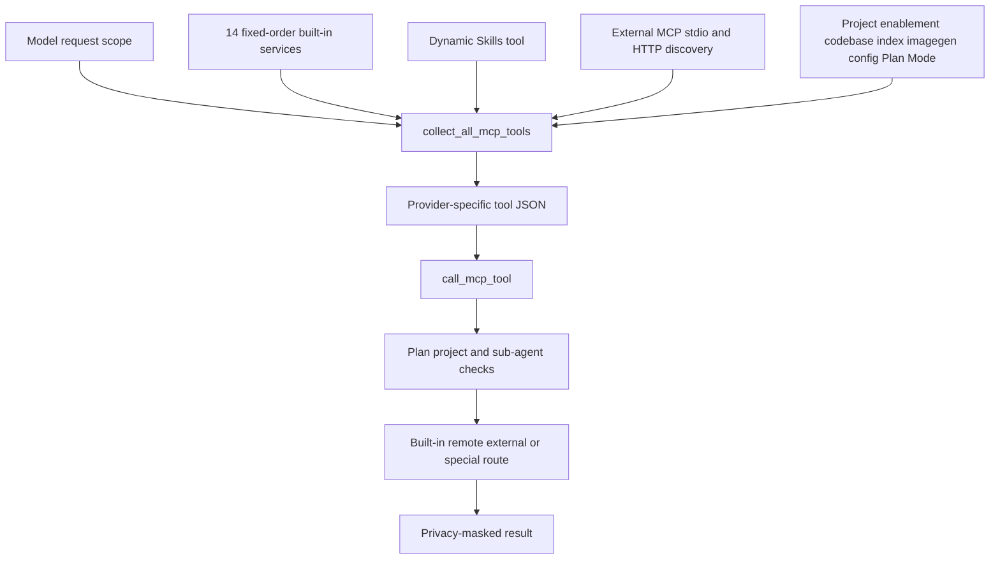

**维护说明**：固定服务必须追加到 `builtin_services_in_order` 末尾以保持 prompt cache；Skills 和 remote workspace 不计入 14 个固定服务。

**源码锚点**：`native/src/mcp/builtin.rs`、`native/src/mcp/tools.rs`、`native/src/mcp/service.rs`、`native/src/mcp/external/`、`native/src/mcp/privacy_mask.rs`。

## 3. Skills

**用途与边界**：Skills 配置按全局或项目 scope 管理，模型侧工具按请求动态注入；内置 Skills 和文档在启动时幂等同步到 `~/.snow/`。

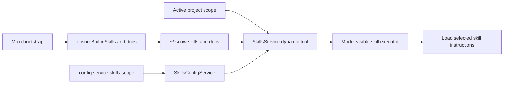

**维护说明**：`skills_config` 是 config 的 skills scope 委托，不是独立注册 MCP 服务；动态工具是否出现取决于 scope 和可用配置。

**源码锚点**：`src/main/app/ensureBuiltinSkills.ts`、`native/src/mcp/servers/skills.rs`、`native/src/mcp/servers/skills_config.rs`、`native/src/mcp/servers/config.rs`、`native/src/mcp/tools.rs`。

## 4. Hooks 与子代理

**用途与边界**：Hooks 为用户消息、工具、压缩和子代理生命周期提供可配置决策点；子代理是独立会话和 Renderer loop，但权限及 checkpoint 受父会话约束。

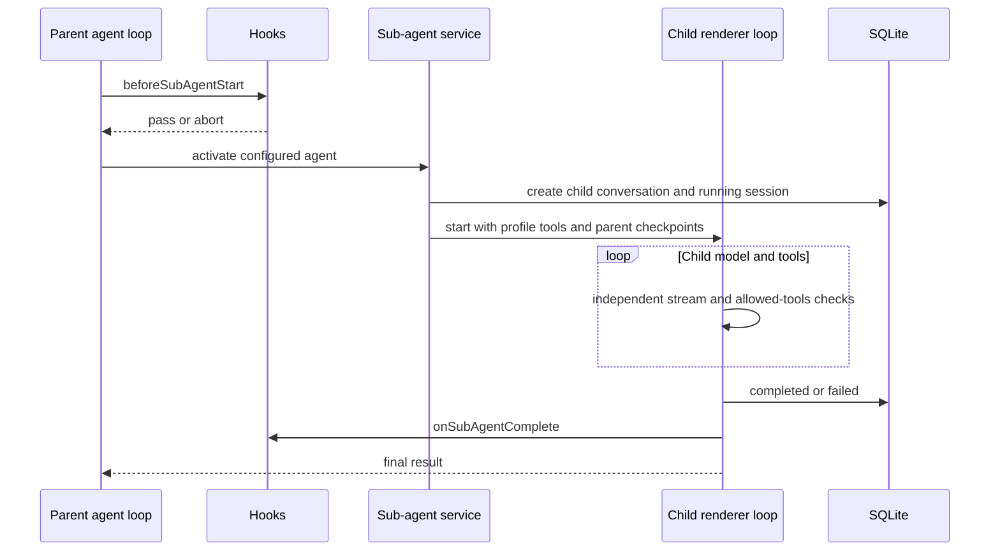

**维护说明**：工具 Hook 顺序是 `toolConfirmation` → 授权 → `beforeToolCall` → MCP → `afterToolCall`。父 abort 传播到子代理；启动时遗留 running 会话被取消。

**源码锚点**：`src/renderer/components/mainContent/chatMessages/hooks/subAgentActivation.ts`、`toolExecution.ts`、`useToolAuthorization.ts`、`hookOutcome.ts`、`native/src/hooks/`、`native/src/mcp/servers/sub_agents.rs`。

## 5. 图像生成与图库

**用途与边界**：imagegen MCP 依据独立 channel 配置调用 provider；生成结果写文件并登记图库，Renderer 将连续并行调用合并为画廊。

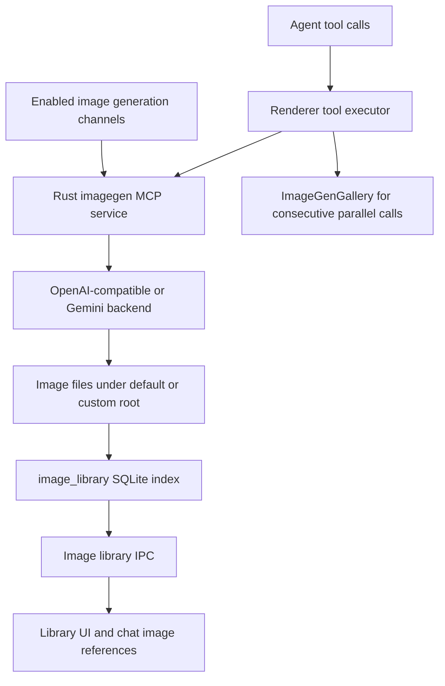

**维护说明**：工具只在至少一个 channel 启用时发现。并行多图是多次工具调用，Renderer 画廊负责统一网格；图库目录更换走 prepare/chunk/commit/rollback journal 流程。

**源码锚点**：`native/src/mcp/servers/imagegen.rs`、`src/main/ipc/handlers/imageHandlers.ts`、`native/src/storage/services/image_library.rs`、`native/src/exports/images.rs`、`src/main/ipc/handlers/imageLibraryHandlers.ts`。

## 6. 浏览器

**用途与边界**：Renderer webview 提供可视页面，Main 管理 Electron 网络记录、弹窗、密码和上下文菜单，Rust MCP browser 服务暴露模型工具。

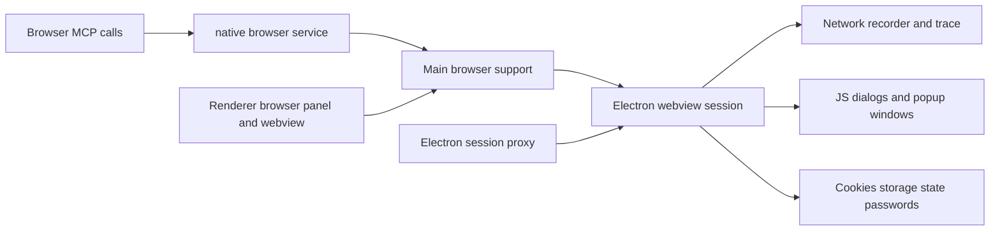

**维护说明**：`browserNetworkRecorder`、storage state 和 trace 是辅助模块，不是独立 IPC 注册组。OAuth popup 需要保留 `window.opener` 关系；网络代理由 `sessionProxy.ts` 应用到 Electron session。

**源码锚点**：`native/src/mcp/servers/browser.rs`、`src/main/ipc/handlers/browserNetworkRecorder.ts`、`browserStorageState.ts`、`browserTrace.ts`、`browserPasswordHandlers.ts`、`src/main/browser/browserPopupWindow.ts`、`src/main/app/sessionProxy.ts`。

## 7. 终端与 SSH

**用途与边界**：本地 PTY 和持久 terminal 工具由本地进程管理；SSH manager、远程命令和 remote workspace 适配远端文件、命令与 Git。

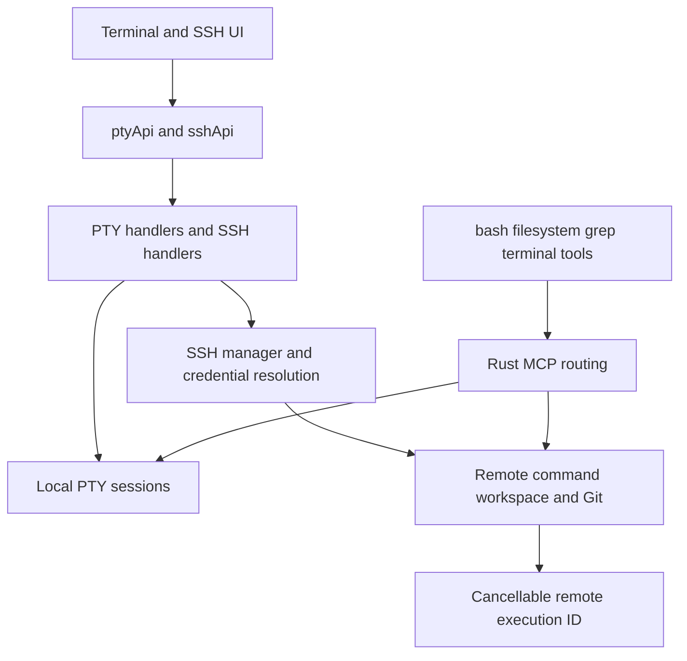

**维护说明**：terminal MCP 默认禁用，需项目显式开启。远程 workspace 是执行支撑，不应重复注册为固定内置服务；Windows/本地与 SSH 路径解析必须在路由前完成。

**源码锚点**：`src/main/pty/registerPtyHandlers.ts`、`src/main/ipc/handlers/sshHandlers.ts`、`src/main/ssh/sshManager.ts`、`remoteWorkspaceCommand.ts`、`remoteGit.ts`、`native/src/mcp/servers/terminal.rs`、`remote_workspace.rs`。

## 8. Git 与代码库索引

**用途与边界**：UI Git 经 Main 和 native export 调用本地或远程 Git；代码库索引由 Rust 构建 embedding/chunk，并仅在索引可用时向模型暴露搜索工具。

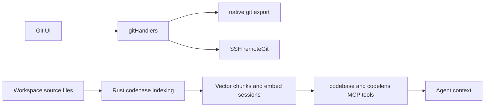

**维护说明**：Git UI 操作与模型工具授权是不同入口。codebase 工具要求有效 project、项目启用且已有 chunk；未建索引时应隐藏而不是返回空能力。

**源码锚点**：`src/main/ipc/handlers/gitHandlers.ts`、`src/main/ssh/remoteGit.ts`、`native/src/exports/git.rs`、`native/src/exports/codebase.rs`、`native/src/mcp/servers/codebase.rs`、`native/src/mcp/servers/codelens/`、`native/src/storage/services/codebase_embed_sessions.rs`。

## 9. Git 工作树与会话执行域隔离

**用途与边界**：支持同一个 Git 仓库在多个分支或独立隔离工作树（WorkTree）下并行开启对话；前端选择器绑定会话执行域，底层通过 SQLite 写锁保证并发安全，请求契约将 `executionWorkspaceRoot` 和 `worktreeId` 严格透传给工具与文件快照 Checkpoint。

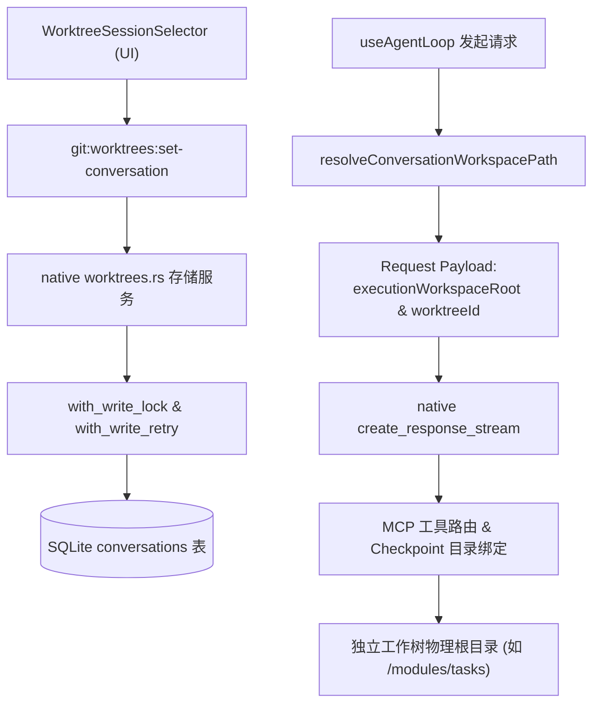

**维护说明**：处于工作树模式时，系统提示词中的工作目录必须严格对齐 `executionWorkspaceRoot`，底层文件变更面板与 Checkpoint 回滚目录（`manifest.work_dir`）必须与物理执行目录保持 100% 对称。

**源码锚点**：`native/src/storage/services/git/worktrees.rs`、`src/renderer/components/mainContent/chatInput/WorktreeSessionSelector.tsx`、`src/renderer/components/mainContent/chatMessages/utils/conversationHelpers.ts`、`src/main/ipc/handlers/gitHandlers.ts`。

## 10. 配置

**用途与边界**：配置跨 file-backed、DB-backed、全局和项目 scope；Renderer 通过 config API 或模型 config MCP 工具访问，Rust 统一验证、掩码、备份和写入。

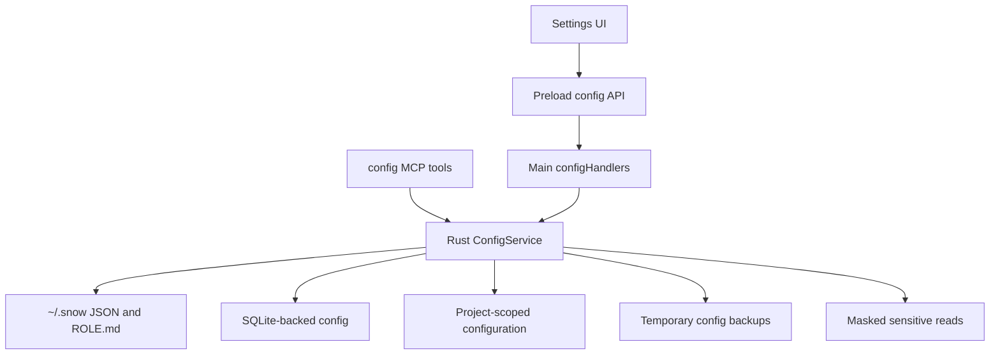

**维护说明**：文件写入采用同目录 tmp + rename；临时备份成功后清理。删除配置必须明确目标和影响；敏感字段读取保持掩码。skills scope 委托 SkillsConfigService。

**源码锚点**：`native/src/mcp/servers/config.rs`、`native/src/mcp/servers/skills_config.rs`、`src/preload/modules/configApi.ts`、`src/main/ipc/handlers/configHandlers.ts`、`src/main/settings/`。

## 11. 应用更新

**用途与边界**：更新器按平台分支；非 macOS 使用 electron-updater 的显式下载/安装状态机，macOS 使用独立检查与下载实现。更新网络遵循 updater 专用 Electron session 代理。

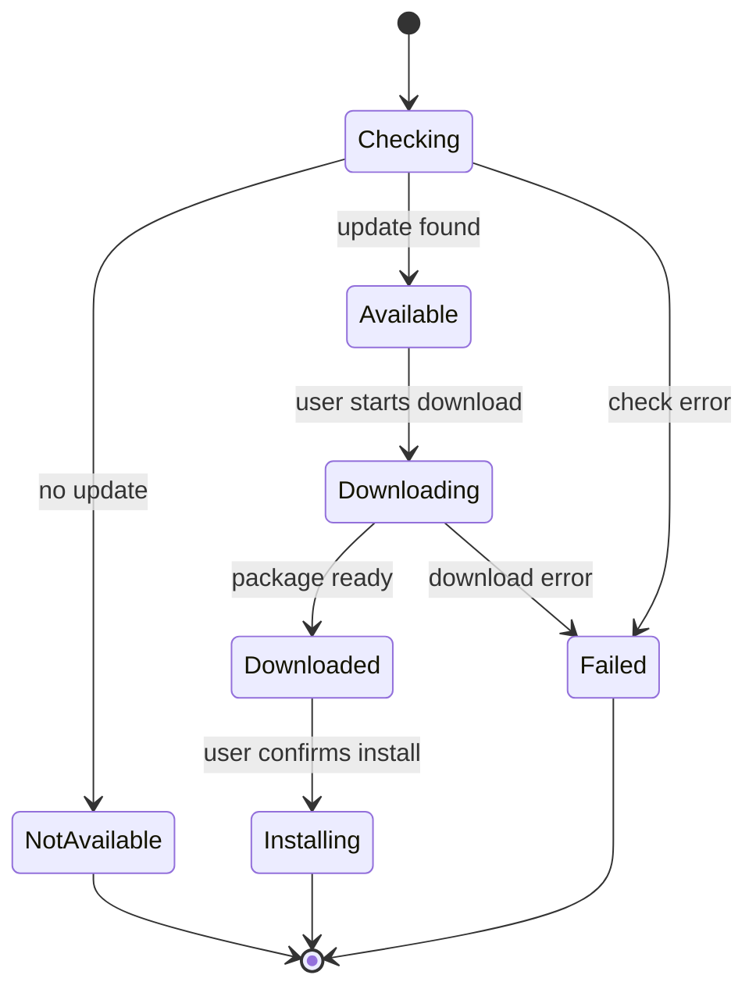

**维护说明**：非 macOS 禁止自动下载和退出自动安装；状态必须体现用户触发的下载与安装。macOS 下载缓存位于 userData updates 相关目录。default session 与 updater partition 都通过 `applySessionProxy`。

**源码锚点**：`src/main/updater/autoUpdater.ts`、`electronUpdater.ts`、`macUpdater.ts`、`updateStatus.ts`、`src/main/app/mainWindow.ts`、`src/main/app/sessionProxy.ts`。

## 12. LSP 语言服务器与语义代码分析

**用途与边界**：提供多语言服务器（Rust `rust-analyzer`、TypeScript `typescript-language-server`、Go `gopls` 等）的进程生命周期管理、语义定义跳转、悬停文档、引用查找与批处理诊断；推送式诊断通过本地缓存向前端和模型提供亚毫秒级响应。

```mermaid
flowchart LR
    AgentTools["Agent LSP 工具\n(goto / hover / references / symbols)"] --> LspServer["mcp/servers/lsp/"]
    LspServer --> ClientMgr["LspClient 进程管理器"]
    ClientMgr --> Subprocess["Language Server 独立进程\n(rust-analyzer / node / gopls)"]
    Subprocess -. "JSON-RPC (stdio)" .-> ClientMgr
    Subprocess -. "textDocument/publishDiagnostics" .-> PushCache["Push Diagnostic Cache\n(推模式诊断缓存)"]
    PushCache --> DiagTools["lsp-diagnostics / workspace-diagnostics"]
    DiagTools --> AgentContext["模型上下文反馈 & 质量复核"]
```

**维护说明**：LSP 工具按能力和语言动态注册；若语言服务器处于退避冷却期或未安装，系统自动降级回退到 CodeLens 或字面检索。诊断工具必须使用 `filePaths` 数组入参。

**源码锚点**：`native/src/mcp/servers/lsp/`、`native/src/mcp/servers/lsp/client.rs`、`native/src/mcp/servers/lsp/prompt_context.rs`、`src/renderer/components/mainContent/chatInput/LspStatusBadge.tsx`。

## 13. 定时任务与可视化工作流编排

**用途与边界**：定时任务提供无头 Agent 自动执行与 Cron/间隔调度；可视化工作流（Workflow Engine）将复杂任务分解为有向无环图（DAG），支持用户在 UI 上交互审核节点、单步继续或在失败节点上续跑。

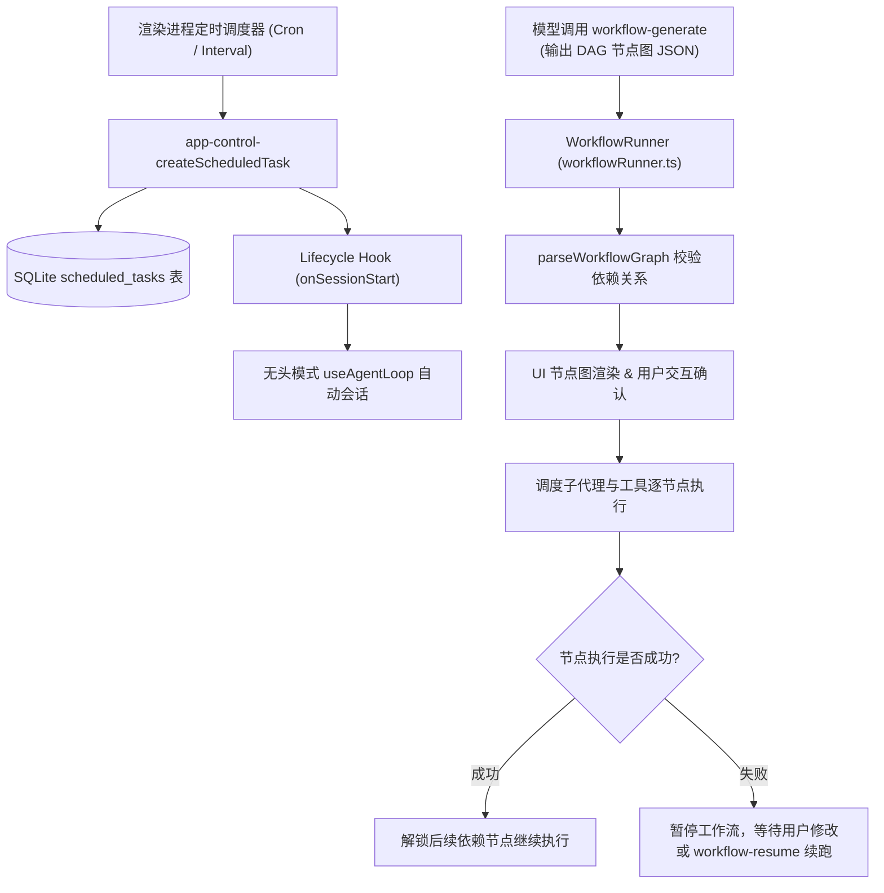

**维护说明**：定时任务在渲染进程常驻计时器中驱动，但在数据库中做全量历史落库与执行次数统计；工作流节点图解析必须防范环形依赖，失败恢复通过 `workflow-resume` 串联原上下文。

**源码锚点**：`src/renderer/components/mainContent/chatMessages/workflow/workflowRunner.ts`、`src/renderer/components/mainContent/chatMessages/toolCalls/WorkflowToolCall.tsx`、`src/preload/modules/scheduledTaskApi.ts`、`native/src/storage/services/scheduled_tasks.rs`。
